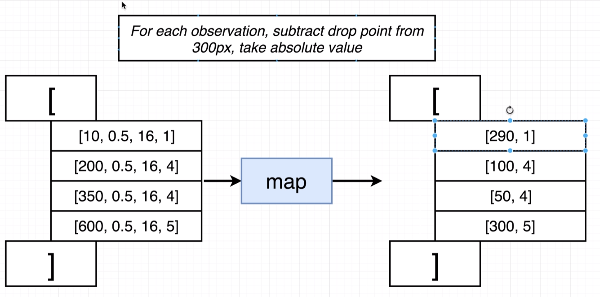
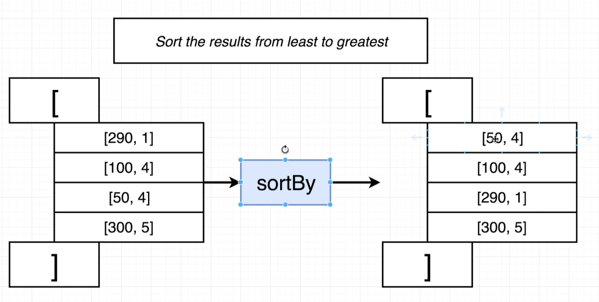
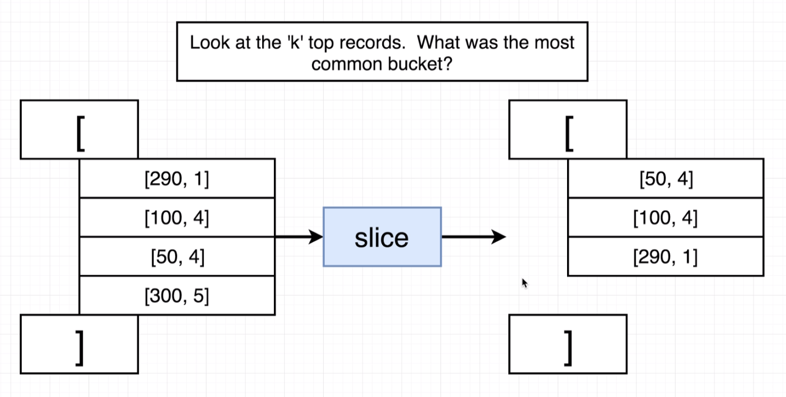

# 자바스크립트로 배우는 머신러닝

참고 사이트 정리

- [Udemy 강좌 바로가기](https://www.udemy.com/machine-learning-with-javascript)
- [Github 소스](https://github.com/StephenGrider/MLKits)
- [JSPlaygrounds](https://stephengrider.github.io/JSPlaygrounds/)
- [Lodash.com](https://lodash.com/docs/4.17.11)

> `Lodash` 간단한 사용방법

```javascript
const numbers = [
	[10, 5],
  [17, 2],
  [34, 1],
  [60, -5],  
];

const sorted = _.sortBy(numbers, row => row[1]);
const mapped = _.map(sorted, row => row[1]);

_.chain(numbers)
	.sortBy(row => row[1])
	.map(row => row[1])
	.value();

....

[-5,1,2,5]
```








