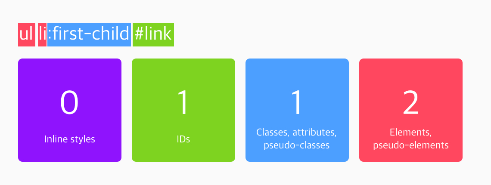

CSS에는 '상속'이라는 개념이 있습니다. 말 그대로 부모 요소의 속성들을 자식들한테 넘겨주는 것인데요. 예시를 한 번 봅시다.

- HTML
- CSS

```html
<div class="div1">
  <h1>Heading 1</h1>
  <p>Paragraph bla bla bla</p>
</div>

.div1 {
  color: blue;
}
```

결과 확인

`.div1`의 폰트 색을 `blue`로 설정해주었고, `<h1>`과 `<p>`에 대해서는 별도의 설정이 없었습니다. 그런데도 `<h1>`과 `<p>` 태그의 폰트 색이 파란색으로 설정되었죠? 그 이유는 `.div1`의 스타일이 자식들에게 **상속되었기**때문입니다.

### 상속되는 속성들

하지만 태그와 속성에 따라 상속이 되지 않는 경우도 많이 있습니다. 예를 들어서 부모 태그에 설정한 `margin`이 모든 자식들에게도 적용되면 총체적 난국이 되겠죠?

*웬만하면* 상속되는 몇 가지 속성들입니다:

1. `color`
2. `font-family`
3. `font-size`
4. `font-weight`
5. `line-height`
6. `list-style`
7. `text-align`
8. `visibility`

이외에도 많지만 일단 자주 사용하는 몇 가지만 적어두었습니다.

위에 있는 속성들도 항상 상속되는 건 아닙니다. 대표적인 예로 `<a>` 태그에는 `color` 속성이 상속되지 않습니다. `<a>` 태그가 억지로 상속을 받아오기 위해서는 해당 속성에 `inherit` 값을 쓰면 됩니다!

- HTML
- CSS

```html
<div class="div1">
  Let's go to <a href="https://google.com" target="_blank">google</a>!
</div>

<div class="div2">
  Let's go to <a href="https://google.com" target="_blank">google</a>!
</div>

HTMLCSS
.div1 {
  color: green;
}

.div2 {
  color: orange;
}

.div2 a {
  color: inherit;
}
```


다양한 선택자를 배워봤습니다. 그런데 여러 선택자가 같은 요소를 가리키면 우선 순위를 어떻게 평가할까요?

# 순서

우선 가장 간단한 겁니다. 완전 똑같은 선택자가 나중에 또 나오면, 이전에 나온 스타일을 덮어쓰게 됩니다.

- HTML
- CSS

```html
<h1>Heading 1</h1>

HTMLCSS
h1 {
  color: blue;
  text-align: center;
}

h1 {
  color: green;
}
```

결과 확인

# 명시도 (Specificity)

같은 요소를 가리키지만 선택자가 다르다면, '명시도(specificity)'에 따라 우선 순위가 결정됩니다.

### 명시도 계산기

명시도 계산 방법을 알려드리겠습니다.

1. 인라인 스타일이 가장 우선 순위가 높습니다.
2. 선택자에 id가 많을 수록 우선 순위가 높습니다.
3. 선택자에 class, attribute, pseudo-class가 많을 수록 우선 순위가 높습니다.
4. 그 다음은 그냥 요소(또는 가상 요소)가 많은 순서입니다.

`<ul>` 태그 안에 `<li>` 태그 안에 `<a id="link">`가 있다고 가정해봅시다. `<ul>`과 `<li>`는 나중에 배울 '리스트' 태그입니다.




첫 번째 경우에는 일반 요소가 세 개, 가상 클래스가 한 개 있어서 '명시도 점수'가 13입니다. 두 번째 경우에는 일반 요소가 두 개, 가상 클래스가 한 개, 그리고 id가 한 개 있어서 112점입니다.

따라서 두 선택자에서 겹치는 스타일이 있는 경우, 두 번째 경우인 `ul li:first-child #link` 선택자의 스타일이 적용되는 거죠!

- HTML
- CSS

```html
<ul>
  <li><a id="link" href="#">Link 1</a></li>
  <li><a id="link" href="#">Link 1</a></li>
  <li><a id="link" href="#">Link 1</a></li>
  <li><a id="link" href="#">Link 1</a></li>
</ul>

ul li:first-child #link {
  color: green;
}

ul li:first-child a {
  color: orange;
}
```