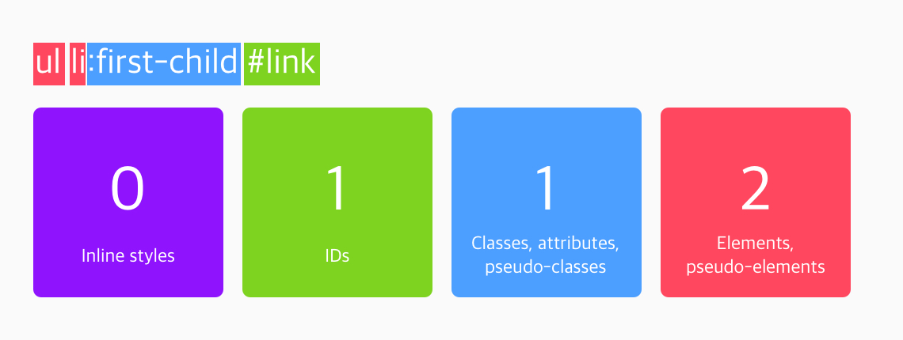

# CSS 우선 순위

> 나중에 나오는 스타일이 덮어씌게 된다.
```
h1 {
  color: blue;
  text-align: center;
}

h1 {
  color: green;
}

<h1>Heading 1</h1>
```

## 명시도

같은 요소를 가리키지만 선택자가 다르다면, '명시도(specificity)'에 따라 우선 순위가 결정됩니다.

명시도 계산기

1. 인라인 스타일이 가장 우선 순위가 높다
2. 선택자에 id가 많을 수록 우선 순위가 높다.
3. 선택자에 class, attribute, pseudo-class가 많을 수록 우선 순위가 높다.
4. 그 다음은 그냥 요소가 많은 순서


<ul> 태그 안에 <li> 태그 안에 <a id="link">가 있다고 가정해봅시다. <ul>과 <li>는 나중에 배울 '리스트' 태그입니다.




첫 번째 경우에는 일반 요소가 세 개, 가상 클래스가 한 개 있어서 '명시도 점수'가 13입니다. 두 번째 경우에는 일반 요소가 두 개, 가상 클래스가 한 개, 그리고 id가 한 개 있어서 112점입니다.

따라서 두 선택자에서 겹치는 스타일이 있는 경우, 두 번째 경우인 ul li:first-child #link 선택자의 스타일이 적용되는 거죠!

```
<ul>
  <li><a id="link" href="#">Link 1</a></li>
  <li><a id="link" href="#">Link 1</a></li>
  <li><a id="link" href="#">Link 1</a></li>
  <li><a id="link" href="#">Link 1</a></li>
</ul>

ul li:first-child #link {
  color: green;
}

ul li:first-child a {
  color: orange;
}
```

# CSS 단위들

SS에는 px, rem, em, % 등 여러 단위가 있습니다. 폰트 크기 뿐만 아니라 padding, margin, width 등 다양한 속성들에 이 단위들을 사용할 수 있습니다.

이 단위들의 차이에 대해 알아봅시다.

px
px는 절대적인 값입니다. 다른 요소의 값에 영향을 받지 않는다는 거죠.

HTMLCSS
```
html {
  font-size: 20px;
}

.container {
  /* 자동으로 html의 font-size 20px을 상속받음 */
  padding-top: 2em; /* 자신의 font-size * 2 = 40px */
  background-color: lime;
}
<div class="container">
  Codeit
</div>
```

결과 확인
rem
rem 은 상대적인 값입니다. 하지만 오직 <html> 태그의 font-size에만 영향을 받습니다.

2rem은 <html> 태그의 font-size의 2배 크기입니다.

HTMLCSS
```
<div class="container">
  Codeit
</div>

html {
  font-size: 20px;
}

.container {
  font-size: 40px;
  padding-top: 2em; /* 자신의 font-size * 2 = 80px */
  background-color: lime;
}

```
결과 확인
em
em도 rem과 마찬가지로 상대적인 값입니다. em은 자기 자신의 font-size를 기준으로 합니다.

2em은 자기 자신의 font-size의 2배 크기입니다. 자기 자신의 font-size를 따로 정해주지 않을 경우, 상위 요소에서 상속받은 값을 기준으로 합니다.

HTMLCSS
<div class="container">
  Codeit
</div>
결과 확인

만약 자기 자신에게 정해진 font-size가 있다면 그 값을 기준으로 em이 결정됩니다.

HTMLCSS
<div class="container">
  Codeit
</div>
결과 확인
퍼센트 (%)
% 역시 상대적인 값이겠죠? %는 어느 항목에서 쓰이냐에 따라 다른 기준이 적용됩니다.

예를 들어 font-size에서 %가 쓰일 경우, 상위 요소의 font-size에 곱해주는 방식으로 계산합니다.

HTMLCSS
<div class="container">
  Codeit
  <p class="text">Codeit</p>
</div>
결과 확인

%가 margin이나 padding의 단위로 사용될 경우, 상위 요소의 width를 기준으로 계산됩니다.

HTMLCSS
<div class="container">
  <p class="text">Codeit</p>
</div>
결과 확인

재미있는 점은 margin-top이나 padding-bottom 등 세로(상하) 속성를 조절할 때에도 상위 요소의 height가 아닌 width를 기준으로 계산된다는 것입니다.

HTMLCSS
<div class="container">
  <p class="text">Codeit</p>
</div>
결과 확인
참고
더 자세히 알아보고 싶으신 분들은 아래 링크를 참고해보세요: https://webdesign.tutsplus.com/ko/tutorials/comprehensive-guide-when-to-use-em-vs-rem--cms-23984