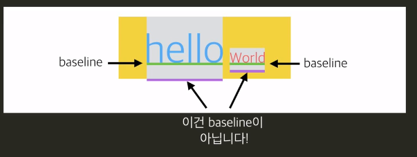
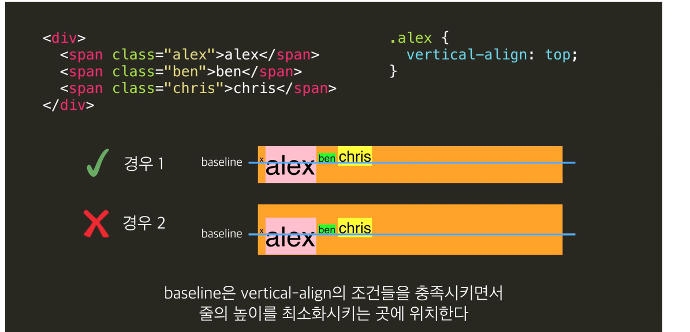

# image 속성

## 이미지 정렬
css
이미지내 글자 중앙정렬시 : `vertical-align: middel`;

# baseline

기본적으로 element들은 `baseline`에 맞혀져 있다.


```

```

# vertical-align

기본속성은 baseline
```
vertical-align: top
vertical-align: middle
```

baseline은 vertical-align의 조건들을 충족시키면서 줄의 높에를 최소화 시키는 곳에 위치한다. 



만약 baseline 위치가 궁금하다면 부모태그에 단지 `x` 문자를 추가해서 위치가 이동되는지 체크할 수 있다.

## 가로 가운데

가로 가운데 정렬
어떤 요소를 가로로 가운데 정렬하려면 어떻게 해야 할까요? 간단합니다.

inline 요소
inline 또는 inline-block 요소면 부모 태그에 text-align: center;를 써주면 됩니다.

HTMLCSS
.container {
  text-align: center;
  background-color: lime;
}
결과 확인
block 요소
block 요소면 margin-left: auto;, margin-right: auto;를 써주면 되죠?

HTMLCSS
.block-element {
  width: 100px;
  height: 50px;
  margin-left: auto;
  margin-right: auto;
  background-color: lime;
}
결과 확인

## 세로 가운데 정렬
그렇다면 세로로 가운데 정렬하려면 어떻게 해야 할까요? 저도 이것 때문에 짜증난 적이 많은데요! 사실 CSS에서 모든 걸 한 번에 딱 가운데 정렬을 시키는 방법이 없기 때문에, 저희가 지금까지 배운 다양한 지식을 섞어서 해야 합니다.

몇 가지 방법을 봅시다.

가짜 요소 더하기
vertical-align: middle;을 하면 해결될까요? 우선 vertical-align 속성은 인라인 또는 인라인 블록 요소에 적용되기 때문에 .info를 인라인 블록으로 바꾸겠습니다. 그리고 vertical-align: middle;을 설정해주면...?

HTMLCSS
.container {
  width: 300px;
  height: 400px;
  background-color: gray;
  text-align: center;
}

.info {
  background-color: lime;
  display: inline-block;
  vertical-align: middle;
}
결과 숨기기

vertical-align: middle;은 요소의 가운데를 부모 요소의 소문자 'x'의 가운데와 맞춥니다. 확인해봅시다.

HTMLCSS
.container {
  width: 300px;
  height: 400px;
  background-color: gray;
  text-align: center;
}

.info {
  background-color: lime;
  display: inline-block;
  vertical-align: middle;
}
결과 숨기기

.info 요소를 완전 가운데로 오게 하려면 우선 소문자 'x'가 가운데로 와야 합니다. 방법이 하나 있습니다. 세로 길이가 100%인 요소를 만들고, 그 요소에도 vertical-align: middle;을 하는 거죠!

HTMLCSS
.container {
  width: 300px;
  height: 400px;
  background-color: gray;
  text-align: center;
}

.helper {
  display: inline-block;
  height: 100%;
  vertical-align: middle;
  
  /* 설명을 위해서 */
  width: 10px;
  background-color: red;
}

.info {
  background-color: lime;
  display: inline-block;
  vertical-align: middle;
}
결과 숨기기

이제 거의 다 되었습니다. 여기서 소문자 'x'를 지우고, .helper 요소의 가로 길이를 없애면 되겠죠?

HTMLCSS
.container {
  width: 300px;
  height: 400px;
  background-color: gray;
  text-align: center;
}

.helper {
  display: inline-block;
  height: 100%;
  vertical-align: middle;
}

.info {
  background-color: lime;
  display: inline-block;
  vertical-align: middle;
}
결과 숨기기

근데 아직도 문제가 조금 있습니다. .info의 가로 길이가 100%라면 어떻게 되는지 봅시다.

HTMLCSS
.container {
  width: 300px;
  height: 400px;
  background-color: gray;
  text-align: center;
}

.helper {
  display: inline-block;
  height: 100%;
  vertical-align: middle;
}

.info {
  background-color: lime;
  display: inline-block;
  vertical-align: middle;
  width: 100%;
}
결과 숨기기

갑자기 이상한 곳에 위치되네요. 사실 .helper 와 .info 요소 사이에 띄어쓰기가 한 칸 있어서, 가로 길이 100%인 .info 요소는 자리 부족으로 다음 줄로 가버립니다!

이 문제를 해결하기 위해서는 두 가지 방법이 있습니다.

우선 띄어쓰기를 없애는 방법:

HTMLCSS
.container {
  width: 300px;
  height: 400px;
  background-color: gray;
  text-align: center;
}

.helper {
  display: inline-block;
  height: 100%;
  vertical-align: middle;
}

.info {
  background-color: lime;
  display: inline-block;
  vertical-align: middle;
  width: 100%;
}
결과 숨기기

띄어쓰기 공간 만큼의 마이너스 여백을 주는 방법:

HTMLCSS
.container {
  width: 300px;
  height: 400px;
  background-color: gray;
  text-align: center;
}

.helper {
  display: inline-block;
  height: 100%;
  vertical-align: middle;
}

.info {
  background-color: lime;
  display: inline-block;
  vertical-align: middle;
  width: 100%;

  /* 이 경우 띄어쓰기는 5px 정도였습니다! */
  margin-left: -5px;
}
결과 숨기기

주의 사항:

어떤 요소에 height: 100%;를 설정하기 위해서는 부모의 height가 설정되어 있어야 합니다. 위 경우에는 .helper의 부모인 .container에 height가 설정되어 있었기 때문에 가능했던 것이죠.

line-height로 해결
.info를 인라인 블록으로 설정해주면, line-height 속성을 활용해볼 수도 있습니다. 부모인 .container에 height와 동일한 line-height를 줘보세요.

line-height 속성은 자식들에게 상속되기 때문에 .info에는 line-height: normal;을 꼭 써주셔야 합니다!

HTMLCSS
.container {
  width: 300px;
  height: 400px;
  background-color: gray;
  text-align: center;
  line-height: 400px;
}

.info {
  background-color: lime;
  display: inline-block;
  line-height: normal;
  vertical-align: middle;
}
결과 숨기기

다른 방식?
위의 방법들 말고도 세로 가운데 정렬을 하는 다양한 방식들이 있습니다. 포지셔닝을 이용할 수도 있고, 최근에 나온 flexbox를 이용할 수도 있습니다. 위의 방식으로는 해결되지 않는 상황들도 있을 수 있기 때문에, 다양한 방식들을 연구하는 걸 추천드립니다!


# 세로로 정렬하기

난이도가 꽤 높은 작업이다. 

1. 우선 `display:inline-block` 으로 박스를 최소화 시킨다. 
2. `x`를 태그 앞쪽에 붙여서 중앙정렬 하게 `vertical-align:middle`을 한다. 
3. 그리고 `line-height:normal`로 최적화 시킨다. 

```
<!DOCTYPE html>
<html>
<head>
  <title>코드잇</title>
  <meta charset="utf-8">
  <link rel="stylesheet" href="css/styles.css">
  <link href="https://fonts.googleapis.com/earlyaccess/notosanskr.css" rel="stylesheet">
</head>
<body>
  <div id="navbar">
    <a id="logo" href="#">      
      
    </a>
  </div>
    
  <div class="hero-header">      
    <div class="info">
      <h1><b>코딩</b>, 스펙이 아니라 <b>필수</b>입니다.</h1>
      <h2>코드잇은 코딩을 통해 생각하는 법을 가르칩니다.</h2>
      <a href="#">더 알아보기</a>
    </div>
  </div>
</body>
</html>
```

```
body {
  margin: 0;
  font-family: 'Noto Sans KR', sans-serif;
}

#navbar {
  padding: 0 20px;
  border-bottom: 1px solid #eee;
  overflow: hidden;
  background-color: white;
  box-shadow: 0 1px 3px 0 rgba(0,0,0,0.50);
  height: 60px;
  line-height: 60px;  
}

#logo {
  font-family: serif;
  float: left;

  /* 이건 지우세요 */
    vertical-align:middle;
}

.hero-header {
  background-image: url("../images/hero_image.jpg");
  background-size: cover;
  background-position: center center;
  height: 670px;
  text-align: center;
    line-height: 670px;
}

.hero-header .info {
  /* 이건 지우세요 */  
  display:inline-block;
    vertical-align: middle;
    line-height: normal;
}

.hero-header .info h1 {
  font-size: 36px;
  margin: 0;
  margin-bottom: 13px;
  color: white;
  font-weight: 400;
}

.hero-header .info h2 {
  font-size: 16px;
  margin: 0;
  margin-bottom: 60px;
  color: white;
  font-weight: 400;
}

.hero-header .info a {
  font-size: 14px;
  background-color: white;
  color: #464273;
  padding: 10px 40px;
  text-decoration: none;
  border-radius: 5px;
}


```