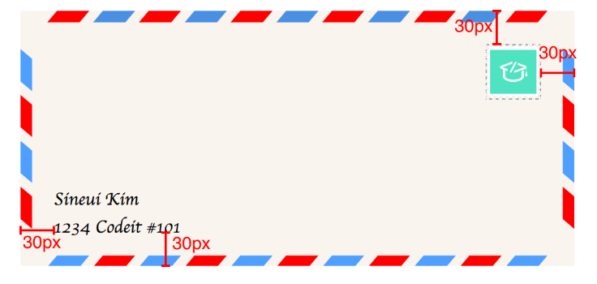

# 포지션 관련 공부

## static
> 포지셔닝이 안된 요소라고 칭함

`position: static`은 기본 위치를 뜻한다. 

## relative
`position: relative` 해당 된 엘리먼트들을 독립적인 위치를 정할 수 있다. 
```
potion: relative
top: 50px;
left: 50px;
```

## fixed
브라우저 기준으로 포지셔닝을 설정
주로 고정된 네비게이션바 자주 쓰인다.

## absolute
> 가장 가까운 `포지셔닝이 된` 조상(`Ancestor`) 요소가 기준
즉 부모의 `포시셔닝` 기준으로 잡는다.

만약 부모가 `포지셔닝`이 없지만 조부모의 `포지셔닝`이 되어 있는 경우 그 기준으로 잡는다. 


## 연습문제



- 부모 태그에 상대위치를 걸고
- 자식에 absoulte를 통해서 위치를 잡아 나간다. 

```
<!DOCTYPE html>
<html>
<head>
  <title>우표 붙이기</title>
  <meta charset="utf-8">
  <link rel="stylesheet" href="styles.css">
</head>
<body>
<div class="env-div">
  
  
  <div class="address">
    Sineui Kim<br>
    1234 Codeit #101
  </div>
</div>
</body>
</html>
```

```
.env-div {
  width: 500px;
  height: 232px;
    /* 1 */
  position: relative;
}

.address {
  font-family: cursive;
    position: absolute;
    bottom: 30px;
    left:30px;
}

/* 2 */
.stamp {
    position: absolute;
    top:30px;
    right:30px;
}

```


# CSS 상속 문제

일반적으로 자식은 부모의 CSS 속성들을 물려받는다. 
하지만 예외적인 속성들이 있으니 꼭 염두에 두고 하자. 

1. color
2. font-family
3. font-size
4. font-weight
5. line-height
6. list-style
7. text-align
8. visibility

만약 이걸 물려받기를 원하는 경우 `inherit` 를 통해서 물려받을 수 있다. 
```
.div1 {
  color: green;
}

.div2 {
  color: orange;
}

.div2 a {
  color: inherit;
}
```