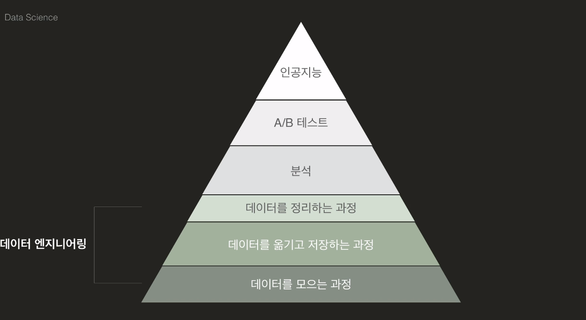
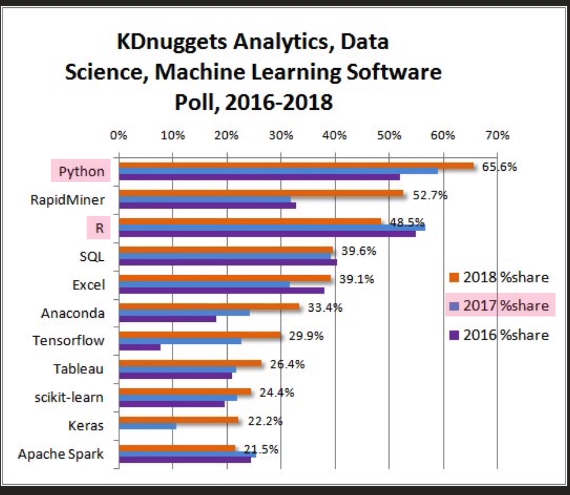

# 코드잇 공부

## 지금 당장 데이터 사이언스를 배워야 하는 이유

- 데이터가 많다 = 할수 있는 일이 많다. 
- 분야를 막론하고 데이터는 정말 중요하다.
- 데이터를 다룰수 있는 능력이 앞으로 정말 중요하다. 

## 데이터 사이언스란 무엇인가?

- 데이터 과학 = 다양한 데이터로부터 지식과 인사이트를 추출
- 데이터와 연관된 모든 것을 의미한다.
- 데이터를 수집해서 가치를 더할수 있는 일을 찾아서 그 문제를 해결하는 일을 뜻한다

## 데이터 사이언스에 필요한 능력

- 프로그래맹
- 수학과 통계
- 전문 도메인 지식

## 데이터 사이언스에 대한 오해

- 인공지능, 딥러닝에서 데이터가 차지하는 비중이 크다

## 데이터 사이언스의 순서

- 인공지능을 배우기 위해 기본기를 다지기 위해 기본 분석부터 배우자

## 데이터 사이언스의 목표

- 데이터에 가치를 더해서 주어진 문제를 해결

## 왜 파이썬으로 데이터 사이언스?

- R은 통계를 위해 만들어진 언어
  - 통계와 시각화만을 위한 툴
- 파이썬은 여러분야에 사용하기 때문에 다른 분야로 넘어갈 수 있다. 
- 파이썬이 현재 R 보다 더 데이터 사이언스쪽에서 인기가 높다.
- 

## 1장 정리

데이터 사이언스에는 어떤 단계들이 있을까요? 물론 상황과 분야에 따라 조금의 변동은 있겠지만, 대략적으로는 이런 순서로 진행됩니다.

1. 문제 정의하기
2. 데이터 모으기
3. 데이터 다듬기
4. 데이터 분석하기
5. 데이터 시각화 및 커뮤니케이션

## 문제 정의하기

> 해결하고자 하는 문제를 정의합니다.

이 단계에서는 해결하고자 하는 게 무엇인지, 언제까지 어떤 결과물을 얻을 것인지, 어떤 방식으로 데이터를 활용할 것인지 등을 설정합니다. 아무 목적 없이 데이터를 살펴 보면, 의미 있는 발견을 하기 어려우니까요!

- 목표 설정
- 기간 설정
- 평가 방법 설정
- 필요한 데이터 설정

## 데이터 모으기

> 필요한 데이터를 모을 수 있는 방법을 찾습니다.

누군가 이미 모아 놓은 데이터를 그대로 사용할 수도 있고, 공공 기관 등에서 배포한 자료를 찾아 볼 수도 있고, 혹은 웹사이트에서 직접 데이터를 수집할 수도 있습니다.

- 웹 크롤링
- 자료 모으기
- 파일 읽고 쓰기

## 데이터 다듬기

> 데이터의 퀄리티를 높여서 의미 있는 분석이 가능하게끔 합니다.

일반적으로 우리가 수집한 데이터에는 수많은 문제점들이 있습니다. 이런 문제점들로 인해 분석 자체가 불가능할 수도 있고, 혹은 분석을 하더라도 잘못된 결론으로 이어질 수도 있습니다. “쓰레기를 넣으면 쓰레기가 나온다(garbage in, garbage out)”라는 표현이 있을 정도입니다.

- 데이터 관찰하기
- 데이터 오류 제거
- 데이터 정리하기

## 데이터 분석하기

> 준비된 데이터로부터 의미를 찾습니다.

이 과정은 통계를 이용해서 수치적으로도 할 수도 있고, 수십 가지의 그래프를 그려보면서 탐색할 수도 있습니다. 우리가 처음 설계했던 방식대로 데이터를 활용해서 원하는 결과를 도출해 내야 합니다!

- 데이터 파악하기
- 데이터 변형하기
- 통계 분석
- 인사이트 발견
- 의미 도출

## 커뮤니케이션

> 분석 결과를 다른 사람들에게 전달합니다.

어떤 문제를 해결하려 했는지, 어떻게 데이터를 모았는지, 어떤 방식으로 어떤 인사이트를 얻었는지 등을 다른 사람들에게 전달해야 합니다. 적절한 시각화를 통해 소통을 원활히 할 수 있습니다.

- 다양한 시각화
- 커뮤니케이션
- 리포트

## 기본 구성

“데이터 사이언스 입문" 수업은 크게 다섯 개의 유닛으로 이루어져 있습니다. 각 유닛은 몇 개의 챕터로 이루어져 있고, 각 챕터는 여러 개의 레슨(영상, 노트, 과제, 퀴즈)으로 구성되어 있습니다.

목차를 간단하게 살펴 봅시다.

### Unit 1: 데이터 사이언스 시작하기

> 데이터 사이언스를 위한 준비!

요즘 데이터 사이언스 분야에서 핫한 Jupyter Notebook부터 시작해서, 파이썬으로 데이터 사이언스를 하기 위해 필수인 `numpy` 라이브러리와 `pandas` 라이브러리를 공부합니다.

- Chapter 1: 데이터 사이언스란?
- Chapter 2: Jupyter Notebook
- Chapter 3: Numpy
- Chapter 4: Pandas와 DataFrame

### Unit 2: DataFrame 다루기

> DataFrame 마스터하기!

파이썬으로 데이터 사이언스를 하는 매 순간 DataFrame이란 걸 사용해야 하는데요. DataFrame에 대한 기본적인 이해를 하고, 또 DataFrame을 현란하게 다루기 위한 트레이닝을 합니다.

- Chapter 5: 데이터 인덱싱
- Chapter 6: 데이터 변형하기
- Chapter 7: 큰 데이터 파악하기

### Unit 3: 데이터 분석과 시각화

> 데이터 분석가가 되기 위한 첫걸음!

코드잇의 “데이터 사이언스 입문” 수업에서는 일반적인 데이터 사이언스 프로세스를 거꾸로 공부합니다. 시각화와 통계를 이용한 분석을 가장 먼저 다룬다는 거죠. 다양한 시각화 툴과 기본적인 통계 공부를 통해, 놀라운 인사이트를 얻게 될 수 있습니다.

- Chapter 8: 시각화와 그래프
- Chapter 9: Seaborn 시각화
- Chapter 10: 통계 분석
- Chapter 11: Exploratory Data Analysis **( 3월 12일 오픈 예정!)**
- Chapter 12: 데이터 분석 인사이트 **( 3월 14일 오픈 예정!)**

## Unit 4: 데이터 퀄리티 높이기

> 쓰레기를 보석으로!

“쓰레기를 넣으면 쓰레기가 나온다(garbage in, garbage out)”고 앞서 말씀 드렸죠? 데이터의 좋은 기준이 무엇인지 이해하고 데이터를 고칠 수 있다면, 쓰레기 같은 코드도 충분히 보석으로 재탄생할 수 있습니다.

- Chapter 13: 좋은 데이터의 기준 **( 3월 16일 오픈 예정!)**
- Chapter 14: 데이터 클리닝 **( 3월 19일 오픈 예정!)**

## Unit 5: 데이터 만들어내기

> 웹의 모든 데이터가 내 거!

분석을 하기 위해 필요한 데이터를 수집해야겠죠? 웹페이지를 분해하는 코드도 작성하고, 자동으로 웹을 돌아다니면서 정보를 수집하는 프로그램도 만들어 봅니다.

- Chapter 15: 데이터를 만드는 방법 **( 3월 22일 오픈 예정!)**
- Chapter 16: 웹에서 긁어오기 **( 3월 25일 오픈 예정!)**
- Chapter 17: 필요한 것만 골라내기 **( 3월 28일 오픈 예정!)**
- Chapter 18: 셀레니움 **( 3월 31일 오픈 예정!)**

## 권장 학습법

흥미로운 학습을 위해 다양한 분야의 데이터를 사용해 보려 노력했습니다. 하지만 결국 여러분이 이 수업을 들으며 하셔야 할 일은, 데이터 사이언스를 관심 있는 분야와 접목시키는 것입니다.

챕터가 끝나면 바로 다음 챕터로 넘어가지 마시고, 이미 갖고 있는 데이터나 주변에서 쉽게 찾을 수 있는 데이터로 복습해 보세요. 좋아하는 분야에 대한 데이터 사이언스를 하면, 훨씬 즐겁고 보람 있게 공부할 수 있을 것입니다. 그리고 어쩌면 남들이 보지 못하는 것을 찾게 될 수도 있겠죠!

과제에는 필요에 따라 힌트가 제공되어 있습니다. 하지만 힌트를 먼저 열어보지 마시고, 힌트 없이 푸는 것을 최대한 시도해 보세요. 데이터 사이언스는 데이터를 능숙하게 다루고, 다양하게 사고하는 능력이 필요한 분야입니다. 힌트 없이 주어진 문제 만으로 해결하려고 하는 시도는 여러분의 실력과 사고력을 향상시켜 줄 것입니다. 도저히 안 되겠다 싶을 때 하나씩 힌트를 열어보세요!

## Jupyter notebook

## 설치

### 1. 아나콘다 다운로드

[아나콘다 다운로드 링크](https://www.anaconda.com/distribution/)로 접속한 뒤, 설치 파일을 다운로드 받습니다.

### 2. 아나콘다 설치

설치 파일을 실행하면 다음과 같은 화면이 나타납니다. `I Agree` 버튼을 눌러 설치를 진행하세요.

`next` 버튼을 눌러서 설치를 계속 진행합니다.

아래 사진과 같이 아나콘다가 설치될 경로를 정해주고 `next` 버튼을 눌러 다음 단계로 넘어갑니다.

설치에서 중요한 과정입니다. 만약에 `Add Anaconda to my PATH environment variable` 체크 박스에 체크를 하면 명령 prompt 창 (git , powershell, cmd)과 같은 환경에서 ananconda를 사용할 수 있습니다.

만약에 체크를 하지 않으면 windows에서 시작메뉴 아이콘을 클릭하는 방법으로만 Anaconda Navigator를 실행할 수 있습니다. 따라서 원하지 않는다면 체크를 하지 않아도 괜찮지만 추후 편의를 위해서 아래 체크박스를 선택하고 `install` 버튼을 눌러 설치를 진행하길 권장합니다.

설치가 완료되면 `next` 버튼을 눌러 다음 단계를 진행하세요.

만약 VS Studio Code를 설치하고 싶다면 설치를 진행하세요. 설치하지 않아도 Jupyter Notebook을 사용할 수 있습니다.

### 3. 설치 완료

설치가 완료되었습니다.

### 4. Jupyter Notebook 실행하기

Anaconda Navigator를 실행하고 `launch` 버튼을 눌러 Jupyter Notebook을 실행하세요.

## 쥬피터 노트북 단축키

- 실행 : Ctrl + Enter
- 셀추가 : 
  - a : above
  - b : below
  - 더블 d : 삭제
  - 마우스로 여러셀 선택 가능
  - 실행하고 새로운 셀 추가 : alt + enter