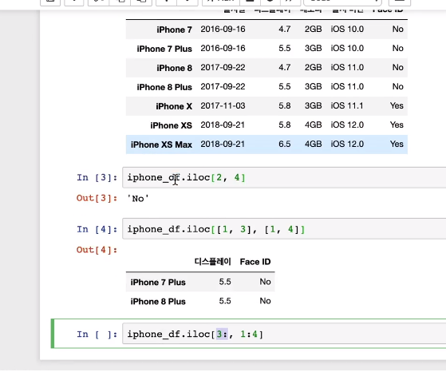

# DataFrame 위치를 인덱싱 하기

> iloc 를 사용하면 위치로(int) 인덱싱해서 값을 가져올 수 있다. 

```
iphone_df.iloc([1,3], [1,4])
```



## 정리

DataFrame 인덱싱을 하는 방법과 종류가 많아서 헷갈리기 쉽습니다.

인덱싱이 익숙해져야 다음 내용을 쉽게 배울 수 있으니, 꼭 숙지하고 넘어가세요!

| 이름으로 인덱싱하기           | 기본 형태                             | 단축 형태                      |
| ----------------------------- | ------------------------------------- | ------------------------------ |
| 하나의 row 이름               | `df.loc["row4"]`                      |                                |
| row 이름의 리스트             | `df.loc[["row4", "row5", "row3"]]`    |                                |
| row 이름의 리스트 슬라이싱    | `df.loc["row2":"row5"]`               | `df["row2":"row5"]`            |
| 하나의 column 이름            | `df.loc[:, "col1"]`                   | `df["col1"]`                   |
| column 이름의 리스트          | `df.loc[:, ["col4", "col6", "col3"]]` | `df[["col4", "col6", "col3"]]` |
| column 이름의 리스트 슬라이싱 | `df.loc[:, "col2":"col5"]`            |                                |

| 위치로 인덱싱하기             | 기본 형태               | 단축 형태 |
| ----------------------------- | ----------------------- | --------- |
| 하나의 row 위치               | `df.iloc[8]`            |           |
| row 위치의 리스트             | `df.iloc[[4, 5, 3]]`    |           |
| row 위치의 리스트 슬라이싱    | `df.iloc[2:5]`          | `df[2:5]` |
| 하나의 column 위치            | `df.iloc[:, 3]`         |           |
| column 위치의 리스트          | `df.iloc[:, [3, 5, 6]]` |           |
| column 위치의 리스트 슬라이싱 | `df.iloc[:, 3:7]`       |           |