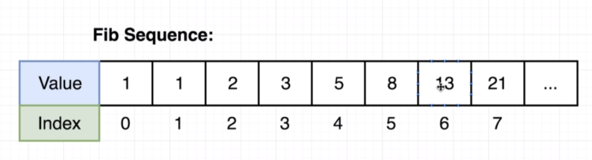
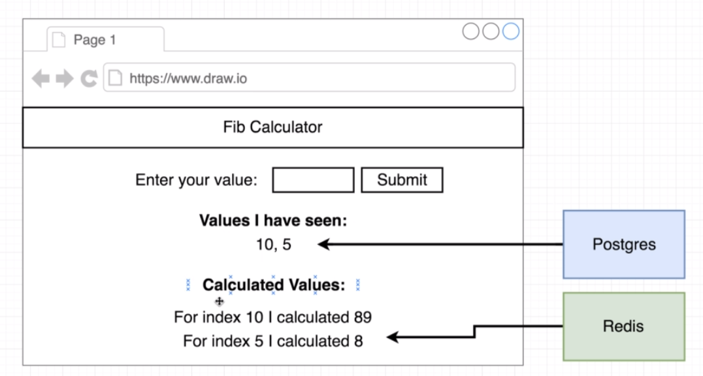
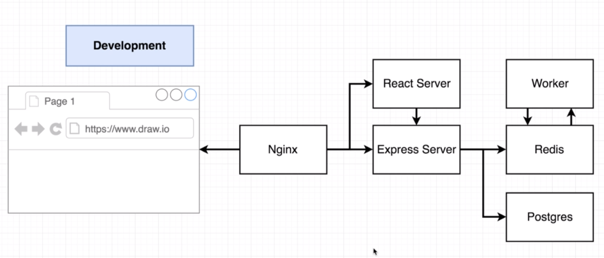
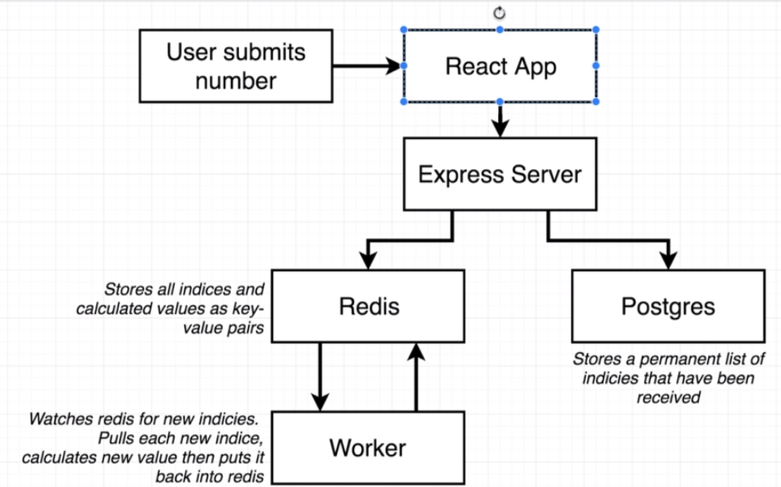
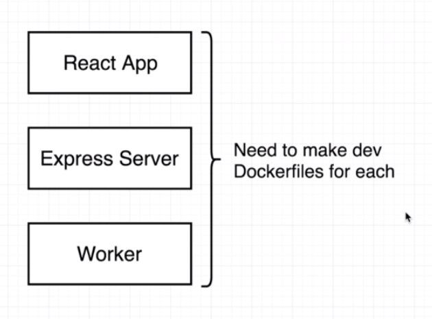
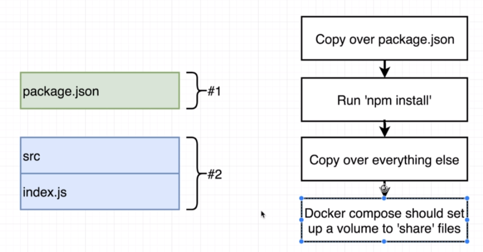
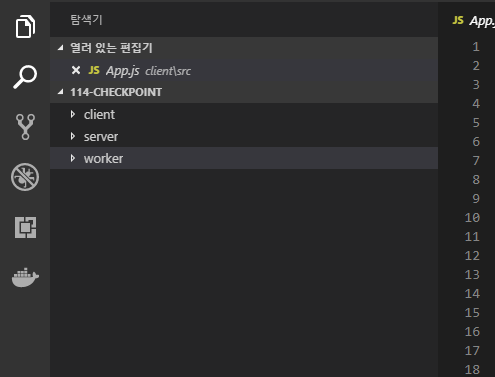

# 도커 & 쿠버네이트 5주차

1주차 스터디

- [Dockerfile을 이용한 서버 배포](http://javaexpert.tistory.com/967?category=719756)

2주차 스터디

- [Docker-compose 입문](http://javaexpert.tistory.com/975?category=719756)

3주차 스터디

- [github를 통해 aws ec2로 자동 배포 #1](http://javaexpert.tistory.com/984?category=719756)

4주차 스터디

- [github를 통해 aws ec2로 자동 배포 #2](http://javaexpert.tistory.com/986)


## 5주차 스터디 공부 내용

이번 차에서는 좀 더 복잡한 형태의 서비스를 구성해볼 예정이다. 

인덱스를 넣으면 해당되는 피보나치 수열을 계산하는 출력해주는 앱을 개발할 예정이다. 



## 화면 구성

화면은 `React` 로 작성될 예정이며 아래와 같이 구성된다. 

- 인덱스를 입력받는다. 
- Indicies I hava seen 에서는 지금까지 입력받은 인덱스를 저장해서 보여준다. ( by postgres db)
- 마지막 Worker 라는 로직을 통해서 수열이 계산되어 지고 그 값이 `Redis` 에 저장되서 보여주게 된다. 



## 서비스 구성





- Nginx` 서버를 통해서 접근된다. 
- 프론트는 `React Server` 로 프록시 된다. 
- API 서버는 `Express Server` 로 프록시 된다. 
- `Express Server`는 `Redis` 로 값을 호출하지만 있는 경우 바로 리턴이 되겠지만 없는 경우 `Worker` 를 통해서 계산된 값을 다시 가져와서 저장하고 리턴을 한다. 
- 마지막으로 유저가 입력한 index은 저장을 `postgres` 통해서 한다.

> 이후에 진행되는 [소스](https://github.com/bear2u/docker_study_examp1)는 여기에서 받을수 있다.

## 소스 구성

### Worker

피보나치 수열을 계산하는 로직이 담긴 서비스를 개발한다. 

- `redis` 추가시 구독
- 새로운 값이 입력되는 경우 `fib(index)` 함수를 통해서 값을 계산해서 다시 `redis` 에 저장한다.

> keys.js

```javascript
module.exports = {
  redisHost: process.env.REDIS_HOST,
  redisPort: process.env.REDIS_PORT
};
```

> index.js

```javascript
const keys = require('./keys');
const redis = require('redis');

const redisClient = redis.createClient({
  host: keys.redisHost,
  port: keys.redisPort,
  retry_strategy: () => 1000
});
const sub = redisClient.duplicate();

function fib(index) {
  if (index < 2) return 1;
  return fib(index - 1) + fib(index - 2);
}

sub.on('message', (channel, message) => {
  redisClient.hset('values', message, fib(parseInt(message)));
});
sub.subscribe('insert');
```

> package.json

```javascript
{
  "dependencies": {
    "nodemon": "1.18.3",
    "redis": "2.8.0"
  },
  "scripts": {
    "start": "node index.js",
    "dev": "nodemon"
  }
}
```

### Server

> keys.js

- 설정값은 추후 도커 환경변수로 입력받게 된다. 

```javascript
module.exports = {
  redisHost: process.env.REDIS_HOST,
  redisPort: process.env.REDIS_PORT,
  pgUser: process.env.PGUSER,
  pgHost: process.env.PGHOST,
  pgDatabase: process.env.PGDATABASE,
  pgPassword: process.env.PGPASSWORD,
  pgPort: process.env.PGPORT
};

```

> index.js

- `express` 서버 사용
- `postgres` 호출
- `redis` 호출
- api 호출 따른 restful 작성

```javascript
const keys = require('./keys');

// Express App Setup
const express = require('express');
const bodyParser = require('body-parser');
const cors = require('cors');

const app = express();
app.use(cors());
app.use(bodyParser.json());

// Postgres Client Setup
const { Pool } = require('pg');
const pgClient = new Pool({
  user: keys.pgUser,
  host: keys.pgHost,
  database: keys.pgDatabase,
  password: keys.pgPassword,
  port: keys.pgPort
});
pgClient.on('error', () => console.log('Lost PG connection'));

pgClient
  .query('CREATE TABLE IF NOT EXISTS values (number INT)')
  .catch(err => console.log(err));

// Redis Client Setup
const redis = require('redis');
const redisClient = redis.createClient({
  host: keys.redisHost,
  port: keys.redisPort,
  retry_strategy: () => 1000
});
const redisPublisher = redisClient.duplicate();

// Express route handlers

app.get('/', (req, res) => {
  res.send('Hi');
});

app.get('/values/all', async (req, res) => {
  const values = await pgClient.query('SELECT * from values');

  res.send(values.rows);
});

app.get('/values/current', async (req, res) => {
  redisClient.hgetall('values', (err, values) => {
    res.send(values);
  });
});

app.post('/values', async (req, res) => {
  const index = req.body.index;

  if (parseInt(index) > 40) {
    return res.status(422).send('Index too high');
  }

  redisClient.hset('values', index, 'Nothing yet!');
  redisPublisher.publish('insert', index);
  pgClient.query('INSERT INTO values(number) VALUES($1)', [index]);

  res.send({ working: true });
});

app.listen(5000, err => {
  console.log('Listening');
});

```

> package.json

```javascript
{
  "dependencies": {
    "express": "4.16.3",
    "pg": "7.4.3",
    "redis": "2.8.0",
    "cors": "2.8.4",
    "nodemon": "1.18.3",
    "body-parser": "*"
  },
  "scripts": {
    "dev": "nodemon",
    "start": "node index.js"
  }
}
```

### Client

- Routing 을 통해서 OtherPage.js 호출
- `react-create-app` 을 통해서 설치
- `Fib.js`, `App.js`, `Otherpage.js` 참고

> Fib.js

```javascript
import React, { Component } from 'react';
import axios from 'axios';

class Fib extends Component {
  state = {
    seenIndexes: [],
    values: {},
    index: ''
  };

  componentDidMount() {
    this.fetchValues();
    this.fetchIndexes();
  }

  async fetchValues() {
    const values = await axios.get('/api/values/current');
    this.setState({ values: values.data });
  }

  async fetchIndexes() {
    const seenIndexes = await axios.get('/api/values/all');
    this.setState({
      seenIndexes: seenIndexes.data
    });
  }

  handleSubmit = async event => {
    event.preventDefault();

    await axios.post('/api/values', {
      index: this.state.index
    });
    this.setState({ index: '' });
  };

  renderSeenIndexes() {
    return this.state.seenIndexes.map(({ number }) => number).join(', ');
  }

  renderValues() {
    const entries = [];

    for (let key in this.state.values) {
      entries.push(
        <div key={key}>
          For index {key} I calculated {this.state.values[key]}
        </div>
      );
    }

    return entries;
  }

  render() {
    return (
      <div>
        <form onSubmit={this.handleSubmit}>
          <label>Enter your index:</label>
          <input
            value={this.state.index}
            onChange={event => this.setState({ index: event.target.value })}
          />
          <button>Submit</button>
        </form>

        <h3>Indexes I have seen:</h3>
        {this.renderSeenIndexes()}

        <h3>Calculated Values:</h3>
        {this.renderValues()}
      </div>
    );
  }
}

export default Fib;

```

> OtherPage.js

```javascript
import React from 'react';
import { Link } from 'react-router-dom';

export default () => {
  return (
    <div>
      Im some other page
      <Link to="/">Go back to home page!</Link>
    </div>
  );
};

```

> App.js

```javascript
import React, { Component } from 'react';
import logo from './logo.svg';
import './App.css';
import { BrowserRouter as Router, Route, Link } from 'react-router-dom';
import OtherPage from './OtherPage';
import Fib from './Fib';

class App extends Component {
  render() {
    return (
      <Router>
        <div className="App">
          <header className="App-header">
            
            <h1 className="App-title">Welcome to React</h1>
            <Link to="/">Home</Link>
            <Link to="/otherpage">Other Page</Link>
          </header>
          <div>
            <Route exact path="/" component={Fib} />
            <Route path="/otherpage" component={OtherPage} />
          </div>
        </div>
      </Router>
    );
  }
}

export default App;
```


>  위의 모든 소스는 [여기](https://github.com/bear2u/docker_study_examp1)에서 받을수 있다. 


자 그럼 실제 이러한 서비스들을 각각의 도커로 만들어서 묶어서 연결하는지를 공부해도록 하자. 기대되는 순간이 아닐수 없다. 

## 도커 구성






### Complex 폴더

자 그럼 이제 도커 세팅을 해보자. 우선 기본 환경은 세개의 폴더로 구성된 루트에서 작업이 시작될 예정이다. 

> `complex` 폴더



### Client Dockerfile.dev

> Client > Dockerfile.dev

```javascript
FROM node:alpine
WORKDIR '/app'
COPY './package.json' ./
RUN npm install
COPY . .
CMD ["npm", "run", "start"]
```

이게 낯설다면 이전 주차들을 다시 공부하도록 하자. 

```
> docker build -f Dockerfile.dev .
....
> docker run 도커 아이디
```

## Server Dockerfile.dev

> Server > Dockerfile.dev

```
FROM node:alpine
WORKDIR "/app"
COPY ./package.json ./
RUN npm install
COPY . .
CMD ["npm", "run", "dev"]
```

```
> docker build -f Dockerfile.dev .
....
> docker run 도커 아이디
```

커넥션 오류가 나올것이다. 아직 DB를 올린게 아니라서 그렇다. 

