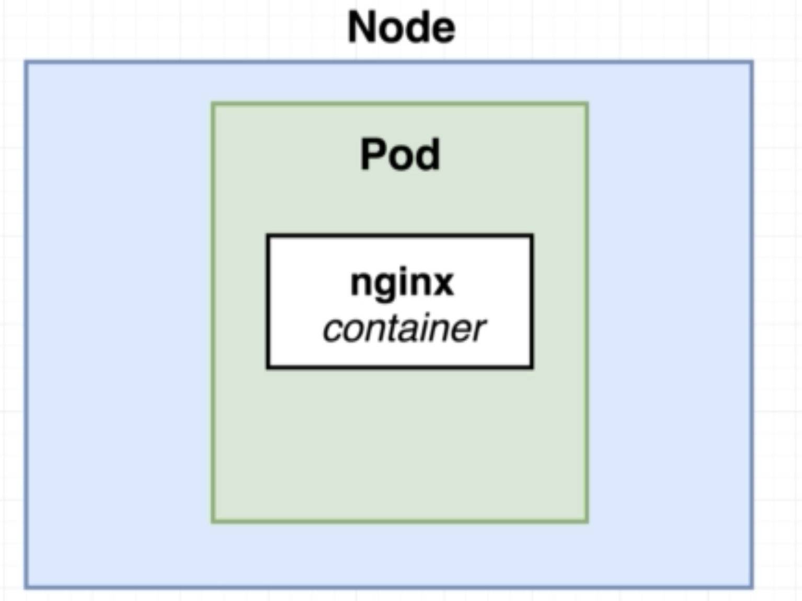
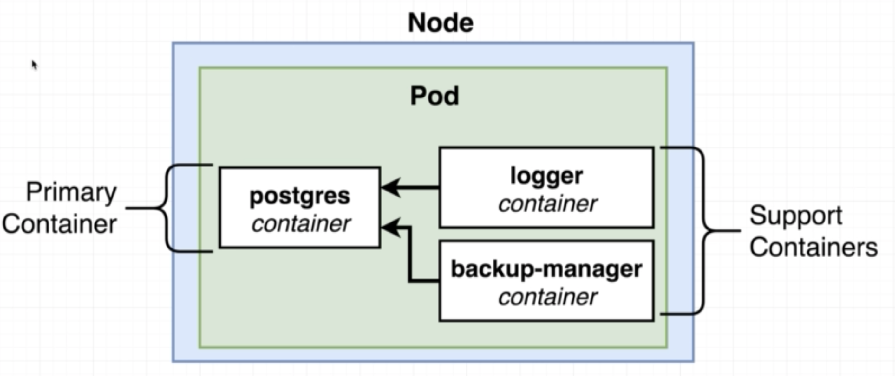
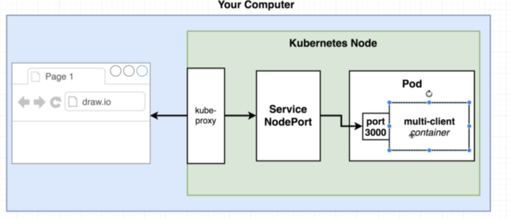
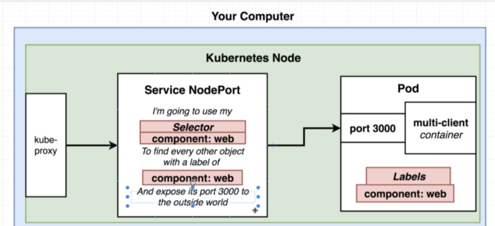
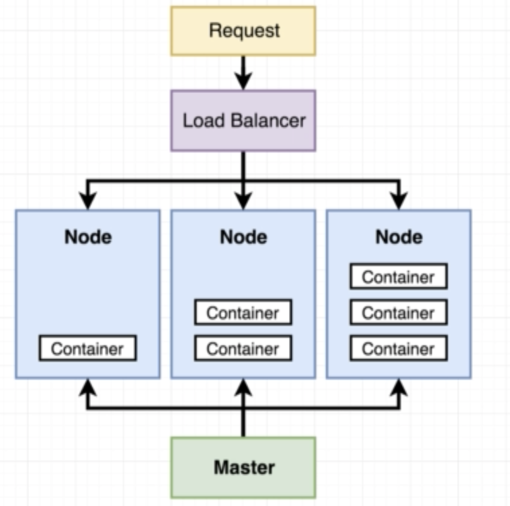

# Kubernetes

```
minikube start
```

## 상태확인

```
minikube status
```

## 클러스터 정보 확인

```
kubectl cluster-info
```

## 목표

다양한 도커 이미지들을 활용해서 로컬 쿠버네티스를 통해서 올리는 게 목표

## 도커 컴포즈와 쿠버네티스 비교

- docker-compose
  - 이미지들을 각각 빌드해서 올린다
  - 우리가 원하는 컨테이너를 만든다
  - 각 네트워크 속성들에 대해 정의를 각각 한다.
- kubernetes
  - 이미 모든 이미지들이 만들어져있다고 가정한다
  - 우리가 만들기를 원하는 하나의 오브젝트에 하나의 설정을 준비한다
  - 우리는 모든 네트워크를 수동으로 설정해야 한다

우리는 도커 허브에 이미 올라가있는 이미지를 가져와서 쿠버네티스에서 설정하고 배포를 하는 과정을 진행을 할 예정이다. 

## 포드 구성 파일 추가

- docker-hub 에서 `bear2u/multi-client` 검색
- 폴더를 새로 추가 (`mkdir sample-k8s`)
- 설정 파일 추가 
  - `client-pod.yaml`

```yaml
apiVersion: v1
kind: Pod
metadata:
    ## 1
  name: client-pod
  labels:
    component: web
spec:
	## 2
  containers:
    - name: client
      image: bear2u/multi-client
      ports:
      	    ## 3
        - containerPort: 3000    
```

1. kind는 만들고자 하는 오브젝트 유형
2. 다른 설정에서 불러와서 사용할 이름 정의
3. 포드 내 콘테이너들 설정 정의를 한다
4. 포드 내 콘테이너 포트를 정의를 한다. (내부용인걸 유념)

## 노드 설정 파일 추가

> client-node-port.yaml

```yaml
apiVersion: v1
kind: Service
metadata:
  name: client-node-port
spec:
  type: NodePort
  ports:
  	# 1
    - port: 3050  
    # 2
      targetPort: 3000
    # 3  
      nodePort: 31515
  selector:
    # 4
    component: web    
```

서비스 형태의 설정파일을 추가한다. 

- `kind : Service` 정의해서 서비스 설정 파일인걸 체크

1. port는 해당 서비스 포트를 뜻한다. 외부로 향하는 포트는 아니다. 
2. targetPort는 내부에 콘테이너 포트를 뜻한다. 
3. nodePort는 외부에서 접속시 들어올 수 있는 포트를 뜻한다. 

현재 개발 서버이기 때문에 따로 RB(로드 발랜싱)은 지정하지 않는다. 

## 설정파일

설정파일은 다음 4가지로 만들어질 수 있다. 

- StatefulSet 
- ReplicaController
- Pod 
- Service

`apiVersion`은 다음 두가지 종류를 가진다. 


## 기본 적인 노드의 구성




- 포드는 하나이상의 콘테이너를 담고 있어야 한다
- 하나의 포드에 여러개의 콘테이너를 담는 경우는 정말 긴밀하게 연결되어 있는 경우를 생각하자


## 설정 파일 타입


## 바람직한 예




## 구성도 (미니 큐브)






## 설정 파일 선언

이제 설정 파일 두개를 `kubectl` 를 통해서 `선언`을 하도록 하자. 

```
kubectl apply -f client-pod.yaml
kubectl apply -f client-node-port.yaml
```

## pods & services

설정한 내용에 대해서 포드 동작되는 지 체크할려면 아래와 같이 할 수 있다

```
kubectl get pods

.......
client-pod                            1/1       Running   1          1h
```

서비스에 대해서도 가져올 수 있다

```
kubectl get services

........
client-node-port              NodePort    10.109.106.191   <none>        3050:31515/TCP   6d
```


## 웹 테스트

이제 서버에 동작이 잘 되는지 체크하자. 

우선 IP를 가져오자. vm box를 통해서 가져와야 하기 때문에 머신을 통해야 한다

```
minikube ip

........
192.168.99.100
```

이제 실행해보자. 웹 브라우저에 다음과 같이 쳐서 들어갈 수 있다

```
http://192.168.99.100:31515/
```

## 전체 배포 흐름




## 참고

- docker ps 를 하면 현재 실행되고 있는 콘테이너들이 보인다. 그걸 죽이더라도 쿠버네티스가 다시 시작한다. 
- 선언형으로 이루어져서 운영자는 마스터에 설정파일을 적용하면 스케쥴로 인해 포드수를 서서히 올리거나 줄이도록 한다. 
- 물론 명령형으로 수동으로 올리거나 내릴순 있지만 추천은 안함

