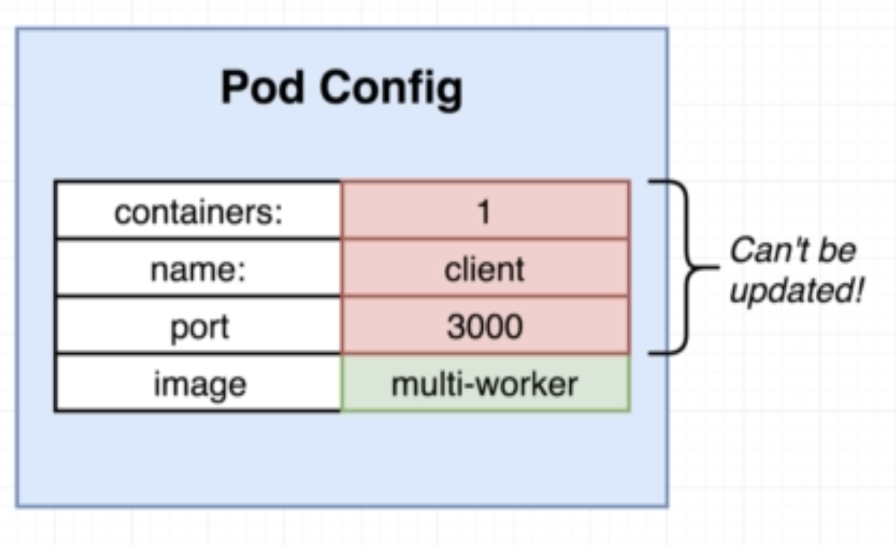
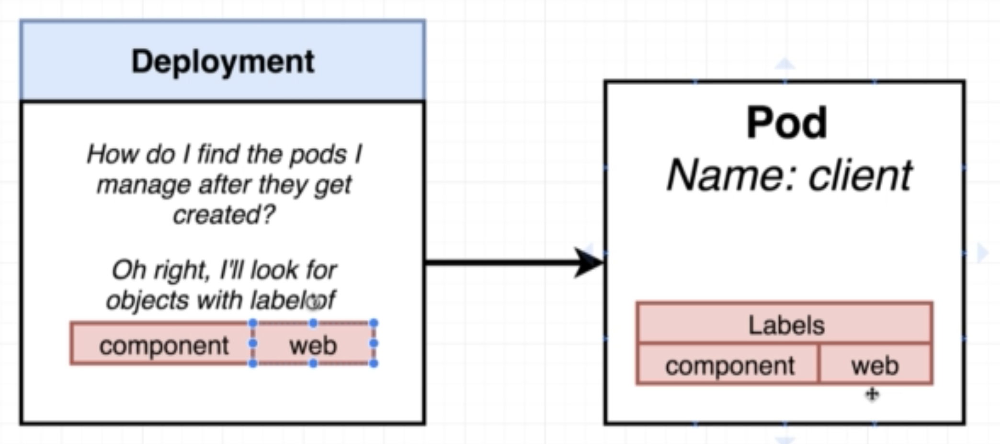
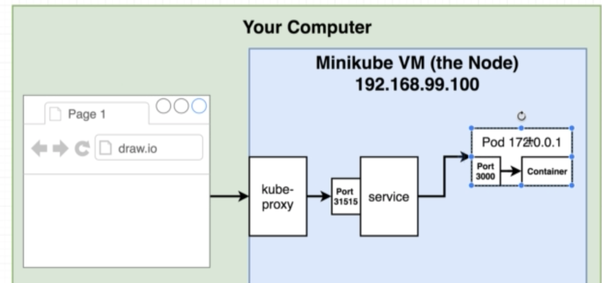
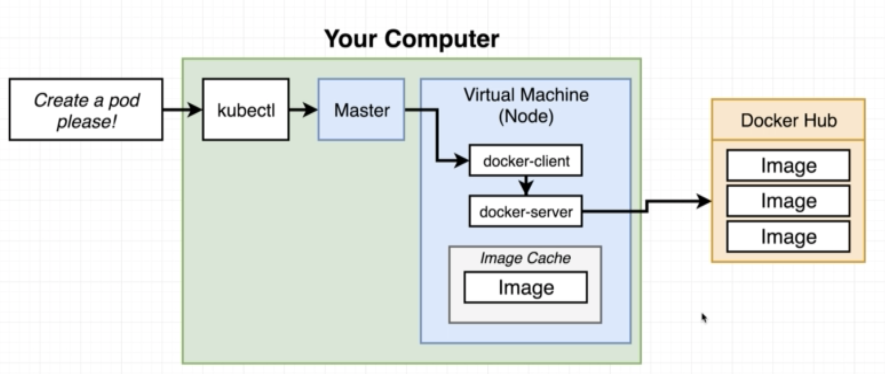
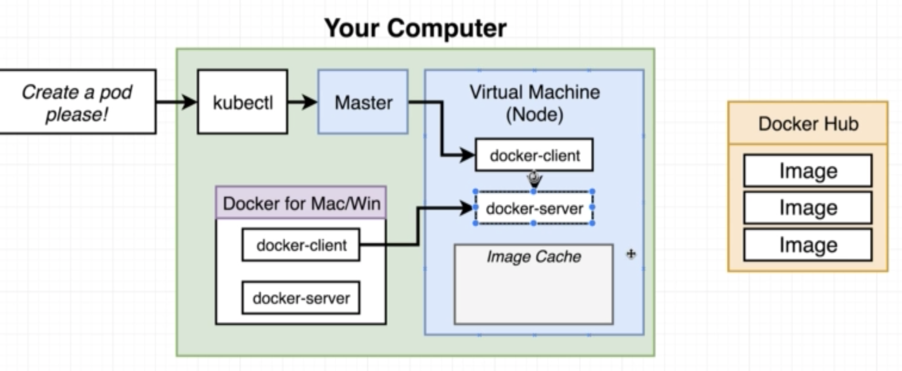

# 쿠버네티스 2번째 시간

## pod 자세한 설명 스크립트

```
# kubectl describe <object type> <object name>

> kubectl describe pod client-pod

...........

Name:         client-pod
Namespace:    default
Node:         minikube/10.0.2.15
Start Time:   Sat, 02 Feb 2019 12:05:16 +0900
Labels:       component=web
Annotations:  kubectl.kubernetes.io/last-applied-configuration={"apiVersion":"v1","kind":"Pod","metadata":{"annotations":{},"labels":{"component":"web"},"name":"client-pod","namespace":"default"},"spec":{"container...
Status:       Running
IP:           172.17.0.16
Containers:
  client:
    Container ID:   docker://465ecbe522f537a36c26c021d88c1efb21782daf1e6fffd1e93be3469701a4d5
    Image:          bear2u/multi-worker
    Image ID:       docker-pullable://bear2u/multi-worker@sha256:6559ad68144e14b8f6f3054ab0f19056853ea07a7c4ead068d9140bd0a33b926
    Port:           3000/TCP
    Host Port:      0/TCP
    State:          Running
      Started:      Sat, 09 Feb 2019 10:24:04 +0900
    Last State:     Terminated
      Reason:       Completed
      Exit Code:    0
      Started:      Sat, 09 Feb 2019 10:06:12 +0900
      Finished:     Sat, 09 Feb 2019 10:24:01 +0900
    Ready:          True
    Restart Count:  3
    Environment:    <none>
    Mounts:
      /var/run/secrets/kubernetes.io/serviceaccount from default-token-28mbg (ro)
Conditions:
  Type           Status
  Initialized    True
  Ready          True
  PodScheduled   True
Volumes:
  default-token-28mbg:
    Type:        Secret (a volume populated by a Secret)
    SecretName:  default-token-28mbg
    Optional:    false
QoS Class:       BestEffort
Node-Selectors:  <none>
Tolerations:     node.kubernetes.io/not-ready:NoExecute for 300s
                 node.kubernetes.io/unreachable:NoExecute for 300s
Events:
  Type    Reason                 Age               From               Message
  ----    ------                 ----              ----               -------
  Normal  Scheduled              6d                default-scheduler  Successfully assigned client-pod to minikube
  Normal  SuccessfulMountVolume  6d                kubelet, minikube  MountVolume.SetUp succeeded for volume "default-token-28mbg"
  Normal  Pulling                6d                kubelet, minikube  pulling image "bear2u/multi-client"
  Normal  Pulled                 6d                kubelet, minikube  Successfully pulled image "bear2u/multi-client"
  Normal  Created                6d                kubelet, minikube  Created container
  Normal  Started                6d                kubelet, minikube  Started container
  Normal  SuccessfulMountVolume  12h               kubelet, minikube  MountVolume.SetUp succeeded for volume "default-token-28mbg"
  Normal  SandboxChanged         12h               kubelet, minikube  Pod sandbox changed, it will be killed andre-created.
  Normal  Pulling                12h               kubelet, minikube  pulling image "bear2u/multi-client"
  Normal  Pulled                 12h               kubelet, minikube  Successfully pulled image "bear2u/multi-client"
  Normal  Created                12h               kubelet, minikube  Created container
  Normal  Started                12h               kubelet, minikube  Started container
  Normal  SuccessfulMountVolume  25m               kubelet, minikube  MountVolume.SetUp succeeded for volume "default-token-28mbg"
  Normal  SandboxChanged         25m               kubelet, minikube  Pod sandbox changed, it will be killed andre-created.
  Normal  Pulling                25m               kubelet, minikube  pulling image "bear2u/multi-client"
  Normal  Pulled                 25m               kubelet, minikube  Successfully pulled image "bear2u/multi-client"
  Normal  Killing                7m                kubelet, minikube  Killing container with id docker://client:Container spec hash changed (3635549375 vs 3145631940).. Container will be killed and recreated.
  Normal  Pulling                7m                kubelet, minikube  pulling image "bear2u/multi-worker"
  Normal  Created                7m (x2 over 25m)  kubelet, minikube  Created container
  Normal  Pulled                 7m                kubelet, minikube  Successfully pulled image "bear2u/multi-worker"
  Normal  Started                7m (x2 over 25m)  kubelet, minikube  Started container
```

##  업데이트 오류

만약 pod 설정파일에서 `containerPort`를 변경시 어떻게 되는지 보자

```
> kubectl apply -f client-pod.yaml

.......

the Pod "client-pod" is invalid: spec: Forbidden: pod updates may not change fields other than `spec.containers[*].image`, `spec.initContainers[*].image`, `spec.activeDeadlineSeconds` or `spec.tolerations` (only additions to existing tolerations)
{"Volumes":[{"Name":"default-token-28mbg","HostPath":null,"EmptyDir":null,"GCEPersistentDisk":null,"AWSElasticBlockStore":null,"GitRepo":null,"Secret":{"SecretName":"default-token-28mbg","Items":null,"DefaultMode":420,"Optional":null},"NFS":null,"ISCSI":null,"Glusterfs":null,"PersistentVolumeClaim":null,"RBD":null,"Quobyte":null,"FlexVolume":null,"Cinder":null,"CephFS":null,"Flocker":null,"DownwardAPI":null,"FC":null,"AzureFile":null,"ConfigMap":null,"VsphereVolume":null,"AzureDisk":null,"PhotonPersistentDisk":null,"Projected":null,"PortworxVolume":null,"ScaleIO":null,"StorageOS":null}],"InitContainers":null,"Containers":[{"Name":"client","Image":"bear2u/multi-worker","Command":null,"Args":null,"WorkingDir":"","Ports":[{"Name":"","HostPort":0,"ContainerPort":

A: 9999,"Protocol":"TCP","HostIP":""}],"EnvFrom":null,"Env":null,"Resources":{"Limits":null,"Requests":null},"VolumeMounts":[{"Name":"default-token-28mbg","ReadOnly":true,"MountPath":"/var/run/secrets/kubernetes.io/serviceaccount","SubPath":"","MountPropagation":null}],"VolumeDevices":null,"LivenessProbe":null,"ReadinessProbe":null,"Lifecycle":null,"TerminationMessagePath":"/dev/termination-log","TerminationMessagePolicy":"File","ImagePullPolicy":"Always","SecurityContext":null,"Stdin":false,"StdinOnce":false,"TTY":false}],"RestartPolicy":"Always","TerminationGracePeriodSeconds":30,"ActiveDeadlineSeconds":null,"DNSPolicy":"ClusterFirst","NodeSelector":null,"ServiceAccountName":"default","AutomountServiceAccountToken":null,"NodeName":"minikube","SecurityContext":{"HostNetwork":false,"HostPID":false,"HostIPC":false,"ShareProcessNamespace":null,"SELinuxOptions":null,"RunAsUser":null,"RunAsGroup":null,"RunAsNonRoot":null,"SupplementalGroups":null,"FSGroup":null},"ImagePullSecrets":null,"Hostname":"","Subdomain":"","Affinity":null,"SchedulerName":"default-scheduler","Tolerations":[{"Key":"node.kubernetes.io/not-ready","Operator":"Exists","Value":"","Effect":"NoExecute","TolerationSeconds":300},{"Key":"node.kubernetes.io/unreachable","Operator":"Exists","Value":"","Effect":"NoExecute","TolerationSeconds":300}],"HostAliases":null,"PriorityClassName":"","Priority":null,"DNSConfig":null}

B: 3000,"Protocol":"TCP","HostIP":""}],"EnvFrom":null,"Env":null,"Resources":{"Limits":null,"Requests":null},"VolumeMounts":[{"Name":"default-token-28mbg","ReadOnly":true,"MountPath":"/var/run/secrets/kubernetes.io/serviceaccount","SubPath":"","MountPropagation":null}],"VolumeDevices":null,"LivenessProbe":null,"ReadinessProbe":null,"Lifecycle":null,"TerminationMessagePath":"/dev/termination-log","TerminationMessagePolicy":"File","ImagePullPolicy":"Always","SecurityContext":null,"Stdin":false,"StdinOnce":false,"TTY":false}],"RestartPolicy":"Always","TerminationGracePeriodSeconds":30,"ActiveDeadlineSeconds":null,"DNSPolicy":"ClusterFirst","NodeSelector":null,"ServiceAccountName":"default","AutomountServiceAccountToken":null,"NodeName":"minikube","SecurityContext":{"HostNetwork":false,"HostPID":false,"HostIPC":false,"ShareProcessNamespace":null,"SELinuxOptions":null,"RunAsUser":null,"RunAsGroup":null,"RunAsNonRoot":null,"SupplementalGroups":null,"FSGroup":null},"ImagePullSecrets":null,"Hostname":"","Subdomain":"","Affinity":null,"SchedulerName":"default-scheduler","Tolerations":[{"Key":"node.kubernetes.io/not-ready","Operator":"Exists","Value":"","Effect":"NoExecute","TolerationSeconds":300},{"Key":"node.kubernetes.io/unreachable","Operator":"Exists","Value":"","Effect":"NoExecute","TolerationSeconds":300}],"HostAliases":null,"PriorityClassName":"","Priority":null,"DNSConfig":null}
```



- 이미지만 변경할수 있다는 걸 유념하자

## Deployment

기존 포드형태에서는 이미지말고는 변경이 안된다. 이걸 극복하기 위해서 Depoyment라는 개념을 하나 더 추가를 하자

Deployment에서는 Pod 설정을 가지고 있다. 

pod 에서 포트를 변경시 Deployment 에서는 포트를 죽이고 새로운 포트를 올린다. 

그럼 새 파일을 만들어서 설정 파일을 만들자

> client-deployment.yaml

```yaml
apiVersion: apps/v1
kind: Deployment
metadata:
  name: client-deployment
spec:
  replicas: 1
  selector: 
    matchLabels:
      component: web
  template:
    metadata:
      labels:
        component: web
    spec:
      containers:         
        - name: client
          image: bear2u/multi-client
          ports:
            - containerPort: 3000 
```

- template 밑에 포드를 구성
- replicas 를 1개이상 설정시 템플릿을 여러개 만든다



##  설정 파일 삭제

>  기존 설정 파일 삭제를 할 때 사용되는 스크립트

```
kubectl delete -f client-pod.yaml
```

10초 정도 후에 확인을 해보자

```
kubectl get pods

...
no resources found
```

새로운 deployment 설정 파일 적용

```
$ kubectl apply -f client-deployment.yaml
deployment.apps "client-deployment" configured
```

- `pods ->` `deployments` 로 명령어가 변경이 되는 점 유의

```
$ kubectl get deployments
NAME                  DESIRED   CURRENT   UP-TO-DATE   AVAILABLE   AGE
client-deployment     1         1         1            1           56d
```

- pods 확인시 deployment 로 자동 생성되는 걸 확인 가능하다

```
$ kubectl get pods
NAME                                  READY     STATUS    RESTARTS   AGE
client-deployment-848b54d879-ch26z    1/1       Running   5          56d
```

- 이미지를 바꿔서 새롭게 `deployment` 에서 포드가 변경되는 걸 보자

```
$ kubectl get pods
NAME                                  READY     STATUS              RESTARTS   AGE
client-deployment-848b54d879-ch26z    1/1       Running             5          56d
client-deployment-89bb69575-54pnn     0/1       ContainerCreating   0          5s
$ kubectl get pods
NAME                                  READY     STATUS    RESTARTS   AGE
client-deployment-89bb69575-54pnn     1/1       Running   0          43s
```

- 자세한 설명을 보여주는 명령어

```
$ kubectl get pods -o wide
NAME                                  READY     STATUS    RESTARTS   AGE       IP            NODE
client-deployment-89bb69575-54pnn     1/1       Running   0          7m        172.17.0.1   minikube
```



```
kubectl describe pods client-deployment
```

- deployment.yaml 에서 replica를 변경시 숫자를 주목하자

```
...
replicas: 5
....
```

```
$ kubectl apply -f client-deployment.yaml

$ kubectl get deployment
NAME                  DESIRED   CURRENT   UP-TO-DATE   AVAILABLE   AGE
client-deployment     5         3         3            1           56d
```

- 하나씩 하나씩 올라가는 걸 확인 할 수 있다. 


## 도커 업데이트 이미지 배포

만약 도커내 이미지가 업데이트 되는 경우 배포를 하는 경우에 대해서 알아보자

- 도커 허브에 푸시
- 마지막 이미지를 다시 가져와서 배포

```
kubectl apply -f client-deployment.yaml

nothing changed
```

하지만 이미 변경된 내용이 없기 때문에 적용이 안된다. 이 부분을 해결하기 위해서는 다음 3가지의 방법이 있을 수 있다

- 수동으로 설정을 삭제한다 (비추천)
- **태그별로 이미지를 만들어서 업데이트 진행(많이 쓰는 편)**
  - 이미지가 변경되기 때문에 새로운 포드가 올라가고 업데이트를 진행한다
  - ex) bear2u/multi-client:v1...v2
- **선언형 명령어로 업데이트 선언**


### 새로운 업데이트 단계

1. 도커 이미지 태그별로 생성

   ```
   docker build -t bear2u/multi-client:v2 .
   ```

2. 도커 허브로 푸시

   ```
   docker push <tag>
   ```

3. 쿠버네티스 업데이트 명령어로 실행

   ```
   # kubectl set image <object_type> / <object_name> <container_name> = <new image to use>
   
   $ kubectl set image deployment/client-deployment client=bear2u/multi-client:v2
   ```

4. 업데이트 서버 테스트

   ```
   http://192.168.99.100:31515
   ```





- 현재 로컬에 있는 도커와 쿠버네티스(미니큐브)는 다른 가상서버라서 도커가 분리되서 공유되지 않는다

해당 미니큐브 서버로 접속하기 위해서는 eval 명령어를 이용할 수 있다. (도커 환경 설정이 가능하다)

실행시 미니큐브에 있는 도커 콘테이너를 볼수 있다

```
$ eval $(minikube docker-env)
$ docker ps
........
CONTAINER ID        IMAGE                        COMMAND                  CREATED             STATUS PORTS                                                                NAMES
5551a5172d45        bear2u/multi-client          "nginx -g 'daemon of…"   14 minutes ago      Up 14 minutes                                                                      k8s_client_client-deployment-747d8c754-kncgq_default_17678d42-2c1f-11e9-8634-08002761bac3_0
5d2e22a0c7c9        k8s.gcr.io/pause-amd64:3.1   "/pause"                 14 minutes ago      Up 14 minutes                                                                      k8s_POD_client-deployment-747d8c754-kncgq_d
```

```
$ minikube docker-env

export DOCKER_TLS_VERIFY="1"
export DOCKER_HOST="tcp://192.168.99.100:2376"
export DOCKER_CERT_PATH="/Users/bear2u/.minikube/certs"
export DOCKER_API_VERSION="1.35"
# Run this command to configure your shell:
# eval $(minikube docker-env)
```

### 그럼 이 과정이 필요한 이유는 ?

- 직접 쿠버네티스 노드 안에 도커 로그를 확인할 경우

- 쿠버네티스내 캐싱된 도커들 정리할 경우

  - ```
    docker system prune -a
    ```


### kubectl 로 minikube 도커로 접속가능

```
kubectl exec -it <docker image name>
kubectl logs <docker image name>
```


## 결론

오늘 공부한 내용은 다음과 같다. 

- 포드에 대한 설명 및 실행 스크립트
- 업데이트시 하는 방법에 대해서 고민
- Pods와 Depolyment와의 관계
- minikube 내 도커 시스템 접속 및 관리
- 설정 파일 삭제 방법


이상으로 9주차 도커 & 쿠버네티스 스터디 정리 내용이다. 참석해주셔서 감사합니다.

