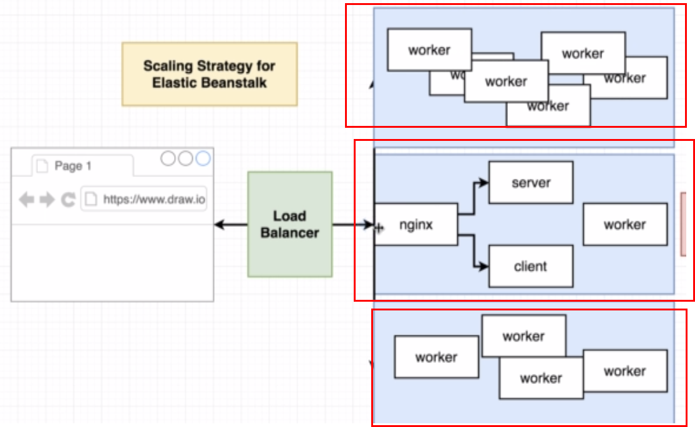
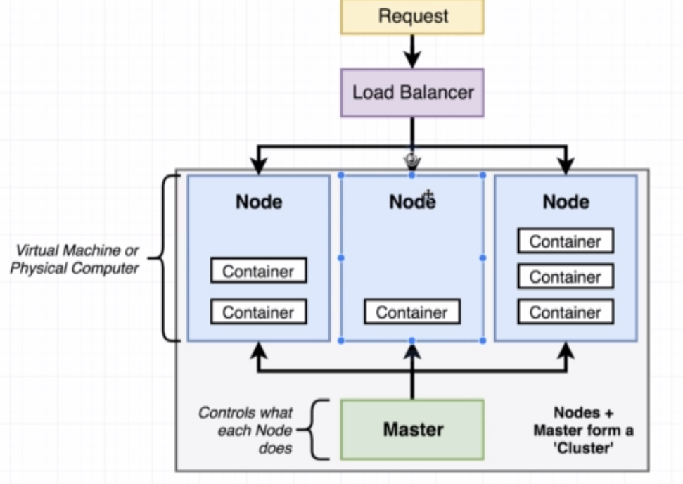
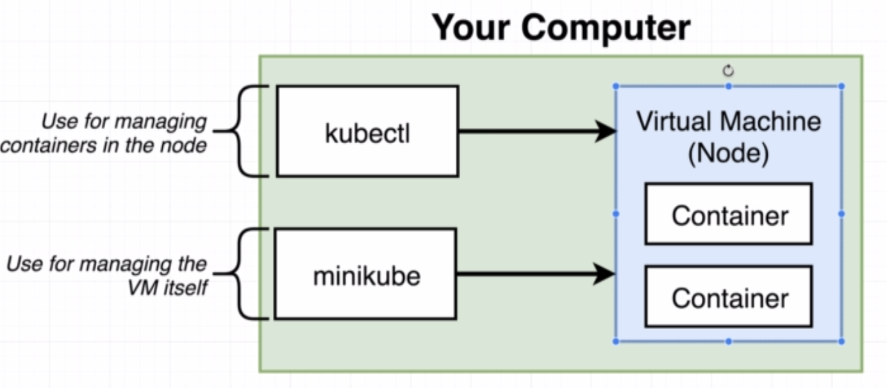

# 쿠버 네티스 1주차 스터디

## 쿠버네티스 장점

쿠버네티스를 이용해서 도커 콘테이너들을 유연하게 배치를 할 수 있다. 

위에 같이 도커 콘테이너들을 또 하나의 그룹으로 만들어서 배치를 할수 있는게 가장 큰 장점이라고 한다. 

## 쿠버네티스 클러스터 기본 구조

마스터에 설정을 *선언* 을 하면 그에 따라서 세팅이 변한다. 

## 쿠버네티스를 쓰는 이유?

다른 이미지들이 속해있는 도커 콘테이너들을 많이 돌릴때 쿠버네티스를 쓰면 유용하다고 한다. 

## 쿠버네티스 실습 환경

- 개발시에는 `minikube` 를 통해서 진행한다
- `Production` 에서는 `EKS (Amazon)`, `GKE(Google)`, 직접클러스터 설치

## MiniKube 설치 진행

1. Kubectl 설치
2. virtualbox install
3. minikube 설치

window 10에 설치할 경우에는 [이곳](https://medium.com/@JockDaRock/minikube-on-windows-10-with-hyper-v-6ef0f4dc158c)을 참조하자

