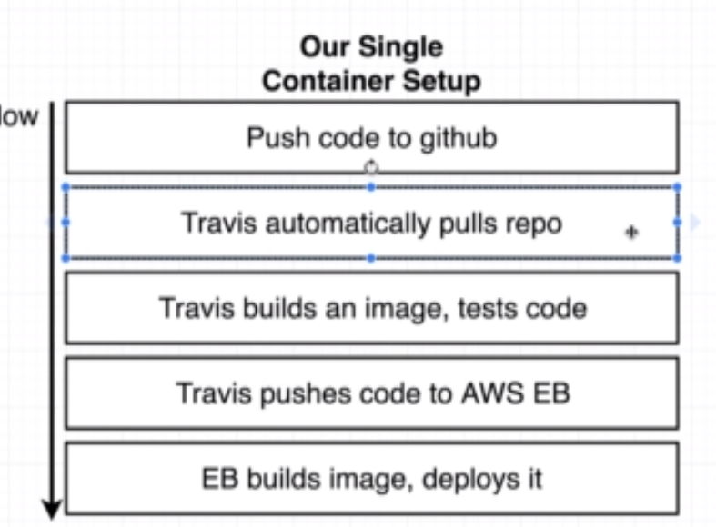
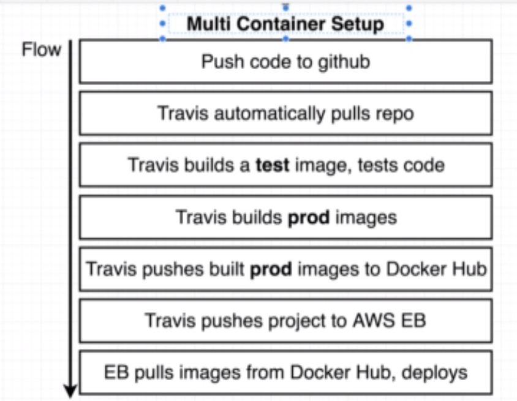
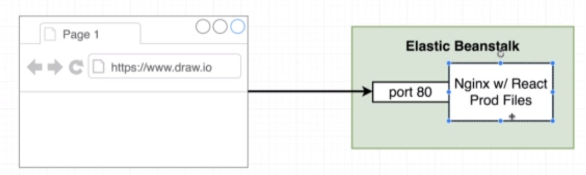
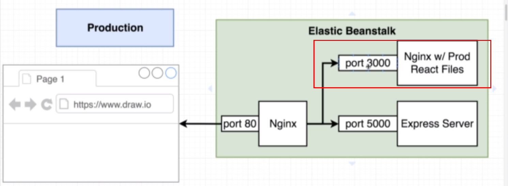
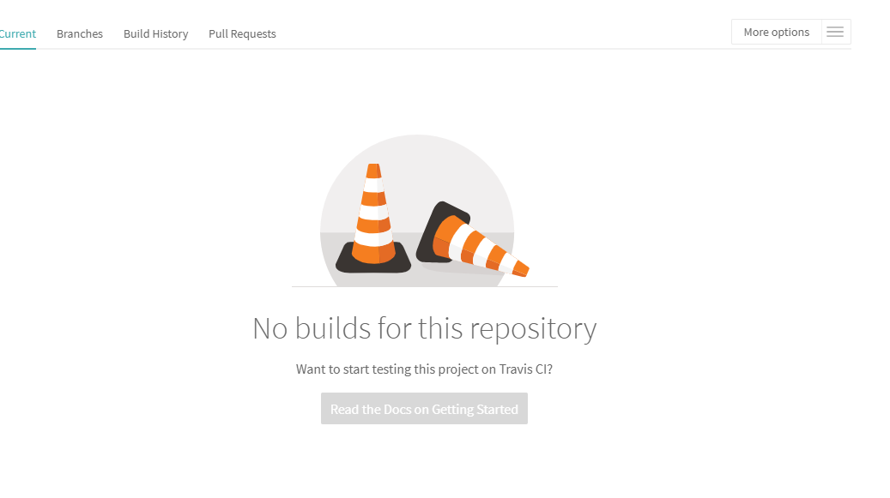
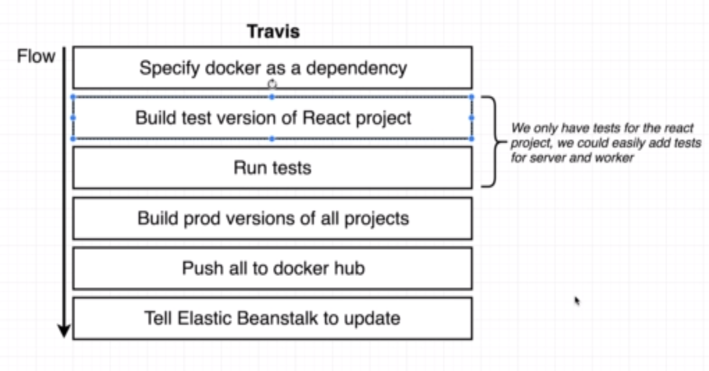
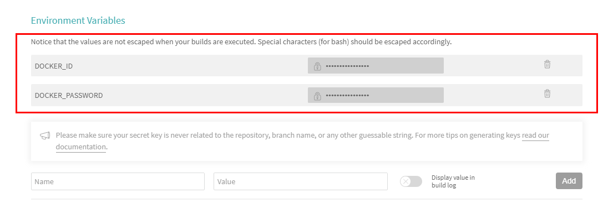
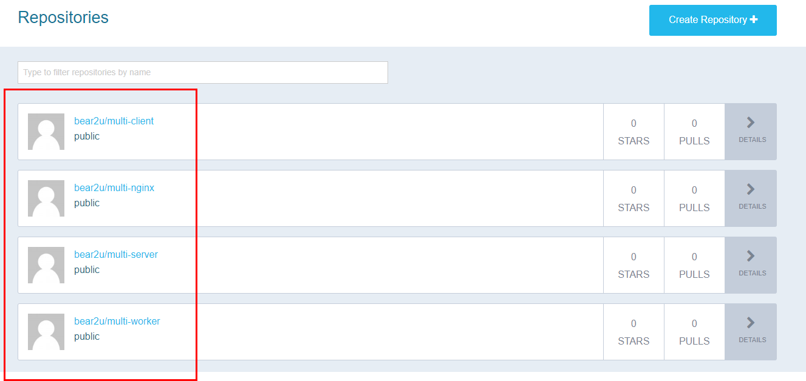

## 도커&쿠버네티스 6주차 스터디 정리내용

> 부산에서 매주 진행되는 스터디입니다. 
>
> 부산에서 다른 스터디 내용을 보실려면 [카페](https://cafe.naver.com/busandev) 에서 보실수 있습니다.
>
> <https://www.udemy.com/docker-and-kubernetes-the-complete-guide> 을 공부하고 있습니다
>
> 출처: 
>
> http://javaexpert.tistory.com/990?category=719756

1주차 스터디

- [Dockerfile을 이용한 서버 배포](http://javaexpert.tistory.com/967?category=719756)

2주차 스터디

- [Docker-compose 입문](http://javaexpert.tistory.com/975?category=719756)

3주차 스터디

- [github를 통해 aws ec2로 자동 배포 #1](http://javaexpert.tistory.com/984?category=719756)

4주차 스터디

- [github를 통해 aws ec2로 자동 배포 #2](http://javaexpert.tistory.com/986)

5주차 스터디

- [복잡한 형태의 서비스를 도커로 배포하기](http://javaexpert.tistory.com/990)

## 스터디 내용

이번 6주차에는 이전 주차에서 공부한 내용을 기반으로 `Client Production` 을 `Docker Hub` 로 `Travis`를 통해서 자동 배포하는 걸 배울 예정이다. 

그리고 `Production` 을 하는 방법에 대해서도 공부하도록 한다. 

이전에 배운 내용(`Single`) 과 이번 주차 부터 배울 내용에 대한 `Flow` 를 알아보도록 하자. 

### Single Container Flow

- Github 에 푸시
- `Travis` 에 자동으로 레포를 웹훅으로 가져온다. 
- `Travis`에서 이미지를 빌드하고 코드들을 테스팅 한다. 
- `AWE EB(ElasticBean)` 에 `Travis`는 코드를 푸시한다. 
- `EB`는 이미지를 빌드하고 그걸 배포한다. 



### Multi Container Flow

- `Github` 에 푸시
- `Travis`에 자동으로 레포를 웹훅으로 가져온다. 
- `Travis` 는 이미지를 테스트하고 코드를 테스트한다. 
- **Travis 는 Production 이미지를 빌드한다. **
- `Travis `는 도커허브에 `Prod.` 이미지들을 푸시한다. 
  - `Docker Hub ID,PWD` 는 따로 셋팅에서 저장한다. 
- `Travis` 는 `AWS EB` 에 프로젝트를 푸시한다. 
- `EB`는 도커허브로 부터 이미지들을 가져와서 배포한다. 



## 사전 준비

자 그럼 시작을 해보자. 

우선 소스를 이전꺼 다음으로 진행할텐데 `Github checkout` 으로 같이 시작을 할 수 있다. 

```
> git clone https://github.com/bear2u/docker-study2.git
...
> git checkout 64b470215f24a1450cd7d70d72f79700f0781542
....

```

### Dockerfile

> `worker / Dockerfile`

`Dockerfile.dev` 파일 내용과 같으며 마지막에 커맨드 라인만 `dev` -> `start` 로 변경해준다. 

```
FROM node:alpine
WORKDIR "/app"
COPY ./package.json ./
RUN npm install
COPY . .
CMD ["npm", "run", "start"]
```

> `server / Dockerfile`

```
FROM node:alpine
WORKDIR "/app"
COPY ./package.json ./
RUN npm install
COPY . .
CMD ["npm", "run", "start"]
```

> `nginx / Dockerfile`

```
FROM nginx
COPY ./default.conf /etc/ngnix/conf.d/default.conf
```

### Client with another nginx

`client` 은 좀 복잡하다. 

`싱글 콘테이너`를 만들때 `nginx` 와 `react build`를 통해서 서버를 구성했었다. 



하지만 멀티 콘테이너를 구성시 외부에도 `nginx` 를 두고 내부에도 `nginx` 를 세팅해야 하는 걸 명심하자. 



그럼 멀티 콘테이너 구성시 어떻게 하는지 알아보자. 

### Client 내부 ngnix 구성 

> `client / nginx`/ `default.conf`

3000 포트로 들어오도록 허용하며 `index` 파일을 메인으로 한다.

```
server {
    listen 3000;

    location / {
        root /usr/share/nginx/html;
        index index.html index.htm;
        try_files $uri $uri/ /index.html;
    }
}
```

> `client`/`Dockerfile`

- `builder` 이미지에 `build` 된 `Prod` 파일들을 넣고
- `nginx` 설정을 복사를 하고
- `nginx` 에 이전 `builder` 내 `/app/build` 폴더에 있는 `Prod` 파일들을 `html` 로 복사를 해준다. 

```
FROM node:alpine as builder
WORKDIR '/app'
COPY ./package.json ./
RUN npm install
COPY . .
RUN npm run build

FROM nginx
EXPOSE 3000
COPY ./nginx/default.conf /etc/nginx/conf.d/default.conf
COPY --from=builder /app/build /user/share/nginx/html
```

### Client test 수정

현재로썬 `Client Test`  진행시 충돌이 발생될 수 있다고 한다. 당장은 비활성화를 하고 진행하도록 하자. 

> `client / src/ App.test.js`

```
import React from 'react';
import ReactDOM from 'react-dom';
import App from './App';

it('renders without crashing', () => {});
```

이제 준비가 다 되었다. Travis 를 연결해서 배포를 해보자. 

## Travis + Github 연동

만약 새로운 프로젝트이면 `Github`에 저장소를 만들어서 푸시하고`Travis` 에서 활성화를 해주도록 하자. 

- `Github` 에 푸시

- `Travis` 에서 연동

  - 만약 목록에 안나온다면 왼쪽 상단에 `Sync Account`를 클릭해서 동기화를 하자. 

    




## Travis 설정



> `.travis.yml`
>
> 주의점은 `travis` 설정시 태그를 꼭 도커 허브 아이디를 태그명으로 지정해줘야 한다. 

```
sudo: required
services:
  - docker

before_install:
  - docker build -t bear2u/react-test -f ./client/Dockerfile.dev ./client

script:
  - docker run bear2u/react-test npm test -- --coverage

after_success:
  - docker build -t bear2u/multi-client ./client
  - docker build -t bear2u/multi-nginx ./nginx
  - docker build -t bear2u/multi-server ./server
  - docker build -t bear2u/multi-worker ./worker
  # Log in to the docker CLI
  - echo "$DOCKER_PASSWORD" | docker login -u "$DOCKER_ID" --password-stdin
  # Take those images and push them to docker hub
  - docker push bear2u/multi-client
  - docker push bear2u/multi-nginx
  - docker push bear2u/multi-server
  - docker push bear2u/multi-worker

```

`Beanstalk` 에 올리는 과정을 제외한 `docker hub`에 올리는 것까지 진행되었다. 

도커 허브 관련해서 `id, password` 는 셋팅을 통해서 해준다. 

> `Settings`




그럼 `Github`에 푸시를 해본다. 

`Travis` 가 정상적으로 연동되어서 `hub` 에 푸시가 되는 걸 확인 할 수 있다. 

```
.... 


Time:        1.19s
Ran all test suites.
--------------------------|----------|----------|----------|----------|-------------------|
File                      |  % Stmts | % Branch |  % Funcs |  % Lines | Uncovered Line #s |
--------------------------|----------|----------|----------|----------|-------------------|
All files                 |        0 |        0 |        0 |        0 |                   |
 App.js                   |        0 |      100 |        0 |        0 |                10 |
 Fib.js                   |        0 |      100 |        0 |        0 |... 44,45,52,56,62 |
 OtherPage.js             |        0 |      100 |        0 |        0 |                 5 |
 index.js                 |        0 |        0 |        0 |        0 |     1,2,3,4,5,7,8 |
 registerServiceWorker.js |        0 |        0 |        0 |        0 |... 36,137,138,139 |
--------------------------|----------|----------|----------|----------|-------------------|
travis_time:end:2e40ccb6:start=1541861556459182738,finish=1541861559398870991,duration=29396882

......
......


ac7ed8526610: Pushed
5761fba18cc8: Pushed
e9aaefdfed5d: Pushed
latest: digest: sha256:2eadc96e313836b05b807d46c2692c2818856c11aa1aa15dde69edd2103a5315 size: 1782
travis_time:end:0578baae:start=1541861604426303298,finish=1541861609935082744,duration=5508779446
travis_fold:end:after_success.9

Done. Your build exited with 0.
```




이렇게 도커 허브에 정상적으로 올라간 걸 볼수 있다. 

여기까지 소스는 `Github` 에서 확인이 가능하다. 

다음 시간에는 aws 의 `beanstalk` 으로 올려서 `docker hub`를 통해서 이미지를 가져와서 서비스를 실행하는 방법에 대해서 공부할 예정이다. 

이상으로 도커 & 쿠버네티스 6주차 스터디 정리 내용이다. 

참석해주셔서 감사합니다. 