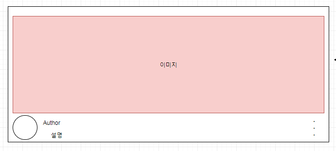
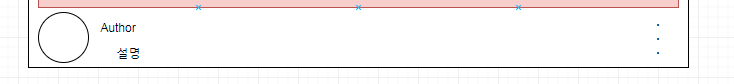

# Flutter Youtube 화면 개발

- 이 내용은 [Google IO 2018 Busan 에서 조성윤님이 발표하신 내용](https://www.slideshare.net/ssuserf65996/2018-google-io-extended-busan-flutter-session)을 기반으로 했습니다. 
- 부산에서 진행된 flutter 2주차 스터디 내용입니다. 
- 1주차 스터디 : [TodoList 화면 개발](http://javaexpert.tistory.com/985)
- 전체 소스는 [Github](https://github.com/bear2u/youtube_clone_app) 에서 받으실수 있습니다.


2주차 스터디는 Youtube Api를 활용해서 화면 구성을 공부해보는 시간을 가져봅니다. 

이번시간에 배우는 부분은 아래와 같습니다. 

- **Youtube Api 조회**
- **Json decoding -> dart class 로 변환하는 방법**
- **FutureBuilder 로 비동기로 위젯 구성하기**

우선 프로젝트를 기본적으로 구성을 해봅니다. 

> main.dart

- material 테마를 가져옵니다. 
- src/app.dart 를 import 해서 패키징 합니다.

```dart
import 'package:flutter/material.dart';

import 'package:youtube_clone_app/src/app.dart';

void main() => runApp(App());
```

> app.dart

- `Theme` 설정합니다. 
- `home.dart` 를 import 해서 런칭 위젯 설정해줍니다.

```dart
import 'package:flutter/material.dart';

import 'package:youtube_clone_app/src/home.dart';

class App extends StatelessWidget {
  @override
  Widget build(BuildContext context) {
    return MaterialApp(
      theme: ThemeData(
        primarySwatch: Colors.red
      ),
      home: Home(),
    );
  }
}	
```

## Home Widget

Home 위젯은 탭이 포함된 메인 을 말합니다. 

탭은 총 3개로 구성될 예정입니다.  매주 공부할 내용을 기반으로 하나씩 채워나가면서 만들어 볼 예정입니다. 

- **Youtube ( 2주차 )**
- **Chat ( 3주차 )**
- **Nearby ( 4주차 )**

`Home` 위젯은 탭이 바뀌면 `setState`를 호출해서 변해야 해서 `statefulwidget` 으로 만듭니다. 

```dart
class Home extends StatefulWidget {
  @override
  State<StatefulWidget> createState() => HomeState();
}

class HomeState extends State<Home>{
    ...
}
```

내용은 크게 `appbar`, `body`, `bottomNavigationBar` 가 포함되어 있습니다. 

```dart
@override
Widget build(BuildContext context) {
  return Scaffold(
    appBar: _buildMatchAppbar(context), //1
    body: _tabs[_tabIndex], //2
    bottomNavigationBar: _buildBottomNavigationBar(context), //3
  );
}
```

1. AppBar를 커스텀 해서 만들어줍니다. 

   ```dart
     Widget _buildMatchAppbar(context) {
       return AppBar(
         title: Text(
             "Flutter Study App",
             style: TextStyle(color: AppBarColor),
         ),
         backgroundColor: AppBackgroundColor,
       );
     }
   ```

2.  3개의 화면 위젯을 미리 만들어서 리스트로 호출하고 있습니다.

   ```dart
   var _tabIndex = 0;
   final List<Widget> _tabs = [YoutubeScreen(), ChatScreen(), NearByScreen()];
   ```

3. [BottomNavigationBar](https://docs.flutter.io/flutter/material/BottomNavigationBar-class.html) 라고 flutter 에서 미리 만들어서 제공해주는 탭바 비슷한게 있습니다. `Scaffold` 기본 위젯에 포함되어 있어서 생성 후 바로 사용이 가능합니다.

   ```dart
   _buildBottomNavigationBar(context) => Theme(
       data: Theme.of(context).copyWith(
         canvasColor: AppBackgroundColor,
         primaryColor: BottomNaviItemSelectedColor,
         iconTheme: Theme.of(context).iconTheme.copyWith(color: BottomNaviItemColor),
         textTheme: Theme.of(context).textTheme.copyWith(caption: TextStyle(
           color: BottomNaviItemColor
         )),
       ),
       child: BottomNavigationBar(
         items: <BottomNavigationBarItem>[
           _bottomNavigationBarItem(Icons.videocam, "youtube"),
           _bottomNavigationBarItem(Icons.chat, "chat"),
           _bottomNavigationBarItem(Icons.map, "nearby")
         ],
         type: BottomNavigationBarType.fixed,
         currentIndex: _tabIndex,
         onTap: (int index) {        
           setState(() {
             _tabIndex = index;
           });
         },
       ));
   
   
   BottomNavigationBarItem _bottomNavigationBarItem(IconData icon, String text) {
     return new BottomNavigationBarItem(icon: Icon(icon), title: Text(text));
   }
   ```

   탭 이벤트가 발생시 onTap 함수를 통해서 setState 호출해서 body 를 변경하고 있습니다. 

   ```dart
   onTap: (int index) {        
       setState(() {
       _tabIndex = index;
   });
   ```


`Home.dart` 전체 소스는 다음과 같습니다. 

```dart
import 'package:flutter/material.dart';

import 'package:youtube_clone_app/src/tabs/youtubeScreen.dart';
import 'package:youtube_clone_app/src/commons/colors.dart';


import 'package:youtube_clone_app/src/tabs/NearByScreen.dart';
import 'package:youtube_clone_app/src/tabs/ChatScreen.dart';

class Home extends StatefulWidget {
  @override
  State<StatefulWidget> createState() => HomeState();
}

class HomeState extends State<Home>{

  var _tabIndex = 0;
  final List<Widget> _tabs = [YoutubeScreen(), ChatScreen(), NearByScreen()];

  @override
  void initState() {
    // TODO: implement initState
    super.initState();

  }
  @override
  Widget build(BuildContext context) {
    return Scaffold(
      appBar: _buildMatchAppbar(context),
      body: _tabs[_tabIndex],
      bottomNavigationBar: _buildBottomNavigationBar(context),
    );
  }

  Widget _buildMatchAppbar(context) {
    return AppBar(
      title: Text(
          "Flutter Study App",
          style: TextStyle(color: AppBarColor),
      ),
      backgroundColor: AppBackgroundColor,
    );
  }

  _buildBottomNavigationBar(context) => Theme(
      data: Theme.of(context).copyWith(
        canvasColor: AppBackgroundColor,
        primaryColor: BottomNaviItemSelectedColor,
        iconTheme: Theme.of(context).iconTheme.copyWith(color: BottomNaviItemColor),
        textTheme: Theme.of(context).textTheme.copyWith(caption: TextStyle(
          color: BottomNaviItemColor
        )),
      ),
      child: BottomNavigationBar(
        items: <BottomNavigationBarItem>[
          _bottomNavigationBarItem(Icons.videocam, "youtube"),
          _bottomNavigationBarItem(Icons.chat, "chat"),
          _bottomNavigationBarItem(Icons.map, "nearby")
        ],
        type: BottomNavigationBarType.fixed,
        currentIndex: _tabIndex,
        onTap: (int index) {          
          setState(() {
            _tabIndex = index;
          });
        },
      ));


  BottomNavigationBarItem _bottomNavigationBarItem(IconData icon, String text) {
    return new BottomNavigationBarItem(icon: Icon(icon), title: Text(text));
  }
}

```

## Youtube Widget

`youtube` 위젯도 동적으로 리스트를 가져와야 해서 `Stateful` 위젯으로 구성합니다.

```dart
class YoutubeScreen extends StatefulWidget {
  @override
  _YoutubeState createState() => _YoutubeState();
}

class _YoutubeState extends State<YoutubeScreen> with AutomaticKeepAliveClientMixin<YoutubeScreen>{
  @override
  bool get wantKeepAlive => true;
}
```

- `AutomaticKeepAliveClientMixin` 은 탭이 변경시 유지를 해준다고 하는데 지금 동작이 잘 안되고 있어서 다시 살펴봐야 할것으로 보입니다.

  - `bool get wantKeepAlive => true;` 을 설정해줘야 합니다. 

  - `build` 에서 부모를 `super.build` 해줘야 합니다.

    ```dart
    @override
    Widget build(BuildContext context) {
      super.build(context);
      return _createListBuilder();
    }
    ```

### 리스트 구성

`Build` 함수내에 `ListBuilder()` 를 통해서 리스트를 구성해봅니다.

```dart
...
return _createListBuilder();
...
```

```dart
//1
_createListBuilder()  => FutureBuilder(
  //2
  future: _getVideos(),
  //3
  builder: (BuildContext context, AsyncSnapshot snapshot){
    //4  
    switch(snapshot.connectionState) {
      case ConnectionState.none:
      case ConnectionState.waiting:
        //5    
        return Center(
          child: CircularProgressIndicator(),
        );
      //6      
      default :
        var list = snapshot.data;
        return ListView.builder(
            itemCount: list.length,
            itemBuilder: (BuildContext context, int index) => _buildListItem(context, list[index])
        );
    }
  },
);
```

1. [FutureBuilder](https://docs.flutter.io/flutter/widgets/FutureBuilder-class.html)를 통해서 비동기로 youtube api를 조회해서 결과값이 리턴되는 경우 `snapshot` 으로 콜백이 다시 들어옵니다. 
2. `_getVideos()` 함수를 통해서 api 를 호출합니다. 
3. 빌더 함수를 통해서 상태제어를 할수 있습니다. 
4. 기본적으로 처음 호출시 `connectionState`는 `waiting` 상태가 됩니다. 그리고 결과가 리턴되면 `done` 으로 바뀌어서 다시 들어오게 됩니다.
5. 데이터 가져오는 동안 중간에 `Progress` 를 올려서 `ProgressBar` 올려서 볼수 있습니다. 
6. `snapshot.data`는 추후에 나올 함수 list 로 리턴받게 됩니다.  
7. `ListView.builder` 를 통해서 리스트를 만들고 있습니다. 
8. `_buildListItem` 를 통해서 리스트내 각각의 리스트 아이템을 만들어주고 있습니다. 

### 리스트 아이템 구성

`_buildListItem`을 통해서 구성이 됩니다. 전체적인 트리구조는 다음과 같습니다. 




```dart
_buildListItem(context, video) {
  return InkWell(
    onTap: () {
      Scaffold.of(context).showSnackBar(SnackBar(content: Text("clicked : $video")));
    },
    child: Container(
      decoration: BoxDecoration(
        border: Border(bottom: BorderSide(color: BorderColor)),
      ),
      child: Padding(
          padding: const EdgeInsets.all(10.0),
          child: Flex(
            direction: Axis.vertical,
            children: <Widget>[
              _buildItemVideoThumbnail(video),
              _myTubeVideoContent(video)
            ],
          )
      ),
    ),
  );
```

- Thumbnail 이미지와 그 밑에 내용으로 크게 구성되어 있습니다. 

#### Thumbnail 이미지 구성

썸네일은 FadeIn 되는 구조를 가집니다. 

```dart
  _buildItemVideoThumbnail(VideoData video) => AspectRatio(
    aspectRatio: 1.8,
    child: FadeInImage.memoryNetwork(
        placeholder: kTransparentImage,
        image: video.getThumbnailUrl,
        fit: BoxFit.cover
    )
  );
```

- VideoData 라는 데이터 클래스를 통해서 썸네일 이미지를 설정해주고 있습니다. 

- `AspectRatio` 을 통해서 종횡비 비율을 조절하고 있습니다. 

- `kTransparentImage` placeHolder 를 통해서 fadeIn 되는 효과를 만들수 있습니다. 

  ```dart
  import 'dart:typed_data';
  
  final Uint8List kTransparentImage = new Uint8List.fromList(<int>[
    0x89,
    0x50,
    0x4E,
    0x47,
    0x0D,
    0x0A,
    0x1A,
    0x0A,
    0x00,
    0x00,
    0x00,
    0x0D,
    0x49,
    0x48,
    0x44,
    0x52,
    0x00,
    0x00,
    0x00,
    0x01,
    0x00,
    0x00,
    0x00,
    0x01,
    0x08,
    0x06,
    0x00,
    0x00,
    0x00,
    0x1F,
    0x15,
    0xC4,
    0x89,
    0x00,
    0x00,
    0x00,
    0x0A,
    0x49,
    0x44,
    0x41,
    0x54,
    0x78,
    0x9C,
    0x63,
    0x00,
    0x01,
    0x00,
    0x00,
    0x05,
    0x00,
    0x01,
    0x0D,
    0x0A,
    0x2D,
    0xB4,
    0x00,
    0x00,
    0x00,
    0x00,
    0x49,
    0x45,
    0x4E,
    0x44,
    0xAE,
  ]);
  ```

#### 하단 화면 구성하기

각각의 리스트 아이템에서 하단 화면을 구성해봅니다. 

```dart
/// Video Content View builder at ListView Item Widget
  _myTubeVideoContent(VideoData video) => Container(
    alignment: Alignment.topCenter,
    margin: EdgeInsets.only(top: 10.0),
      //1
    child: Row(
      children: <Widget>[
        Container(
          margin: EdgeInsets.only(right: 10.0),
            //2
          decoration: BoxDecoration(
              shape: BoxShape.circle,
              color: BorderColor,
              image: DecorationImage(
                image: NetworkImage(video.getChannelData.getThumbnailUrl),
                fit: BoxFit.contain,
              )
          ),
          width: 32.0,
          height: 32.0,
        ),
          //3
        Flexible(
          child: Column(
            children: <Widget>[
              Container(
                alignment: Alignment.centerLeft,
                child: Text(
                    video.getTitle,
                    maxLines: 2,
                    style: TextStyle(
                        fontWeight: FontWeight.w400,
                        fontSize: 16.0,
                        color: TextColor
                    ),
                    overflow: TextOverflow.ellipsis,
                    textAlign: TextAlign.left),
              ),
                //4
              Container(
                alignment: Alignment.centerLeft,
                child: Text(
                  "${video.getChannelData.getName}",
                  maxLines: 2,
                  textAlign: TextAlign.left,
                  style: TextStyle(color: TextColor,),
                ),
              ),
            ],
            mainAxisAlignment: MainAxisAlignment.start,
          ),
          flex: 1,
        ),
          //5
        InkWell(
            child: Container(child: Icon(Icons.more_vert, size: 20.0, color: BorderColor),),
            onTap: _modalBottomSheet,
            borderRadius: BorderRadius.circular(20.0)
        )
      ],
    ),
  );
```



1. 하단은 프로필 써클 이미지와 기타 설명으로 구성되어 있습니다. 세로로 구성되어 지기 때문에 Row 로 설정합니다. 

2. 써클 이미지 구성은 `BoxDecoration` 위젯 안에 NetworkImage 를 가져옵니다.

   ```dart
   image: DecorationImage(
       image: NetworkImage(video.getChannelData.getThumbnailUrl),
       fit: BoxFit.contain,
   )
   ```

3.  3,4번은 설명글을 구성합니다. `Column` 을 통해서 가로로 설정합니다.

4. 5. 마지막으로 `InkWell`을 통해 `Ripple` 효과를 줘서 더보기 버튼을 구성해봅니다.

#### 더보기 클릭

```dart
_modalBottomSheet
```

바텀시트를 올려서 메뉴를 볼수 있습니다. 

```dart
_modalBottomSheet() => showModalBottomSheet(
      context: context,
      builder: (builder) => Container(
        color: AppBackgroundColor,
        child: new Column(
          children: <Widget>[
            _bottomSheetListTile(Icons.not_interested, "관심 없음", () => debugPrint("관심 없음")),
            _bottomSheetListTile(Icons.access_time, "나중에 볼 동영상에 추가", () => debugPrint("나중에 볼 동영상에 추가")),
            _bottomSheetListTile(Icons.playlist_add, "재생목록에 추가", () => debugPrint("재생목록에 추가")),
            _bottomSheetListTile(Icons.share, "공유", () => debugPrint("공유")),
            _bottomSheetListTile(Icons.flag, "신고", () => debugPrint("신고")),
            Container(
              decoration: new BoxDecoration(
                  border: new Border(top: new BorderSide(color: BorderColor))
              ),
              child: _bottomSheetListTile(Icons.close, "취소", () => Navigator.pop(context)),
            )
          ],

        ),
      )
  );

  /// list tile builder for BottomSheet
  _bottomSheetListTile(IconData icon, String text, Function onTap) =>
      ListTile(
          leading: Icon(icon, color: TextColor),
          title: Text(text, style: TextStyle(color: TextColor),),
          onTap: onTap
      );
```

마지막으로 비디오를 가져오는 부분을 추가해서 데이터를 갱신할 수 있도록 해줍니다. 

```dart
Future<List<VideoData>> _getVideos() async {
    List<VideoData> videoDataList = new List<VideoData>();
    String dataURL = "https://www.googleapis.com/youtube/v3/videos?chart=mostpopular&regionCode=KR"
        "&maxResults=20&key=$youtubeApiKey&part=snippet,contentDetails,statistics,status";

    http.Response response = await http.get(dataURL);
    dynamic resBody = json.decode(response.body);
    List videosResData = resBody["items"];

    videosResData.forEach((item) => videoDataList.add(new VideoData(item)));

    for (var videoData in videoDataList) {
      String channelDataURL = "https://www.googleapis.com/youtube/v3/channels?key=$youtubeApiKey&part=snippet&id=${videoData.getOwnerChannelId}";

      http.Response channelResponse = await http.get(channelDataURL);
      dynamic channelResBody = json.decode(channelResponse.body);

      videoData.channelDataFromJson = channelResBody["items"][0];
    }

    return videoDataList;
  }
```

전체 리스트를 가져온다음 각각 채널 정보를 다시 호출하기 때문에 비효율적으로 보이지만 스터디 목적이기 때문에 따로 리팩토링은 하지 않겠습니다. 

#### JSON Decoding

미리 VideoData 와 ChannelData 클래스를 만들어서 Json decoding 해줄수 있습니다. 

다른 방법도 있지만 여기선 기본적인 방법으로 설명합니다.

> VideoDart.dart

```dart
import './ChannelData.dart';

class VideoData {
  String ownerChannelId;
  String thumbnailUrl;
  String title;
  String viewCount;
  String publishDate;
  ChannelData channelData;

  /// Video Data Constructor
  VideoData(Map videoJsonData) {
    this.ownerChannelId = videoJsonData["snippet"]["channelId"];
    this.thumbnailUrl = videoJsonData["snippet"]["thumbnails"]["high"]["url"];
    this.title = videoJsonData["snippet"]["title"];
    this.viewCount = videoJsonData["statistics"]["viewCount"];
    this.publishDate = videoJsonData["snippet"]["publishedAt"];
  }

  /// Video Data unnamed Constructor
  VideoData.includeChannelData(Map videoJsonData, Map channelJsonData) {
    VideoData(videoJsonData);
    this.channelData = ChannelData(channelJsonData);
  }

  set channelDataFromJson(Map channelJsonData) {
    this.channelData = new ChannelData(channelJsonData);
  }

  get getOwnerChannelId => this.ownerChannelId;

  get getThumbnailUrl => this.thumbnailUrl;

  get getTitle => this.title;

  get getViewCount => this.viewCount;

  get getPublishedDate => this.publishDate;

  get getChannelData => this.channelData;
}
```

> ChannelData.dart

```dart
class ChannelData {
  String name;
  String thumbnailUrl;

  ChannelData(Map channelJsonData) {
    this.name = channelJsonData["snippet"]["title"];
    this.thumbnailUrl = channelJsonData["snippet"]["thumbnails"]["default"]["url"];
  }

  get getName => this.name;

  get getThumbnailUrl => this.thumbnailUrl;
}
```

여기까지 2주차 유튜브 리스트 개발이었습니다. 


개선해야 될 내용

- 탭이 변경시 계속 갱신되는 문제
- 좀 더 효율적으로 API 를 호출하는 부분


그럼 다음 주차에는 카카오톡 같은 메신징 화면을 `Firebase` 연동해서 개발해보도록 하겠습니다. 

참석해주셔서 감사합니다.