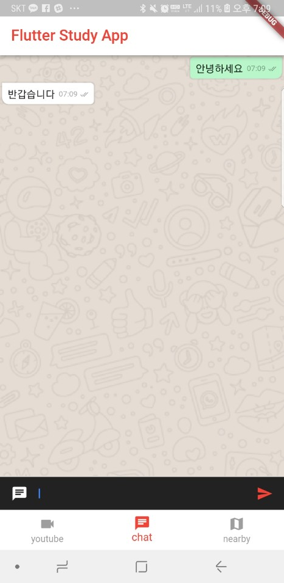
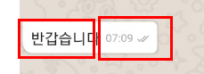

# Flutter 왓츠앱 클론

> 부산에서 매주 진행되는 `Flutter` 스터디 3주차 내용입니다. 

- 1주차
  - [TODO 리스트 앱 개발](http://javaexpert.tistory.com/98)
- 2주차
  - [Youtube 화면 클론](http://javaexpert.tistory.com/988)

> 소스는 [Github](https://github.com/bear2u/youtube_clone_app.git ) 에서 확인 가능합니다.

## 왓츠앱 클론

오늘은 먼저 UI 개발 시간을 가져볼 예정이다. 

우선 완성된 화면은 다음과 같다. 



## ChatScreen

화면은 크게 2개로 나뉜다. 리스트뷰와 하단에 텍스트입력창이다. 

그리고 하단에 텍스트가 입력이 될 때마다 리스트가 업데이트 되는 구조이기 때문에 `StatefuleWidget` 으로 간다. 

```dart
class ChatScreen extends StatefulWidget {
  @override
  State<StatefulWidget> createState() => ChatState();
}

//채팅 화면
class ChatState extends State<ChatScreen>{
    @override
  Widget build(BuildContext context) {
      ....
  }
}
```

앞서 설명했다 싶이 크게 두 부분으로 나뉘어 진다. 

리스트뷰와 텍스트 입력창

- `Column` 은 세로로 정렬 해준다. 
- `_buildListItems`은 추후 리스트뷰를 만들어 준다. 
- `Stack` 으로 뒤에 배경을 깔아주고 위에 리스트뷰로 올린다. 
- `_buildBottomBar`은 하단 텍스트 위젯을 만들는 함수이다. 

```dart
@override
  Widget build(BuildContext context) {
    return Container(
      child: Column(
        children: <Widget>[
          Flexible(
            child:Stack(
              children: <Widget>[
                Positioned(
                  top: 0.0,
                  child: Image.asset(
                    "assets/images/bg_whatsapp.png",
                    fit: BoxFit.fill,
                  ),
                ),
                _buildListItems()
              ],
            ),
          ),
          Divider(height: 1.0,),
          Container(
            decoration:
              BoxDecoration(color: Theme.of(context).cardColor),
            child: _buildBottomBar(),
          )
        ],
      ),
    );
  }
```

리스트 뷰는 ListView.builder 로 구성해서 만들어준다. 

```dart
  Widget _buildListItems() {
    return ListView.builder(
        itemCount: items.length,
        itemBuilder: (BuildContext context, int index) => _generateItems(index)
    );
  }
...
    _generateItems(int index) {
    	return items[index];
	}
```

하단 바텀 뷰는 세가지 위젯으로 이루어져있다. 

- 사진 아이콘 (현재는 채팅아이콘)
- 텍스트 입력창
- 전송버튼

`Flexible` 은 남은 공간을 꽉 차게 만들어 준다. 

그래서 아이콘 2개를 각각 왼쪽, 오른쪽에 위치해준다.  그리고 중간을 Flexible 로 꽉 채워준다. 

- 텍스트폼 내용은 `TextEditingController` 를 통해서 가져오고 설정할 수 있다. 

```dart
Widget _buildBottomBar() {
    return IconTheme(
      data: IconThemeData(
        color: Theme.of(context).accentColor
      ),
      child: Container(
        color: Colors.black87,
        child: Row(
          children: <Widget>[
            Container(
              margin: EdgeInsets.symmetric(horizontal: 4.0),
              child: IconButton(
                  icon: Icon(
                      Theme.of(context).accentColor
                  ),
                  onPressed: () {
                  ...
                  }
              ),
            ),
            Flexible(
              child: TextField(
                controller: _tec,
                style: TextStyle(color: Colors.white),
                decoration: InputDecoration(
                  border: InputBorder.none,
                ),
              ),
            ),
            Container(
              margin: EdgeInsets.symmetric(horizontal: 4.0),
              child: _getDefaultSendButton(),
            )
          ],
        ),
      ),
    );
  }
```

이제 전송 버튼을 클릭시 대화 내용을 `Item` 이라는 리스트에 추가해준다. `setState` 를 통해야 하는 건 기본!!

```dart
List<Bubble> items = [];
...
setState(() {
    items.add(
        Bubble(
            message: _tec.text,
            time: _getCurrentTime(),
            delivered: true,
            isYours: !_isMe,
        ),
    );
    _tec.text = "";
});
```

### 전체 소스

```dart
import 'package:flutter/material.dart';
import 'package:youtube_clone_app/src/widgets/Bubble.dart';
import 'package:intl/intl.dart';

class ChatScreen extends StatefulWidget {
  @override
  State<StatefulWidget> createState() => ChatState();
}

//채팅 화면
class ChatState extends State<ChatScreen>{

  List<Bubble> items = [];
  TextEditingController _tec = TextEditingController();

  bool _isMe = true;

  @override
  Widget build(BuildContext context) {
    return Container(
      child: Column(
        children: <Widget>[
          Flexible(
            child:Stack(
              children: <Widget>[
                Positioned(
                  top: 0.0,
                  child: Image.asset(
                    "assets/images/bg_whatsapp.png",
                    fit: BoxFit.fill,
                  ),
                ),
                _buildListItems()
              ],
            ),
          ),
          Divider(height: 1.0,),
          Container(
            decoration:
              BoxDecoration(color: Theme.of(context).cardColor),
            child: _buildBottomBar(),
          )
        ],
      ),
    );
  }

  Widget _buildListItems() {
    return ListView.builder(
        itemCount: items.length,
        itemBuilder: (BuildContext context, int index) => _generateItems(index)
    );
  }

  Widget _buildBottomBar() {
    return IconTheme(
      data: IconThemeData(
        color: Theme.of(context).accentColor
      ),
      child: Container(
        color: Colors.black87,
        child: Row(
          children: <Widget>[
            Container(
              margin: EdgeInsets.symmetric(horizontal: 4.0),
              child: IconButton(
                  icon: Icon(
                      Icons.chat,
                      color: _isMe
                        ? Theme.of(context).accentColor
                        : Colors.white
                  ),
                  onPressed: () {
                    setState(() {
                      _isMe = !_isMe;
                    });
                  }
              ),
            ),
            Flexible(
              child: TextField(
                controller: _tec,
                style: TextStyle(color: Colors.white),
                decoration: InputDecoration(
                  border: InputBorder.none,
                ),
              ),
            ),
            Container(
              margin: EdgeInsets.symmetric(horizontal: 4.0),
              child: _getDefaultSendButton(),
            )
          ],
        ),
      ),
    );
  }

  _getDefaultSendButton() {
    return IconButton(
      icon: Icon(Icons.send),
      onPressed: () {
        setState(() {
          items.add(
            Bubble(
              message: _tec.text,
              time: _getCurrentTime(),
              delivered: true,
              isYours: !_isMe,
            ),
          );
          _tec.text = "";
        });
      },
    );
  }

  _generateItems(int index) {
    return items[index];
  }

  _getCurrentTime() {
    final f = new DateFormat('hh:mm');

    return f.format(new DateTime.now());
  }
}
```

## Bubble

> 풍선 대화말을 보여주는 위젯이다. 

기본적으로 내부적으로 변경되는 경우가 없으므로 StatelessWidget 으로 구현한다. 

- `message` : 대화내용
- `time` : 전송시간
- `delivered` : 전송여부 (현재로서는 무조건 all done 상태)
- `isYours` 은 상대방 메세지인지 체크

```dart
class Bubble extends StatelessWidget {
  Bubble({this.message, this.time, this.delivered, this.isYours});
}
```

풍선 사방에 약간 라운드 처리를 위해 `Radius` 설정한다. 

```dart
    final radius = isYours
        ? BorderRadius.only(
      topRight: Radius.circular(5.0),
      bottomLeft: Radius.circular(10.0),
      bottomRight: Radius.circular(5.0),
    )
        : BorderRadius.only(
      topLeft: Radius.circular(5.0),
      bottomLeft: Radius.circular(5.0),
      bottomRight: Radius.circular(10.0),
```

그림자 효과와 라운딩 효과를 위해 decoration 적용

```dart
decoration: BoxDecoration(
    boxShadow: [
    BoxShadow(
    blurRadius: .5,
    spreadRadius: 1.0,
    color: Colors.black.withOpacity(.12))
    ],
    color: bg,
    borderRadius: radius,
),
```

내부에 텍스트 넣는 부분이다. 

- stack 으로 구성하는데 `EdgeInsets.only(right: 48.0)`으로 오른쪽에 여백을 둔다. 

- 그리고 그 여백에 날짜와 `all done`아이콘을 위치 한다. 

  

```dart
		child: Stack(
            children: <Widget>[
              Padding(
                padding: EdgeInsets.only(right: 48.0),
                child: Text(message),
              ),
              Positioned(
                bottom: 0.0,
                right: 0.0,
                child: Row(
                  children: <Widget>[
                    Text(time,
                        style: TextStyle(
                          color: Colors.black38,
                          fontSize: 10.0,
                        )),
                    SizedBox(width: 3.0),
                    Icon(
                      icon,
                      size: 12.0,
                      color: Colors.black38,
                    )
                  ],
                ),
              )
            ],
          ),
```

이상으로 간단하게 왓츠앱 대화 UI 를 만들어보았다. 

다음시간에는 `파이어베이스` 및 인증 를 연동해서 그룹 대화를 만들도록 해보겠다. 

참석해주셔서 감사합니다. 

> 소스는 [Github](https://github.com/bear2u/youtube_clone_app.git ) 에서 받으실수 있습니다.