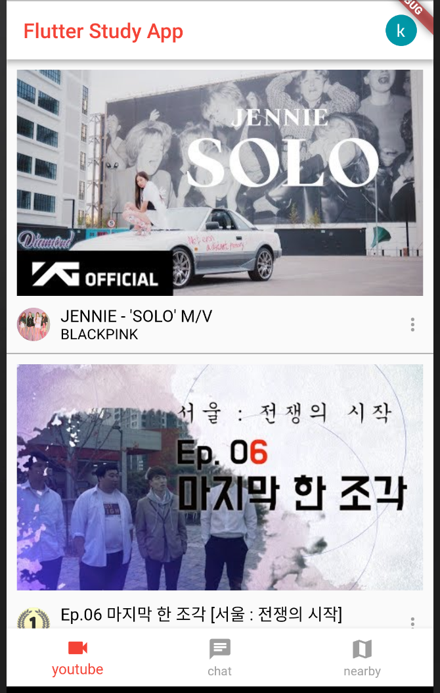
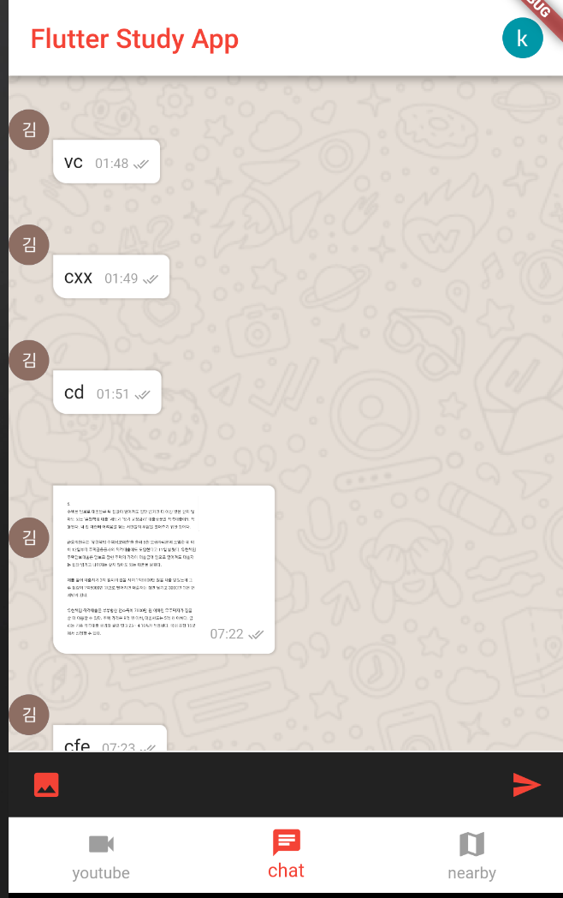
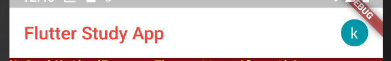
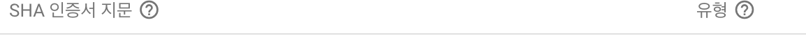
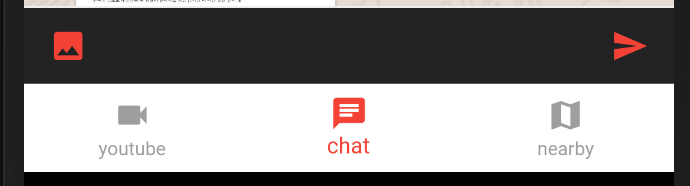

# Flutter WhatsApp 클론 (부산 4주차 스터디)

> 부산에서 매주 진행되는 `Flutter` 스터디 4주차 내용입니다.
>
> 더 많은 부산에서 스터디 정보는 [네이버 카페](https://cafe.naver.com/busandev) 에서 확인 가능합니다.
>
> 소스는 [Github](https://github.com/bear2u/youtube_clone_app) 에서 확인 가능합니다. 






1주차

- [TODO 리스트 앱 개발](http://javaexpert.tistory.com/985)

2주차

- [Youtube 화면 클론](http://javaexpert.tistory.com/988)

3주차

- [WhatsApp 화면 개발](http://javaexpert.tistory.com/992)

## 스터디 내용

이번주차는 저번 스터디에 이어서 로직부분을 진행하도록 하겠다.

- Firestore
- FireBase Auth
  - Google Sigin
- FireBase Storage - 이미지 업로드

## FireStore

> Firebase 에서 제공하는 Collection - Document 형태의 nosql realdb 이다. 
>
> 자세한 설치 및 내용은 [공식문서](https://firebase.google.com/docs/firestore/?authuser=0)를 참조하자. 

### 시나리오 #1

채팅방에서 텍스트박스에 내용을 입력하면  `Firestore`에 내용이 입력되고 그 입력된 내용을 StreamBuilder 로 통해서 구독을 해서 리스트뷰에 자동 업데이트를 하는 게 목표

- `Firebase` 에 앱등록해서 google-service.json 등록 및 gradle 설정
  - 공식문서 : https://firebase.google.com/docs/flutter/setup?authuser=0

### Firestore 저장

```dart
  /// firestore연결해서 저장
  saveChat(ChatData chatData) {
    Firestore.instance.collection(fireStoreCollectionName)
        .document()
        .setData(chatData.toMap());
  }
```

### Firestore 구독 및 리스트 조회

- Firestore snapshot 스트림이용해서 구독처리

```dart
  Widget _buildListItems() {
    return StreamBuilder(
      stream: Firestore.instance.collection("room").snapshots(),
        builder: (BuildContext context, AsyncSnapshot<QuerySnapshot> snapshot) {
          if(!snapshot.hasData) return Text("Loading...");
          List<ChatData> list = snapshot.data.documents.map((DocumentSnapshot document) {
            return ChatData.fromMap(document);
          }).toList();
          print(list);
          return ListView.builder(
              controller: _scrollController,
              itemCount: list.length,
              itemBuilder: (BuildContext context, int index) => _generateItems(list[index])
          );
        }
    );
  }
```

### 시나리오 #2

구글 로그인을 하는데 오른쪽 프로필 이미지를 로그인 후 변하도록 하고 다시 클릭시 로그아웃 다이얼로그 창이 나오도록 하자. 



- Firebase Auth 라이버러리 추가

  - ```dart
    firebase_auth: "0.6.2+1"
    ```

#### 화면 구성

- 상단 바 구성
  - `title`,` profile image` 등으로 구성되어 있다.

```dart
Widget _buildMatchAppbar(context) {
  return AppBar(
    title: Row(
      mainAxisAlignment: MainAxisAlignment.start,
      children: <Widget>[
        Flexible(
          child: Container(
            width: double.maxFinite,
            child: Text(
              "Flutter Study App",
              style: TextStyle(color: AppBarColor),
            ),
          ),
        ),
        _getProfileCircleImage()
      ],
    ),
    backgroundColor: AppBackgroundColor,
  );
}
```

- Profile Image
  - 로그인 상태에는 로그아웃 다이얼로그가 나오게 하고
  - 로그아웃 상태에서는 로그인 다이얼로그가 나오게 한다.

```dart
_getProfileCircleImage() {
  return InkWell(
    onTap: () {
      userData == null
      ? _handleSignIn()
      : _showSignOutDialog();
    },
    child: new Container(
      width: 30.0,
      height: 30.0,
      decoration: new BoxDecoration(
        color: const Color(0xff7c94b6),
        image: new DecorationImage(
          image: userData == null
            ? new AssetImage("assets/images/profile.png")
            : new NetworkImage(userData.photoUrl),
          fit: BoxFit.cover,
        ),
        borderRadius: new BorderRadius.all(new Radius.circular(30.0)),
      ),
    ),
  );
}
```

#### 유의할 점

- Firebase Console 설정 페이지에서 Sha 값을 등록해줘야 한다. 
- 

### 시나리오 #3

`Image Picker` (카메라 또는 갤러리) 를 통해서 가져온 이미지를 Firestorage로 업로드 한다. 

- `Firebase Stroage`
- `Image Picker`



포토 아이콘을 클릭시 Image Picker 가 실행된다. 

Source를 어떤걸 주냐에 따라 차이가 날 수 있다. (`Gallery`, `Camera`)

```dart
void _uploadImage() async {
    File imageFile = await ImagePicker.pickImage(source: ImageSource.camera);
    int timeStamp = DateTime.now().millisecondsSinceEpoch;
    StorageReference storageReference = FirebaseStorage
        .instance
        .ref()
        .child("img_" + timeStamp.toString() + ".jpg");
    StorageUploadTask uploadTask = storageReference.putFile(imageFile);
    uploadTask.onComplete
        .then((StorageTaskSnapshot snapShot) async {
          String imgUrl = await snapShot.ref.getDownloadURL();

          final chatData = ChatData(
              message: null,
              time: _getCurrentTime(),
              delivered: true,
              sender: userData.displayName,
              senderEmail: userData.email,
              senderPhotoUrl: userData.photoUrl,
              imgUrl: imgUrl
          );

          fbApiProvider.saveChat(chatData);

        });
  }
```

마지막으로 Bubble (풍선) 쪽을 살펴보도록 하자. 

```dart
import 'package:flutter/material.dart';

class Bubble extends StatelessWidget {
  Bubble({this.message, this.time, this.delivered, this.isOthers, this.profilePhotoUrl, this.imageUrl});

  final String message, time, profilePhotoUrl, imageUrl;
  final delivered, isOthers;

  @override
  Widget build(BuildContext context) {
    final bg = isOthers ? Colors.white : Colors.greenAccent.shade100;
    final align = isOthers ? MainAxisAlignment.start : MainAxisAlignment.end;
    final icon = delivered ? Icons.done_all : Icons.done;
    final radius = isOthers
        ? BorderRadius.only(
      topRight: Radius.circular(5.0),
      bottomLeft: Radius.circular(10.0),
      bottomRight: Radius.circular(5.0),
    )
        : BorderRadius.only(
      topLeft: Radius.circular(5.0),
      bottomLeft: Radius.circular(5.0),
      bottomRight: Radius.circular(10.0),
    );
    return Row(
      mainAxisAlignment: align,
      children: <Widget>[
        _getCircleProfileIcon(),
        Container(
          //margin: const EdgeInsets.all(3.0),
          margin: isOthers
            ? EdgeInsets.only(top: 50.0, left: 3.0, bottom: 3.0, right: 3.0)
            : EdgeInsets.all(3.0),
          padding: const EdgeInsets.all(8.0),
          decoration: BoxDecoration(
            boxShadow: [
              BoxShadow(
                  blurRadius: .5,
                  spreadRadius: 1.0,
                  color: Colors.black.withOpacity(.12))
            ],
            color: bg,
            borderRadius: radius,
          ),
          child: Stack(
            children: <Widget>[
              Padding(
                padding: EdgeInsets.only(right: 48.0),
                child: message != null
                  ? Text(message)
                  : Image.network(imageUrl, width: 100.0,)
              ),
              Positioned(
                bottom: 0.0,
                right: 0.0,
                child: Row(
                  children: <Widget>[
                    Text(time,
                        style: TextStyle(
                          color: Colors.black38,
                          fontSize: 10.0,
                        )),
                    SizedBox(width: 3.0),
                    Icon(
                      icon,
                      size: 12.0,
                      color: Colors.black38,
                    )
                  ],
                ),
              )
            ],
          ),
        )
      ],
    );
  }

  _getCircleProfileIcon() {
    if(!isOthers) {
      return Container();
    }
    return Container(
      width: 30.0,
      height: 30.0,
      decoration: new BoxDecoration(
        color: const Color(0xff7c94b6),
        image: new DecorationImage(
          image: new NetworkImage(profilePhotoUrl),
          fit: BoxFit.cover,
        ),
        borderRadius: new BorderRadius.all(new Radius.circular(30.0)),
      ),
    );
  }
}
```

이상으로  부산에서 진행된 `Flutter` 입문 스터디 내용이었습니다. 

다음 주는 [Flutter 프로젝트 스터디](https://cafe.naver.com/busandev/111)를 진행할 예정입니다. 관심있으신분은 신청 부탁드립니다. 

