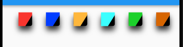
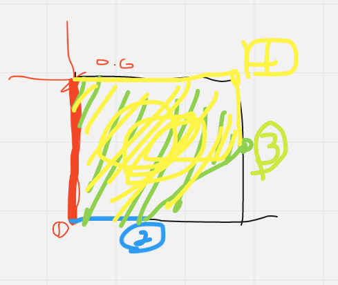

# Flutter 화면 제작 공부

https://www.youtube.com/watch?v=dMLreUXpSQ0&t=1s

를 보고 하나씩 공부 하고자 한다. 

우선 사이즈 부분을 알아보자. 


- `Row`를 사용해서 정렬
- `Container Boxdecoration`을 이용해서 박스형태 제작
- `그림자 효과 적용`

## 소스

### 높이 자동 계산 로직

```dart
double baseHeight = 640.0;

double screenAwareSize(double size, BuildContext context) {
  return size * MediaQuery.of(context).size.height / baseHeight;
}
```


```dart
import 'package:flutter/material.dart';
import 'package:flutter_adidas_shoes_exam/utils.dart';
import 'data.dart';

void main() => runApp(MaterialApp(
      home: MyApp(),
      debugShowCheckedModeBanner: false,
    ));

class MyApp extends StatefulWidget {
  @override
  _MyAppState createState() => _MyAppState();
}

List<String> sizeNumlist = [
  "7",
  "8",
  "9",
  "10",
];

class _MyAppState extends State<MyApp> {
  int _currentSizeIndex = 0;

  @override
  Widget build(BuildContext context) {
    return Scaffold(
      backgroundColor: Colors.white,
      body: Padding(
        padding: const EdgeInsets.all(30.0),
        child: Column(
          children: <Widget>[
            Row(
              children: sizeNumlist.map((item) {
                var index = sizeNumlist.indexOf(item);
                return GestureDetector(
                    child: sizeItem(item, _currentSizeIndex == index, context),
                    onTap: (){
                      setState(() {
                        _currentSizeIndex = index;
                      });
                    },
                );
              }).toList(),
            )
          ],
        ),
      ),
    );
  }
}

Widget sizeItem(String item, bool isSelected, BuildContext context) {
  return Padding(
    padding: EdgeInsets.only(left: 8.0),
    child: Container(
      width: screenAwareSize(30.0, context),
      height: screenAwareSize(30.0, context),
      decoration: BoxDecoration(
        color: isSelected ? Color(0xFFFC3930) : Color(0xFF525663),
        borderRadius: BorderRadius.circular(5.0),
        boxShadow: [
          BoxShadow(
            color: isSelected ? Colors.black.withOpacity(.5) : Colors.black12,
            offset: Offset(0.0, 10.0),
            blurRadius: 10.0
          )
        ]
      ),
      child: Center(
        child: Text(
          item,
          style: TextStyle(color: Colors.white, fontFamily: "Montserrat-Bold", fontSize: 11.0),
        ),
      ),
    ),
  );
}

```

# Clipper를 이용한 뷰



위와 같이 구성할려면 알아야 할 내용

- `Clip`
- `BoxShadow`
- `BoxDecoration`

```dart
class MClipper extends CustomClipper<Path> {
  @override
  Path getClip(Size size) {
    var path = Path();
      //1  
    path.lineTo(0.0, size.height);
      //2  
    path.lineTo(size.width * 0.5, size.height);
      //3
    path.lineTo(size.width, size.height * 0.2);
      //4
    path.lineTo(size.width, 0.0);
    path.close();
    return path;
  }

  @override
  bool shouldReclip(CustomClipper<Path> oldClipper) {
    return true;
  }
}
```

Path는 펜슬로 위치를 잡아가면서 그려주는 역할을 해준다. 



그림이 상당히 이상하지만 순서대로 따라가면서 이렇게 그려주면서 다각형(?)을 그려준다. 

전체 소스

```dart
import 'package:flutter/material.dart';
import 'package:flutter_adidas_shoes_exam/utils.dart';
import 'data.dart';

void main() => runApp(MaterialApp(
      home: MyApp(),
      debugShowCheckedModeBanner: false,
    ));

class MyApp extends StatefulWidget {
  @override
  _MyAppState createState() => _MyAppState();
}

class _MyAppState extends State<MyApp> {

  int _currentColorIndex = 0;

  List<Widget> colorSelector() {
    List<Widget> colorItemList = new List();
    for (var i = 0; i < colors.length; i++) {
      colorItemList
          .add(colorItem(
          colors[i],
          i == _currentColorIndex,
          context,
              () {
            setState(() {
              _currentColorIndex = i;
            });
          }
      ));
    }

    return colorItemList;
  }

  Widget colorItem(Color color, bool isSelected, BuildContext context,
      VoidCallback _ontab) {
    return Padding(
      padding: EdgeInsets.all(16.0),
      child: Container(
        width: screenAwareSize(30.0, context),
        height: screenAwareSize(30.0, context),
        decoration: BoxDecoration(
            color: Colors.black,
            borderRadius: BorderRadius.circular(5.0),
            boxShadow: [
              BoxShadow(
                  color: Colors.black.withOpacity(.8),
                  blurRadius: 10.0,
                  offset: Offset(0.0, 10.0)
              )
            ]
        ),
        child: ClipPath(
          clipper: MClipper(),
          child: Container(
            width: double.infinity,
            height: double.infinity,
            color: color,
          ),
        ),
      ),
    );
  }

  @override
  Widget build(BuildContext context) {
    return Scaffold(
      appBar: AppBar(),
      body: Container(
        width: double.infinity,
        margin: EdgeInsets.only(left: screenAwareSize(20.0, context)),
        child: Row(
          children: colorSelector(),
        ),
      ),
    );
  }

}

class MClipper extends CustomClipper<Path> {
  @override
  Path getClip(Size size) {
    var path = Path();
    path.lineTo(0.0, size.height);
    path.lineTo(size.width * 0.5, size.height);
    path.lineTo(size.width, size.height * 0.2);
    path.lineTo(size.width, 0.0);
    path.close();
    return path;
  }

  @override
  bool shouldReclip(CustomClipper<Path> oldClipper) {
    return true;
  }
}
```

다음에는 `프로그래스바`를 이용해서 `커스텀 뷰`를 공부해볼 예정이다. 

