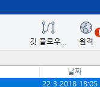
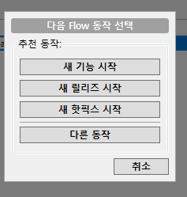
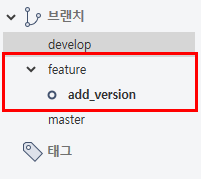
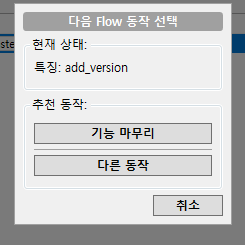
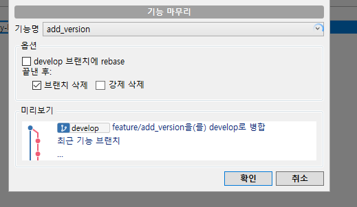
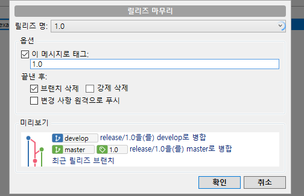
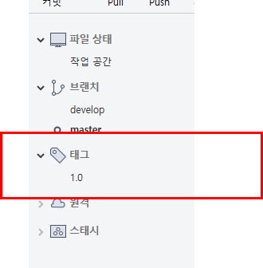
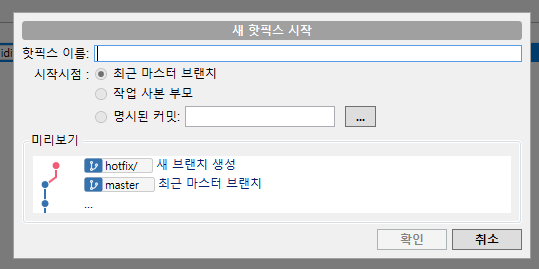

# Gitflow 공부

## init

```
git flow init
```

소스트리를 사용해서 진행해볼 예정이다. 

오른쪽 상단에 



를 클릭해서 branch등을 설정해준다. 

설정화면에서 시작하기를 눌러서 진행해준다. 

그리고 각각의 기능별로 시작시 오른쪽 상단 깃 플로우를 클릭해주면 



## feature(새기능)



그런다음 소스를 수정해서 다시 `finish`를 할 수 있다. 





이런식으로 finish 를 하게 되면 develop 브랜치에 자동으로 `merge` 되는 걸 볼수 있다. 만약 체크를 하면 `rebase` 가 된다. 

## release

출시 버전을 관리를 하는데 출력을 보면

```bash
Summary of actions:
- A new branch 'release/1.0' was created, based on 'develop'


- You are now on branch 'release/1.0'

     
```

`release branch`를 만들는 걸 볼수 있다. 

`finish` 를 진행 시 태그를 남길수 있도록 해준다. 





보시다시피 태그가 달린 걸 볼수 있다. 

## 핫픽스

핫픽스는 `master`에서 급한 수정을 넣을때 사용할 수 있다. 



태그를 같이 넣어서 수정이 가능하다. 


이상으로 `git-flow`를 알아보았다. 

참고 사이트

- https://ko.atlassian.com/git/tutorials/comparing-workflows/gitflow-workflow
- https://zellwk.com/blog/git-flow/
- https://www.youtube.com/watch?v=Ut-7Qxfncik