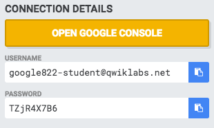
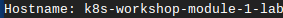
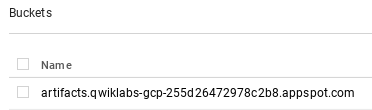

## Setup

#### **Step 1**

#### What you'll need

To complete this lab, you’ll need:

- Access to a standard internet browser (Chrome browser recommended).
- Time. Note the lab’s **Completion** time in Qwiklabs. This is an estimate of the time it should take to complete all steps. Plan your schedule so you have time to complete the lab. Once you start the lab, you will not be able to pause and return later (you begin at step 1 every time you start a lab).
- The lab's **Access** time is how long your lab resources will be available. If you finish your lab with access time still available, you will be able to explore the Google Cloud Platform or work on any section of the lab that was marked "if you have time". Once the Access time runs out, your lab will end and all resources will terminate.
- You **DO NOT** need a Google Cloud Platform account or project. An account, project and associated resources are provided to you as part of this lab.
- If you already have your own GCP account, make sure you do not use it for this lab.
- If your lab prompts you to log into the console, **use only the student account provided to you by the lab**. This prevents you from incurring charges for lab activities in your personal GCP account.

#### Start your lab

When you are ready, click **Start Lab**. You can track your lab’s progress with the status bar at the top of your screen.

**Important** What is happening during this time? Your lab is spinning up GCP resources for you behind the scenes, including an account, a project, resources within the project, and permission for you to control the resources needed to run the lab. This means that instead of spending time manually setting up a project and building resources from scratch as part of your lab, you can begin learning more quickly.

#### Find Your Lab’s GCP Username and Password

To access the resources and console for this lab, locate the Connection Details panel in Qwiklabs. Here you will find the account ID and password for the account you will use to log in to the Google Cloud Platform:



If your lab provides other resource identifiers or connection-related information, it will appear on this panel as well.

#### **Step 2**

In your project, you have a pre-provisioned VM running Ubuntu Xenial and the necessary tools pre-installed. To connect to it:

Click the **Navigation menu** icon (top-left). 

Select **Compute > Compute Engine > VM Instances**.

Your instance is listed as `k8s-workshop-module-1-lab`.

To the right of the instance, click the **SSH** drop-down arrow and select **Open in browser window**. You may need to hide the **Info Panel** on the right to see the drop-down.

This opens another window, copies SSH keys to the host, and logs you in.

#### **Step 3**

Make sure the instance is fully provisioned. To do this, run the following command and look for the `kickstart` directory.

```bash
ls /
```

If the directory is not there, give the instance a few minutes to get fully provisioned before continuing. We've seen it take up to 8 minutes sometimes.

## Run and Distribute Containers With Docker

Docker provides a simple means to package applications as containers with a repeatable execution environment.

Explore Docker by creating and running a simple Docker container image that includes a web server written in Python, upload it to a Docker registry, and share it with everyone so it can be run anywhere that supports Docker.

In this lab, you learn how to:

- Build a Docker image.
- Push a Docker image to Google Cloud Registry.
- Run a Docker container.

### **Run the Web Server Manually**

To install and run even a simple web server, you will have dependencies like `apt` and `pypi` (Python) for deployment. Versions of dependencies frequently change, so it's useful to automate the process of getting the latest dependency versions at installation time.

Run the web server manually to see the steps. Later, you will automate the process to run it on other machines.

#### **Step 1**

The source code for this lab is available in the `/kickstart` folder. Switch to that directory.

```bash
cd /kickstart
```

And list the contents.

```bash
ls -lh
```

You should see a `Dockerfile` and `web-server.py`. web-server.py is a simple Python application that runs a web server which responds to HTTP requests on localhost:8888 and outputs the hostname.

#### **Step 2**

Install dependencies.

Install the latest version of Python and PIP.

```bash
sudo apt-get install -y python3 python3-pip
```

Install Tornado library that is required by the application.

```bash
pip3 install tornado
```

#### **Step 3**

Run the Python application in the background.

```bash
python3 web-server.py &
```

#### **Step 4**

Ensure that the web server is accessible.

```bash
curl http://localhost:8888
```

The response should look like this:



#### **Step 5**

Terminate the web server.

```bash
kill %1
```

### **Package Using Docker**

Now, see how Docker can help. Docker images are described via Dockerfiles. Docker allows the stacking of images. Your Docker image will be built on top of an existing Docker image library/python that has Python pre-installed.

#### **Step 1**

Look at the Dockerfile.

```bash
cat Dockerfile
```

#### **Step 2**

Build a Docker image with the web server.

The image is stored in the local image store.

```bash
sudo docker build -t py-web-server:v1 .
```

Be sure to include the '.' at the end of the command. This tells Docker to store the image in the current working directory.

#### **Step 3**

Run the web server using Docker.

```bash
sudo docker run -d -p 8888:8888 --name py-web-server -h my-web-server py-web-server:v1
```

#### **Step 4**

Try accessing the web server again, and then stop the container.

```bash
curl http://localhost:8888
sudo docker rm -f py-web-server
```

The web server and all its dependencies, including the `python` and `tornado` library, have been packaged into a single Docker image that can now be shared with everyone. The `py-web-server:v1` docker image functions the same way on all Docker supported OSes (OS X, Windows, and Linux).

### **Upload the Image to a Registry**

The Docker image needs to be uploaded to a Docker registry to be available for use on other machines. Upload the Docker image to your private image repository in Google Cloud Registry (gcr.io).

#### **Step 1**

Add the signed in user to the Docker group so you can run docker commands without `sudo` and push the image to the repository as an authenticated user using the Container Registry credential helper.

```bash
sudo usermod -aG docker $USER
```

#### **Step 2**

Restart the `SSH` session so the group change takes effect and return to the `kickstart` directory.

```bash
cd /kickstart
```

#### **Step 3**

Store your GCP project name in an environment variable.

```bash
export GCP_PROJECT=`gcloud config list core/project --format='value(core.project)'`
```

#### **Step 4**

Rebuild the Docker image with a registry name that includes `gcr.io` as the hostname and the project ID as a prefix.

```bash
docker build -t "gcr.io/${GCP_PROJECT}/py-web-server:v1" .
```

Again, be sure to include the '.' at the end of the command. This tells Docker to store the image in the current working directory.

### **Make the Image Publically Accessible**

Google Container Registry stores its images on Google Cloud storage.

#### **Step 1**

Configure Docker to use gcloud as a Container Registry credential helper (you are only required to do this once).

```bash
PATH=/usr/lib/google-cloud-sdk/bin:$PATH
gcloud auth configure-docker
```

When prompted, press **ENTER**.

#### **Step 2**

Push the image to `gcr.io`.

```bash
docker push gcr.io/${GCP_PROJECT}/py-web-server:v1
```

#### **Step 3**

To see the image stored as a bucket (object) in your Google Cloud Storage repository, click the **Navigation menu** icon and select **Storage**.

You should see an image like the following:



#### **Step 4**

Update the permissions on Google Cloud Storage to make your image repository publically accessible.

```bash
gsutil defacl ch -u AllUsers:R gs://artifacts.${GCP_PROJECT}.appspot.com
gsutil acl ch -r -u AllUsers:R gs://artifacts.${GCP_PROJECT}.appspot.com
gsutil acl ch -u AllUsers:R gs://artifacts.${GCP_PROJECT}.appspot.com
```

The image is now available to anyone who has access to your GCP project.

### **Run the Web Server From Any Machine**

The Docker image can now be run from any machine that has Docker installed by running the following command.

```bash
docker run -d -p 8888:8888 -h my-web-server gcr.io/${GCP_PROJECT}/py-web-server:v1
```

You can test it on your VM instance (re-using the `curl` command from above).

To learn more about Dockerfiles, look at [this reference](https://docs.docker.com/engine/reference/builder/).

To know more about Docker images, look at [this reference](https://docs.docker.com/storage/storagedriver/).

Exit the lab environment and return to the Cloud Shell.

```bash
exit
```

## End your lab