# Tensorflow JS 입문 ( 부산 3주차 스터디 )

> 부산에서 매주 진행되는 스터디입니다.
>
> 부산에서 다른 스터디 내용을 보실려면 [카페](https://cafe.naver.com/busandev) 에서 보실수 있습니다.
>
> https://www.udemy.com/machine-learning-with-javascript 을 같이 보면서 공부중입니다.

## 목표

- 텐서플로 JS 에 대한 이해
- 텐서플로를 이용한 예제 재설계 ( `lodash` -> `tensorflow`)
- `tensorflow` 를 이용해서 `knn` 알고리즘 재설계
- `tensorflow`와 함계 다른 알고리즘 빌딩


저번주까지(2주차) 우리는 기본적인 머신러닝 기법인 KNN 에 대해서 공부했다. 

공부한 내용은 다음과 같다. 

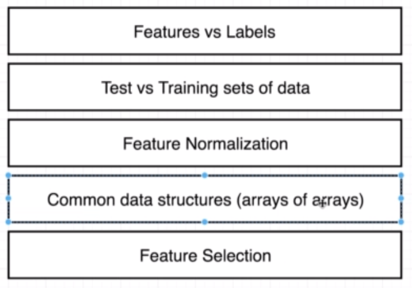

## 공식 홈페이지

> https://js.tensorflow.org/

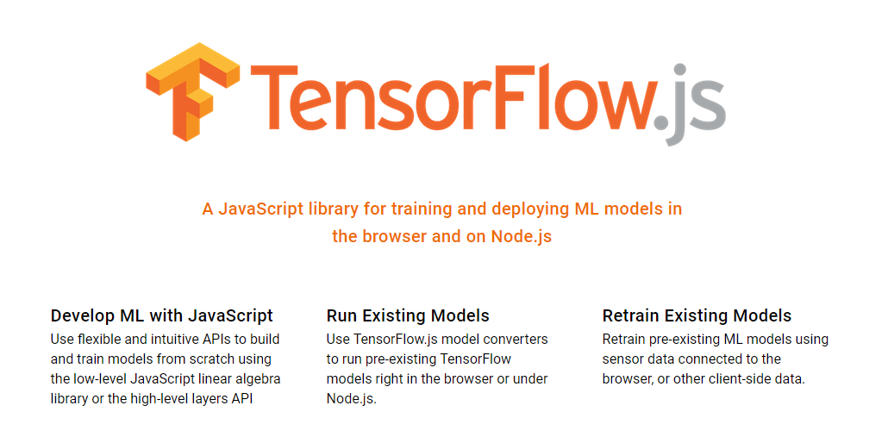

## 첫번째 예제

> ` tensorflow js`를 이용해서 배열에 있는 숫자들을 작업하자

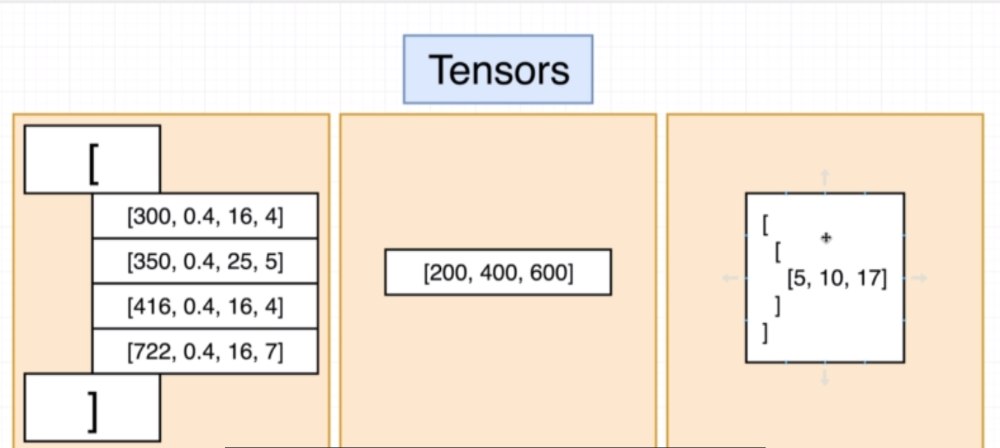

### Dimensions

- 1차원, 2차원, 3차원...n차원 배열

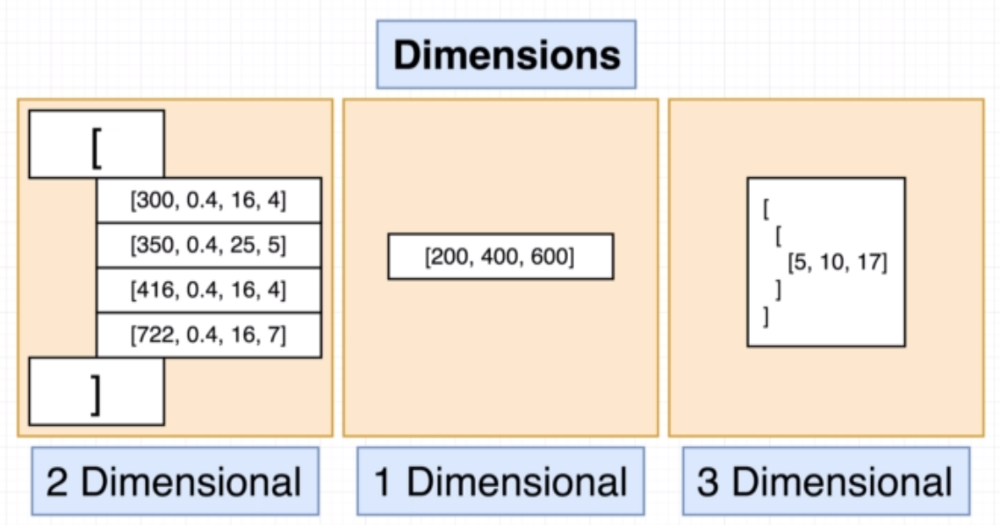

### Shape

- 각각의 배열에 얼마나 많은 레코드를 가지고 있는지 표현
- 배열에 대한 길이를 뜻함

예를 들어 [5,10,17] 에 대한 `shape` 는 3 이라고 생각하면 된다. 


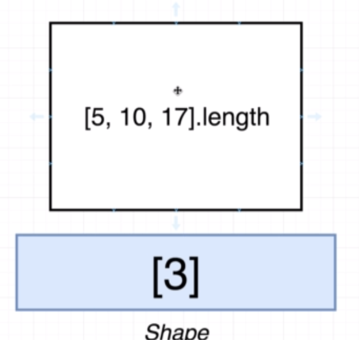


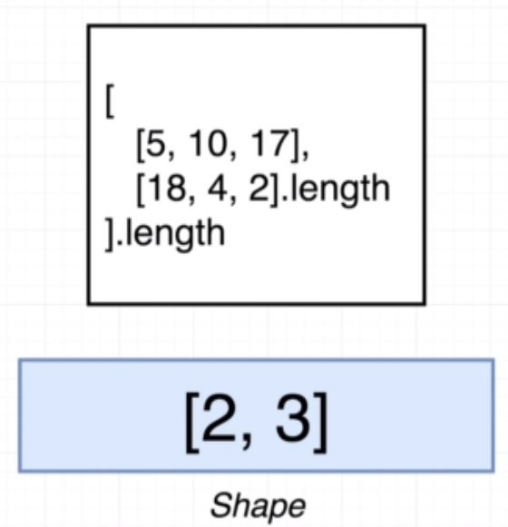

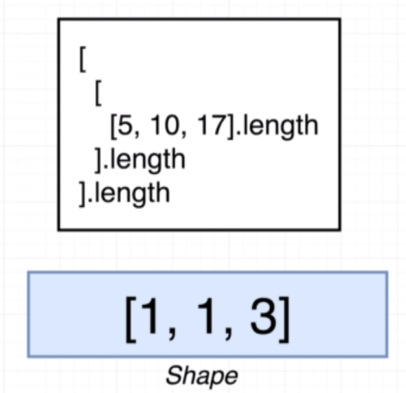


### 실습

> https://stephengrider.github.io/JSPlaygrounds/

```javascript
const data = tf.tensor([1,2,3])

data.shape

>> [3]
```

```javascript
const data = tf.tensor([1,2,3])
const otherdata = tf.tensor([4,5,6]);

data.add(otherdata);

>> [5,7,9]
```

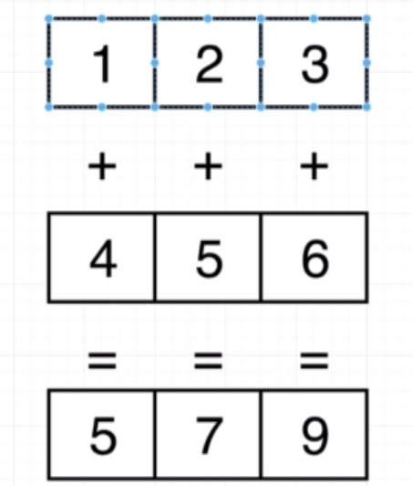

```javascript
const data = tf.tensor([1,2,3])
const otherdata = tf.tensor([4,5,6]);

data.sub(otherdata);
data.mul(otherdata);


>> [-3, -3, -3]
>> [4, 10, 18]
```


```javascript
const data = tf.tensor([
  [1,2,3],
  [4,5,6]
]);
const otherdata = tf.tensor([
  [4,5,6],
  [1,2,3]
]);

data.add(otherdata);

>> [[5, 7, 9], [5, 7, 9]]
```

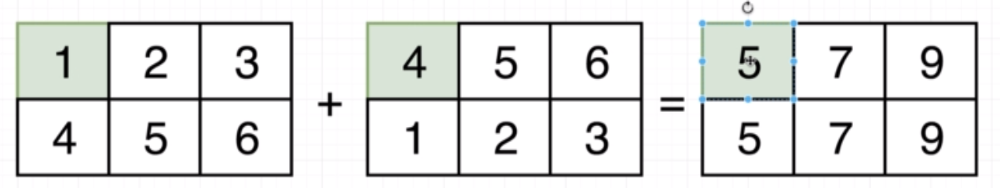


#### 행령의  길이가 안맞는 경우

지금까지 같은 배열을 계산을 진행했다. 하지만 만약 길이가 다른 경우에는 어떻게 처리할까?


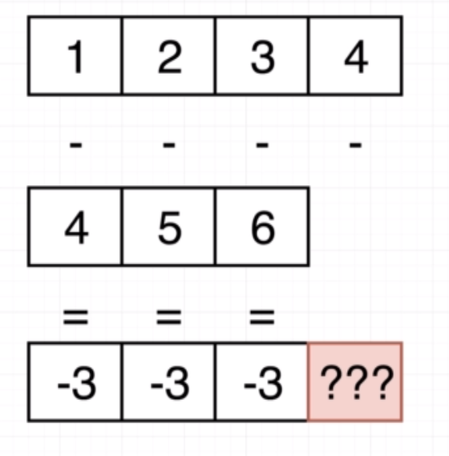

```javascript
const data = tf.tensor([1,2,3]);
const otherdata = tf.tensor([4]);

data.add(otherdata);

>> [5,6,7]
```

#### 브로드캐스팅

행렬의 길이가 다른 경우에도 동작을 하기 위해선 조건이 있다. 그에 대해서 알아보자. 

- 오른쪽에서 왼쪽으로 이동되며 `shapes` 길이가 똑같거나 `어느 한쪽이 1이 되어야 한다. `

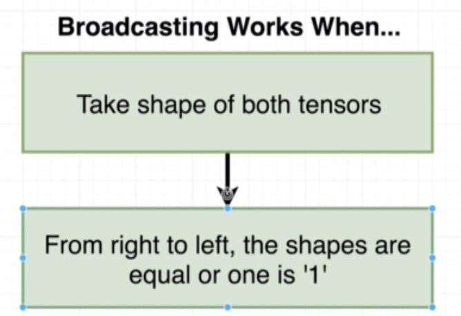

> 어느 한쪽길이가 1이라서 아래 두개의 수식은 성립된다. by 브로드캐스팅

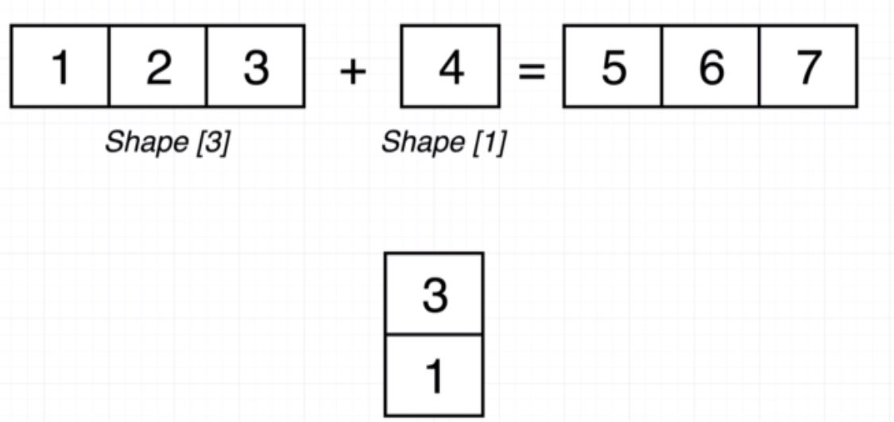

>오른쪽부터 왼쪽으로 1이 있으므로 계산 가능하다.

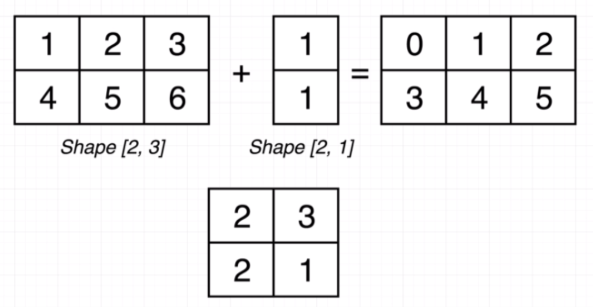

> 다른 텐서들중 하나가 없더라도 다른게 일치한다면 계산이 가능하다. 

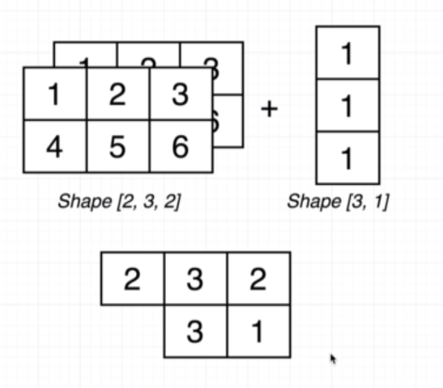

>


#### 텐서플로 핸들링

#### Get

```javascript
const data = tf.tensor([10, 20, 30]);

data.get(0);

>> 10
```

**2차원 배열일 경우에는**

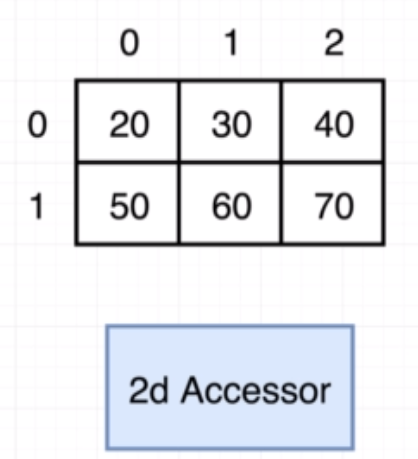

```javascript
const data = tf.tensor([
  [10, 20, 30],
  [40, 50, 60],  
]);

data.get(0, 1);

>> 20
```

> 값을 가져올때 중요한 점은 `(row, column)` 으로 가져온다는 것이다. 

#### Set

```
const data = tf.tensor([
  [10, 20, 30],
  [40, 50, 60],  
]);

data.set(0, 0, 50) //작동안됨
```

#### Slice

```javascript
const data = tf.tensor([
  [10, 20, 30],
  [40, 50, 60],
  [10, 60, 30],
  [10, 70, 30],
  [10, 80, 30],
  [10, 90, 30],
  [10, 100, 30],
  [10, 110, 30],
]);

data.slice([0,1], [8, 1])

>> [[20 ], [50 ], [60 ], [70 ], [80 ], [90 ], [100], [110]]
```

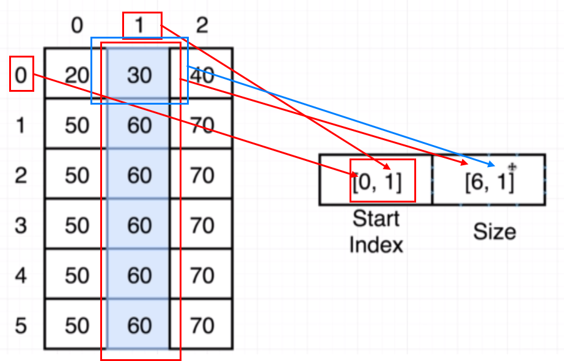

> `size` 는 시작위치가 1이다. 

```javascript
....

data.slice([0,1], [-1, 2]) // 전체 길이를 선택시 -1로 가능하다. 
```

#### Concat

```javascript
const tensorA = tf.tensor([
  [1, 2, 3],
  [4, 5, 6],
  [7, 8, 9],
]);

const tensorB = tf.tensor([
  [10, 11, 12],
  [13, 14, 15],
  [16, 17, 18],
]);

tensorA.concat(tensorB);


>> [[1 , 2 , 3 ], [4 , 5 , 6 ], [7 , 8 , 9 ], [10, 11, 12], [13, 14, 15], [16, 17, 18]]
```

이 결과에서 만약 `shape`를 구하면 어떻게 될까?

```javascript
tensorA.concat(tensorB).shape

>> [6,3]
```

> ???? 어떻게 이런 결과가 나올까?

처음 단계를 살펴보면 A,B 를 합치는 경우 

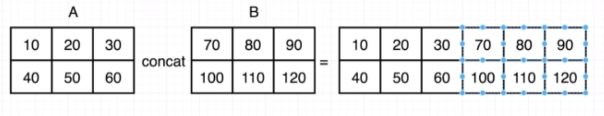

이런 형태를 추측 할 수 있다. 

하지만 shape 결과로 나온걸 추측해보면

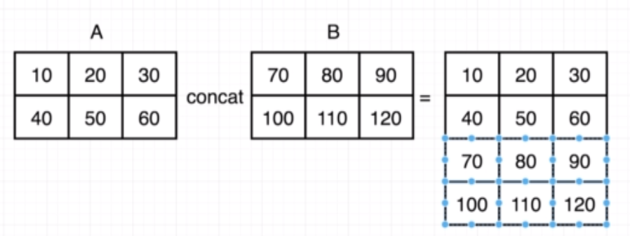

이렇게 구성된 걸 볼 수 있다. 

왜 이렇게 되는 건지 살펴보자. 

#### Axis

텐서플로를 축으로 `shape` 계산이 가능하다. 

기본 세로축은 0, 가로축은 1 로 계산한다. 

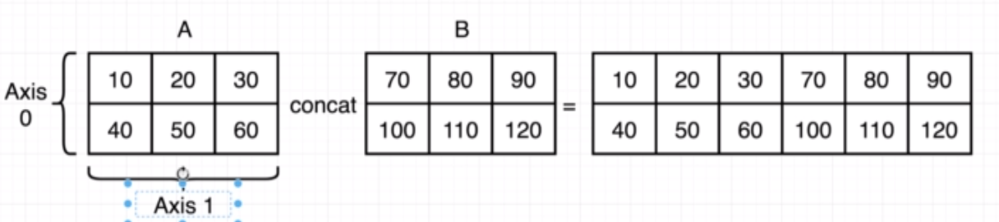


가로축 기준으로 생각해보면 

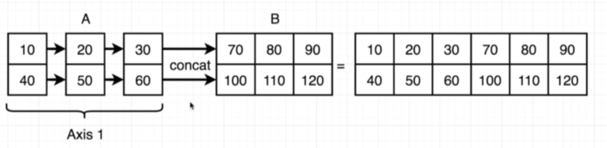

```javascript
const tensorA = tf.tensor([
  [1, 2, 3],
  [4, 5, 6],
  [7, 8, 9],
]);

const tensorB = tf.tensor([
  [10, 11, 12],
  [13, 14, 15],
  [16, 17, 18],
]);

tensorA.concat(tensorB,0).shape
tensorA.concat(tensorB,1).shape

>> [6,3]
>> [3,6]
```


#### 실제 예제

만약 멀리뛰기를 예를 들어보자. 

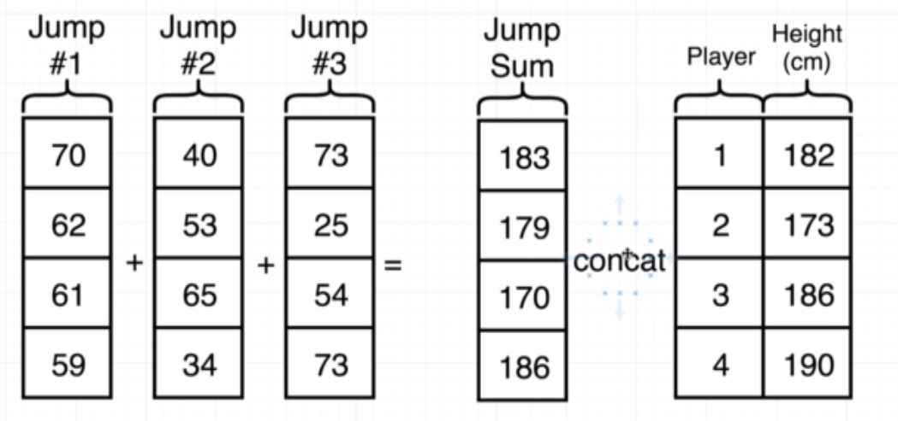

```javascript
const jumpData = tf.tensor([
  [70, 70, 70],
  [80, 70, 90],
  [70, 70, 70]
]);

const playerData = tf.tensor([
  [1,160],
  [2,160],
  [3,160],
  [4,160],
]);

jumpData.sum(0)
jumpData.sum(1)

>> 
[220, 210, 230] //세로축 기준
[210, 240, 210] //가로축 기준
```

> 두개의 shape 가 안맞아서 에러가 난다.

```javascript
const jumpData = tf.tensor([
  [70, 70, 70],
  [80, 70, 90],
  [70, 70, 70]
]);

const playerData = tf.tensor([
  [1,160],
  [2,160],
  [3,160],
  [4,160],
]);

jumpData.concat(playerData)

>> 에러

Error: Error in concat2D: Shape of tensors[1] (4,2) does not match the shape of the rest (3,3) along the non-concatenated axis 1.
```

이럴 경우 해결 방법에 대해서 알아보자. 

```javascript
const jumpData = tf.tensor([
  [70, 70, 70],
  [80, 70, 90],
  [70, 70, 70],
  [70, 70, 70]
]);

const playerData = tf.tensor([
  [1,160],
  [2,160],
  [3,160],
  [4,160],
]);

jumpData.sum(1, true).concat(playerData, 1)

>> [[210, 1, 160], [240, 2, 160], [210, 3, 160], [210, 4, 160]]
```

#### expandDims

```javascript
const jumpData = tf.tensor([
  [70, 70, 70],
  [80, 70, 90],
  [70, 70, 70],
  [70, 70, 70]
]);

const playerData = tf.tensor([
  [1,160],
  [2,160],
  [3,160],
  [4,160],
]);

jumpData.sum(1).expandDims(1)

>> [[210], [240], [210], [210]]
```

```javascript
const jumpData = tf.tensor([
  [70, 70, 70],
  [80, 70, 90],
  [70, 70, 70],
  [70, 70, 70]
]);

const playerData = tf.tensor([
  [1,160],
  [2,160],
  [3,160],
  [4,160],
]);

jumpData.sum(1).expandDims(1).concat(playerData, 1)

>> [[210, 1, 160], [240, 2, 160], [210, 3, 160], [210, 4, 160]]
```

여기까지 3주차 스터디 내용이었다. 

주로 배운 내용은 텐서플로 JS 에서의 이해였다. 

참석해주셔서 감사합니다. 