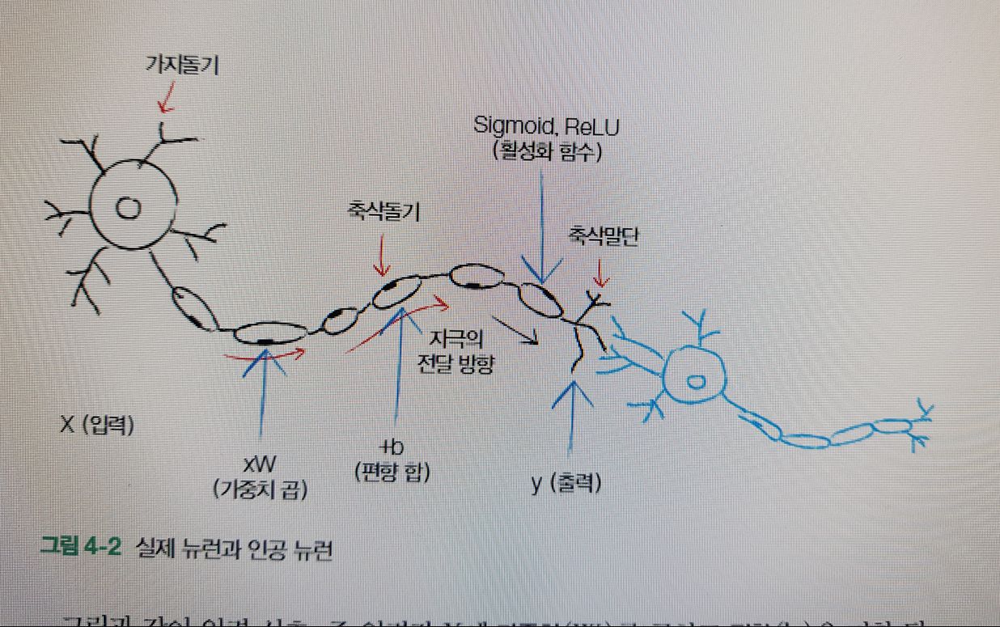

# 인공신경망 기초

그림과 같이 입력신호, 즉 입력값 `x`에 `가중치(W)`를 곱하고 `편향(b)`을 더한뒤 활성화 함수를 거쳐서 `결과값(y)`을 만들어 내는 게 인공 뉴런의 기본이다. 원하는 `y` 값을 만들기 위해서 `w`와 `b`의 값을 변경해 가면서 적잘한 값을 찾아내는 최적화 과정을 `학습` 또는 `훈련` 이라고 한다. 

y = Sigmoid( X x W + b)

> 가중치와 편향을 찾아내는 게 핵심

활성화 함수에는 다음과 같은 종류가 있다. 
- Sigmoid (시그모이드)
- ReLU(렐루)
- tanh(쌍곡틴젠트)

