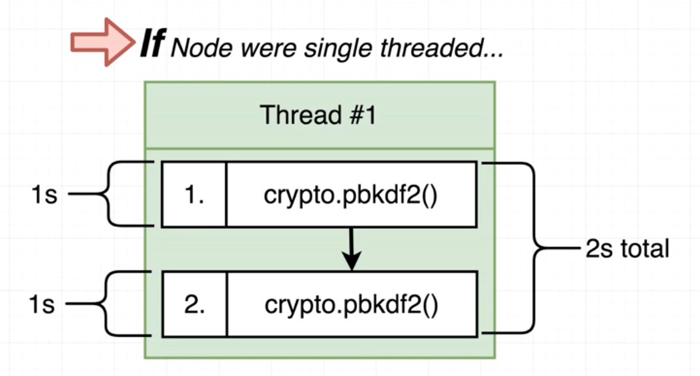
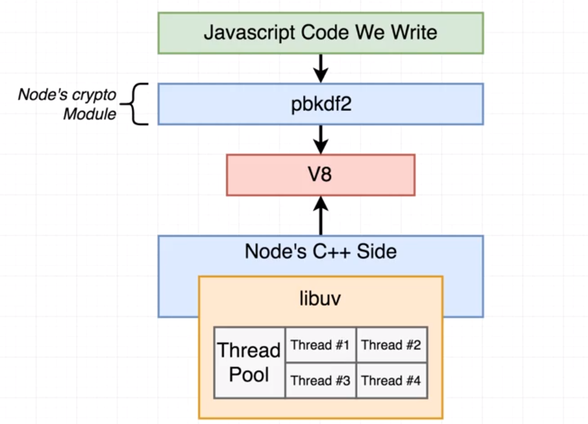
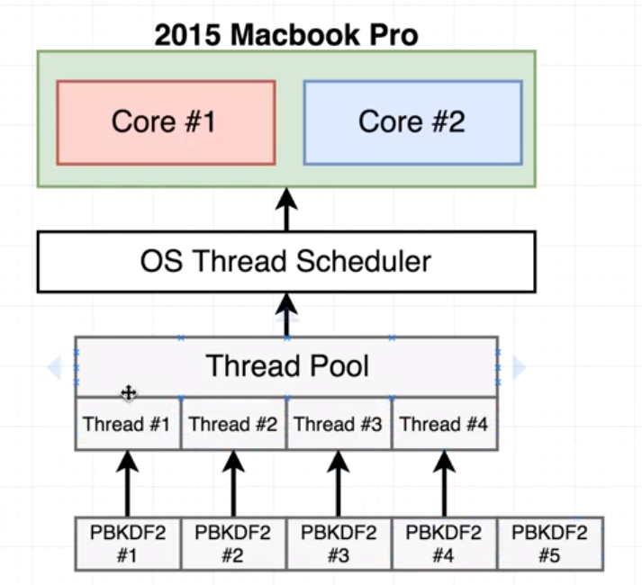
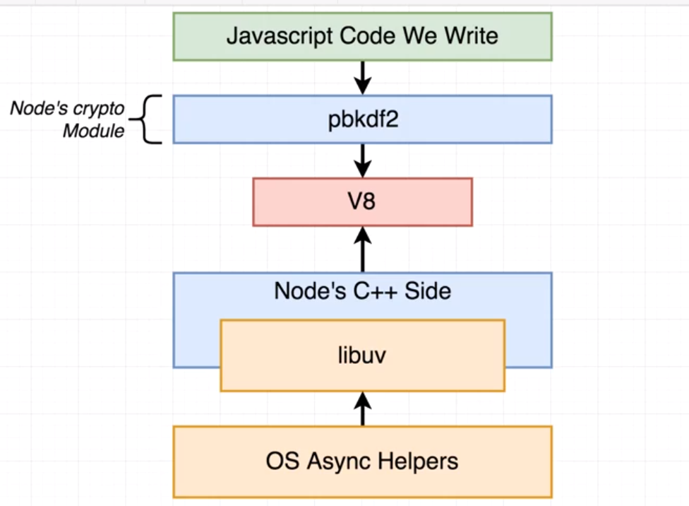
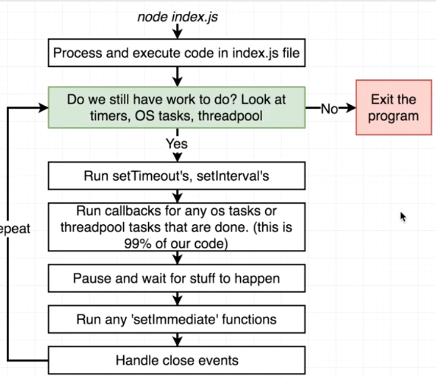
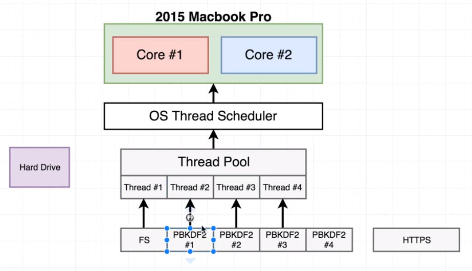

# NodeJS Advance 1주차 스터디 정리 #2

> 부산에서 매주 진행되는 `NodeJS Advance 스터디`입니다.
>
> 더 많은 스터디는 [네이버 카페](https://cafe.naver.com/busandev)에서 확인 부탁드립니다.
>
> 스터디 내용은 [Udemy 강좌](https://www.udemy.com/advanced-node-for-developers)를 같이 보고 정리를 한 글입니다. 

- [NodeJS 내부 구조 정리](http://javaexpert.tistory.com/1000)

## 이벤트 루프 내부 구조

이전 글에도 있지만 다시 내용을 살펴보자. 

- `pendingTimers`
- `pendingOSTasks`
- `pendingOperations`

```javascript
// node myFile.js

const pendingTimers = [];
const pendingOSTasks = [];
const pendingOperations = [];

// New timbers, tasks, operations are recorded from myFile running
myFile.runContents();

function shouldContinue() {
    // Check one : Any pending setTimeout, setInterval, setImmediate?
    // Check two: Any pending OS tasks? (Like server listening to port)
    // Check three: Any pending long running operations? (Like fs module)
    return pendingTimers.length || pendingOSTasks.length || pendingOperations.length;
}
// Entire body executes in one 'tick'
while(shouldContinue()) {
    // 1) Node looks at pendintTimers and sees if any functions
    // are ready to be called. setTimeout, setInterval

    // 2) Node looks at pendingOSTasks and pendingOperations
    // and calls relevant callbacks

    // 3) Pause execution. Continue when ....
    // - a new pendingOSTask is done
    // - a new pendingOperation is done
    // - a timer is about to complete

    // 4) Look at pendingTimers. Call any setImmediate

    // 5) Handle any 'close' events
}

// exit back to terminal
```


> 이번글에서는 이러한 3가지 내용에 대해서 자세히 공부해보도록 한다. 

## 노드는 싱글(단일) 쓰레드일까?

- 이벤트 루프는 기본적으로 `싱글쓰레드`가 맞다. 
- 어떤 라이버러리들은 `싱글쓰레드`가 아니다. 


## 1. Libuv Threads - `pendingOperation`

예를 들어 `pbkdf2` 함수를 예를 들어보자. 

```javascript
const crypto = require('crypto');

const start = Date.now();
crypto.pbkdf2('a', 'b', 100000, 512, 'sha512', () => {
    console.log('1:', Date.now() - start);
});

crypto.pbkdf2('a', 'b', 100000, 512, 'sha512', () => {
    console.log('2:', Date.now() - start);
});

crypto.pbkdf2('a', 'b', 100000, 512, 'sha512', () => {
    console.log('3:', Date.now() - start);
});

crypto.pbkdf2('a', 'b', 100000, 512, 'sha512', () => {
    console.log('4:', Date.now() - start);
});


.....................
4: 1050
1: 1072
3: 1089
2: 1112
```

보시다 시피 동시에 4개의 쓰레드가 동작이 된다. 만약 싱글쓰레드라고 가정하면 각각 1초씩 진행이 되어야 하고 총 4초가 걸려야 한다. 



이유는 `Libuv` 내에서는 자체 `Thread Pool` 을 가지고 있다. 



기본적으로 한개의 쓰레드풀에 4개의 쓰레드가 있으며 이건 `Size`를 늘리거나 줄일 수 있다. 

```
process.env.UV_THREADPOOL_SIZE = 5
```

기본이 4개인걸 테스팅 해보자.  

총 6번을 실행시 1~4번째까지는 1초가 걸리고 5번째 부터는 첫번째 내용이 끝나면 빈자리로 들어가는 걸 볼 수 있다.

```javascript
const crypto = require('crypto');

const start = Date.now();
crypto.pbkdf2('a', 'b', 100000, 512, 'sha512', () => {
    console.log('1:', Date.now() - start);
});

crypto.pbkdf2('a', 'b', 100000, 512, 'sha512', () => {
    console.log('2:', Date.now() - start);
});

crypto.pbkdf2('a', 'b', 100000, 512, 'sha512', () => {
    console.log('3:', Date.now() - start);
});

crypto.pbkdf2('a', 'b', 100000, 512, 'sha512', () => {
    console.log('4:', Date.now() - start);
});

crypto.pbkdf2('a', 'b', 100000, 512, 'sha512', () => {
    console.log('5:', Date.now() - start);
});

crypto.pbkdf2('a', 'b', 100000, 512, 'sha512', () => {
    console.log('6:', Date.now() - start);
});

.......

4: 1050
1: 1072
3: 1089
2: 1112 
6: 1946 <-- 새로운 1초가 걸리는 걸 확인 할수 있다.
5: 1956
```



그러면 Thread Pool 에 대해 궁금한 점이 있을수 있다. 

- 자바스크립트를 위해 쓰레드 풀을 사용하거나 오직 nodejs 함수를 통해서 사용가능한가?

> `Custom JS` 를 통해서 `쓰레드 풀`를 사용을 할수 있다. 

- 어떤 std 라이버러리 함수를 통해서 쓰레드 풀을 사용할 수 있는가?

> 모든 `fs 모듈 함수`를 통해서 사용 가능하다. 그리고 몇개의 `crypto` 함수들은 OS에 종속되어 있다. 

- 그럼 이벤트 루프에서 이러한 쓰레드풀이 어떻게 사용되어 지는가?

> 처음 글에서 봤던 `이벤트 루프` 함수 내 `pendingOperations` 으로 사용되어 진다. 


## 2. OS's async - `pendingOSTasks`



Operation Thread 와는 다르게 운영체제에서 직접 실행하는 내용이다. 

즉 쓰레드를 이용하지 않고 다른 영역에서 호출된다고 보면 된다.  

여러개를 호출해도 한번에 실행되는 걸 볼수 있다. 

````javascript
const https = require('https');

const start = Date.now();

function doRequest() {
    https.request('https://www.google.com', res => {
        res.on('data', () => {});
        res.on('end', () => {
            console.log(Date.now() - start);
        });
    })
    .end();
}

doRequest();
doRequest();
doRequest();
doRequest();
doRequest();
doRequest();
doRequest();
doRequest();

...............
582
591
601
612
630
637
639
667
````

이에 대해 FAQ를 정리해보자. 

- node에서 std 라이버러리에서 OS's async 기능을 사용할 수 있나?

- > 거의 모든 네트워킹 관련된건 OS's async 기능을 이용한다. 

- 이벤트 루프내에서 이 기능이 사용되어 지는가?

- > `pendingOSTasks`로 사용되어 진다. 

## 노드JS 흐름도



## NodeJS 쓰레드 우선 순위

만약에 thread pool 과 os's async이 만날 경우 어떤 순서로 실행될까?

```javascript
const https = require('https');
const crypto = require('crypto');
const fs = require('fs');

const start = Date.now();

function doRequest() {
    https.request('https://www.google.com', res => {
        res.on('data', () => {});
        res.on('end', () => {
            console.log(Date.now() - start);
        });
    })
    .end();
}

function doHash(no) {
    crypto.pbkdf2('a', 'b', 100000, 512, 'sha512', () => {
        console.log(`Hash #${no}:`, Date.now() - start);
    });
}

#1
doRequest();

#3
fs.readFile('multitask.js', 'utf8', () => {
    console.log('FS:', Date.now() - start);
});

#2
doHash(1);
#4
doHash(2);
#5
doHash(3);
#6
doHash(4);

............

633
Hash #2: 965
FS: 966
Hash #1: 971
Hash #3: 990
Hash #4: 1010
```

우선 OS 가 먼저 실행되고 파일읽는게 먼저 실행되었는데 HASH 함수가 먼저 실행된 걸 볼수 있다. 

1. OS 실행 - `doRequest`()

2. `fs.readFile` 실행

3. `ThreadPool` 에 `redFile` 함수 등록

   

4. `readFile` 함수가 OS 단으로 빠짐 - 파일 읽어야 해서

5. 그 쓰레드 번호에 다른 남아있는 `HASH` 함수가 등록됨

   

6. 

7. 그리고 `readFile` 함수가 끝나면 처리가 완료된다.

8. 마지막으로 나머지 HASH 값이 처리가 된다. 

여기까지 이번 주차에서 공부한 내용이다. 

중요한 점은 다음과 같다. 

1. `OS's async `
2. `Thread Pool`
3. `Thread Pool size 조절 가능함`
4. `fs 사용시 순서 고려해야함`

이상으로 1주차 노드 중급 스터디 정리 내용입니다. 

참석해주셔서 감사합니다.