# NodeJS Advance 1주차 스터디 정리

> 부산에서 매주 진행되는 `NodeJS Advance 스터디`입니다.
>
> 더 많은 스터디는 [네이버 카페](https://cafe.naver.com/busandev)에서 확인 부탁드립니다.
>
> 스터디 내용은 [Udemy 강좌](https://www.udemy.com/advanced-node-for-developers)를 같이 보고 정리를 한 글입니다. 
>


## 들어가며

`Node`를 안지 벌써 2년이 넘은것 같다.  하지만 늘 express 로 `rest api` 서버로만 개발만 하다 좀 더 알고 싶은 마음이 항상 있었다. 그래서 스터디 주제도 `중급 노드JS`로 정해서 진행하기로 했다. 


## NodeJS 기본 구조

- `Javascript code` 작성
- `NodeJS`
- `V8` 또는 `libuv` 에서 처리

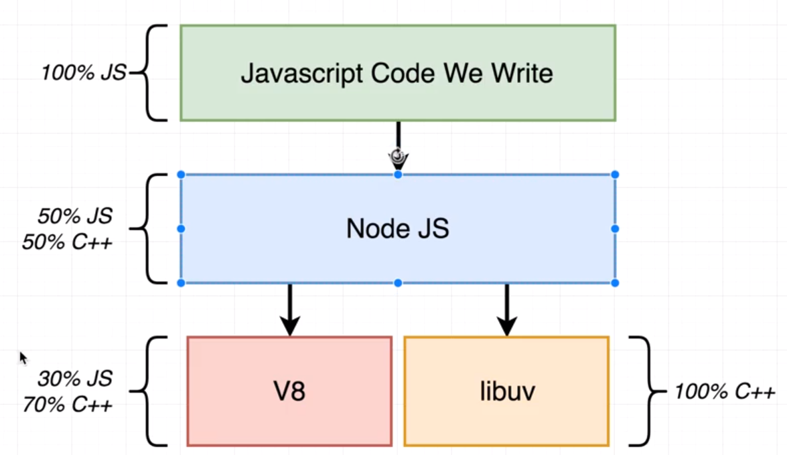

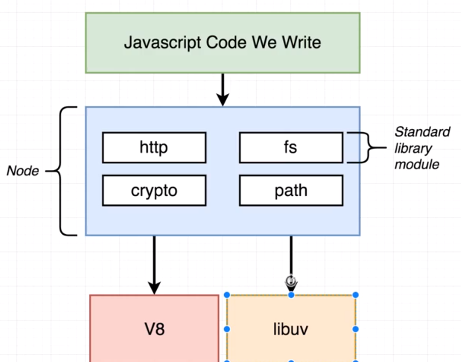

> `Crypto` 안에 있는 `pbkdf2` 함수를 통해서 동작원리를 파악할 예정이다. 

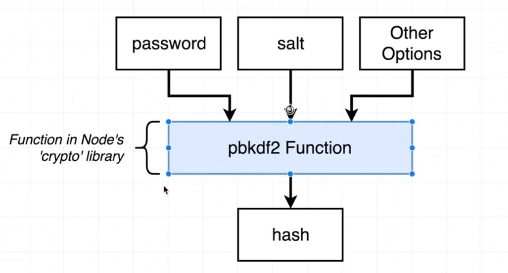

`NodeJS `소스내에 `pbkdf2.js` 파일을 살펴보자. 

[소스위치](https://github.com/nodejs/node/blob/59ace5752a13136eee7ae07ca173bc2addda2e9f/lib/internal/crypto/pbkdf2.js)

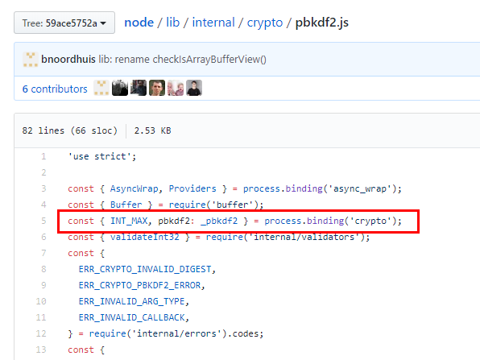

`crypto` 라는 걸 통해서 `process.binding` 을 해주는 걸 볼 수 있다.  

`c++` 로 구현된 걸 가져온 걸로 보인다.  그럼 `c++` 구현 내부를 살펴보면...

> [node /src / node_crypto.cc](https://github.com/nodejs/node/blob/59ace5752a13136eee7ae07ca173bc2addda2e9f/src/node_crypto.cc)


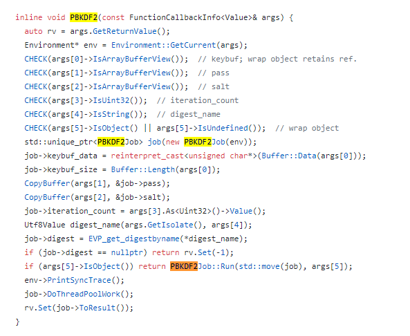

좀 더 내부 과정을 살펴보면 아래 그림과 같다고 한다. 

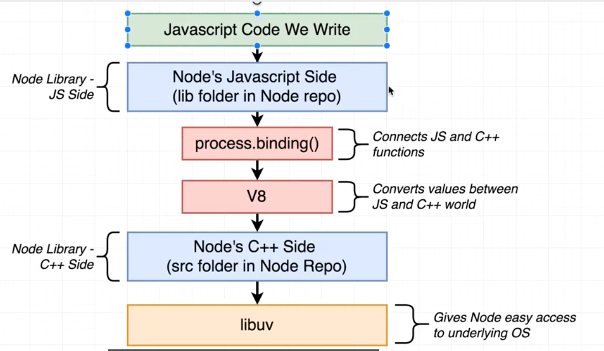


추가적으로 c++ 와 자바스크립트 사이에 `V8` 를 통해서 중개해주고 있는 걸 볼 수 있다. 

> [node /src / node_crypto.cc](https://github.com/nodejs/node/blob/59ace5752a13136eee7ae07ca173bc2addda2e9f/src/node_crypto.cc)

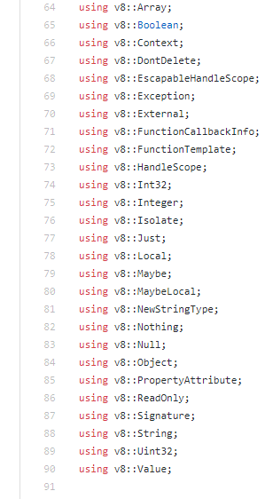


## libuv

이건 좀 더 운영체제와 관련된 내용인데 나중에 공부하도록 한다. 

## Thread

이벤트 루프로 들어가기전 사전지식인 `Thread` 에 대해서 공부하고 넘어가도록 한다. 

>  일반적인 싱글 프로세스 형태

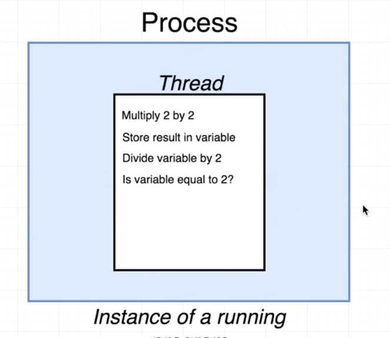

> 멀티 프로세스 형태

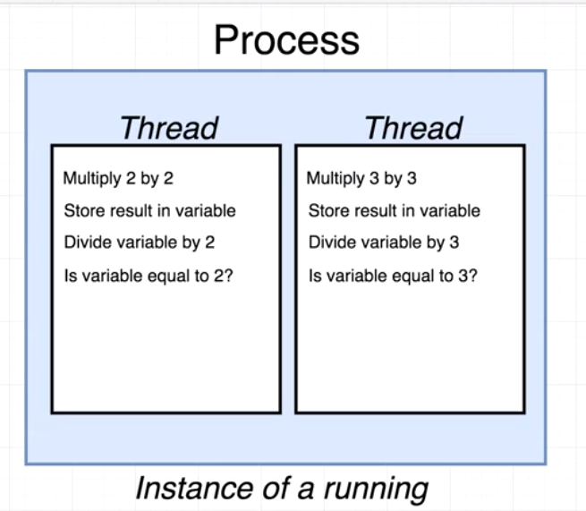

윈도우의 경우 작업관리자를 열고 살펴보면 `Thread` 갯수를 확인할수 있다. 

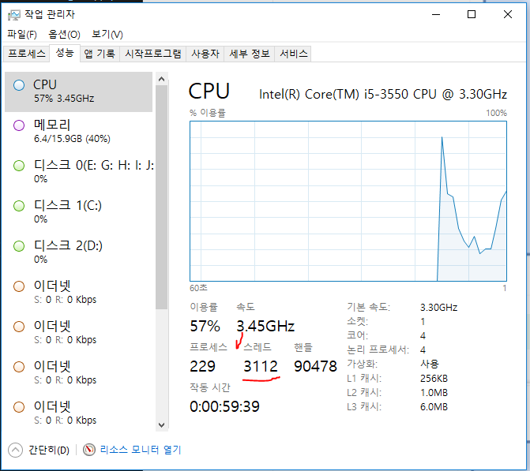

## 스케쥴링

운영체제는 특점 시점에서 처리할 쓰레드를 결정할 수 있다. 


> 하나이상의 `코어`가 있는 경우 여러 쓰레드를 쉽게 빠르게 처리를 할 수 있다. 

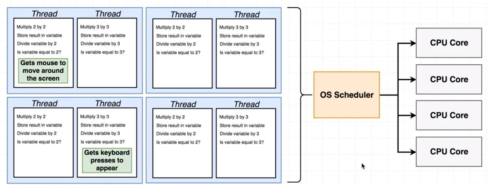

만약에 2개의 쓰레드가 있다고 가정하고 한개의 쓰레드가 I/O 로 시간이 걸린다고 했을 경우 스케쥴러에서 따로 뺀 공간에서 처리를 하고 2번이 끝나고 1을 다시 넣어서 마무리를 할 수 있다. 

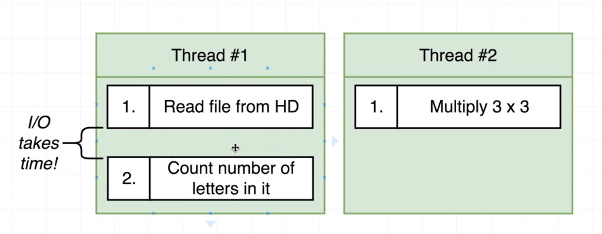

추후 다시 한번 소스를 보면서 쓰레드 관련된 내용을 살펴볼 예정이다. 

## Event loop

> `이벤트 루프`는 한 `쓰레드`가 무엇을 해야하는지 결정하는 `제어 구조`와 같다고 생각하면 된다. 

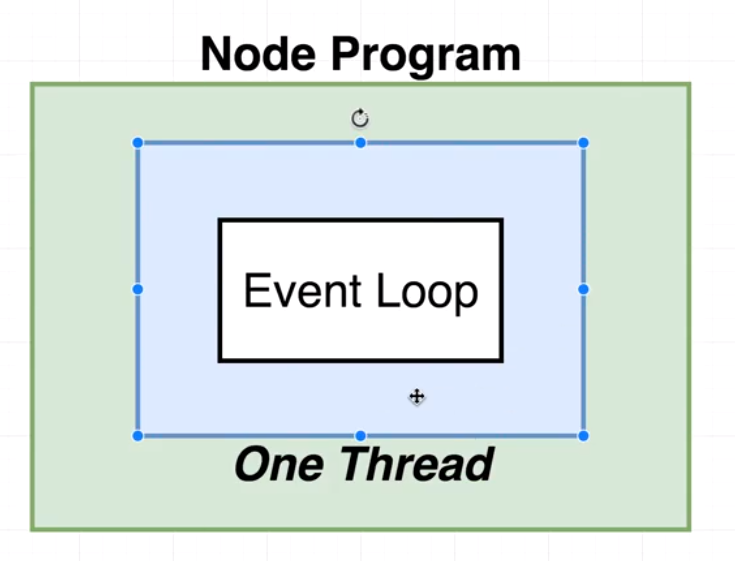

전체적인 이벤트 루프 구조를 `Pseudo code` 로 살펴보자. 

> 크게 3가지 제어 구문이 끝나야 이벤트 루프가 끝난다. 

- `pendingTimers`
  - Check Any pending setTimeout, setInterval, setImmediate?
- `pendingOSTasks`
  - Check Any pending OS tasks? (Like server listening to port)
- `pendingOperations`
  - Check Any pending long running operations? (Like fs module)

```javascript
// node myFile.js

const pendingTimers = [];
const pendingOSTasks = [];
const pendingOperations = [];

// New timbers, tasks, operations are recorded from myFile running
myFile.runContents();

function shouldContinue() {
    // Check one : Any pending setTimeout, setInterval, setImmediate?
    // Check two: Any pending OS tasks? (Like server listening to port)
    // Check three: Any pending long running operations? (Like fs module)
    return pendingTimers.length || pendingOSTasks.length || pendingOperations.length;
}
// Entire body executes in one 'tick'
while(shouldContinue()) {
    // 1) Node looks at pendintTimers and sees if any functions
    // are ready to be called. setTimeout, setInterval

    // 2) Node looks at pendingOSTasks and pendingOperations
    // and calls relevant callbacks

    // 3) Pause execution. Continue when ....
    // - a new pendingOSTask is done
    // - a new pendingOperation is done
    // - a timer is about to complete

    // 4) Look at pendingTimers. Call any setImmediate

    // 5) Handle any 'close' events
}

// exit back to terminal
```

다음 글을 통해서 각각의 내용에 대해서 자세히 살펴볼 예정이다. 

참석해주셔서 감사합니다. 