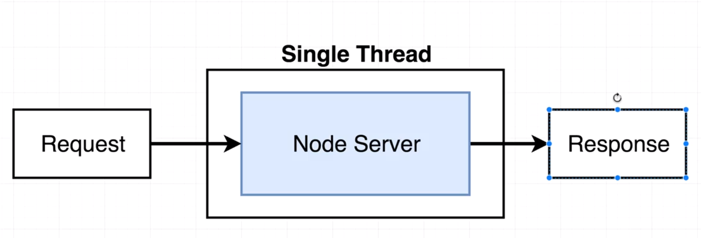
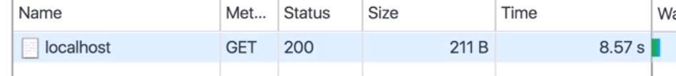
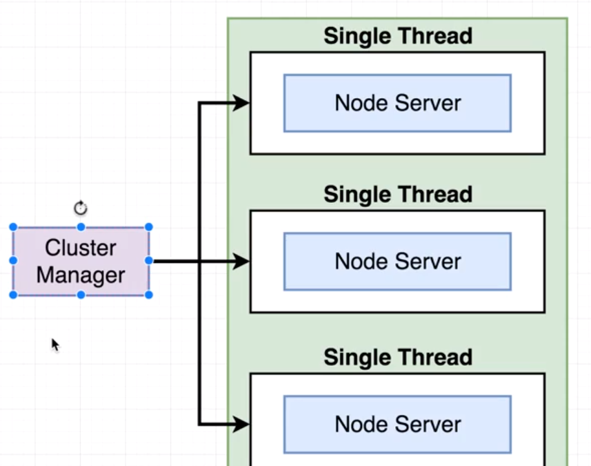
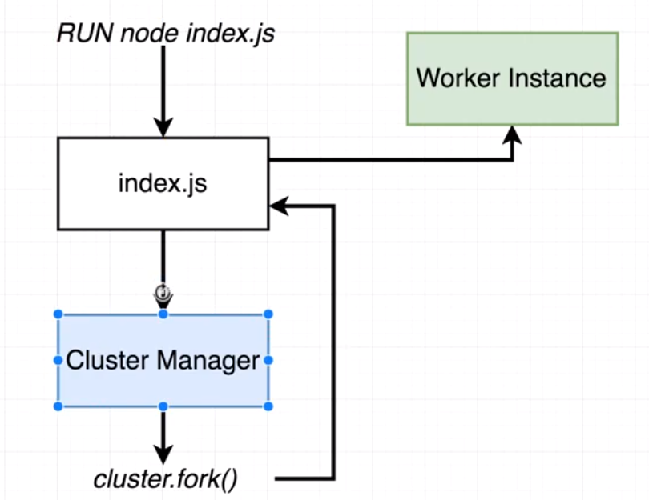
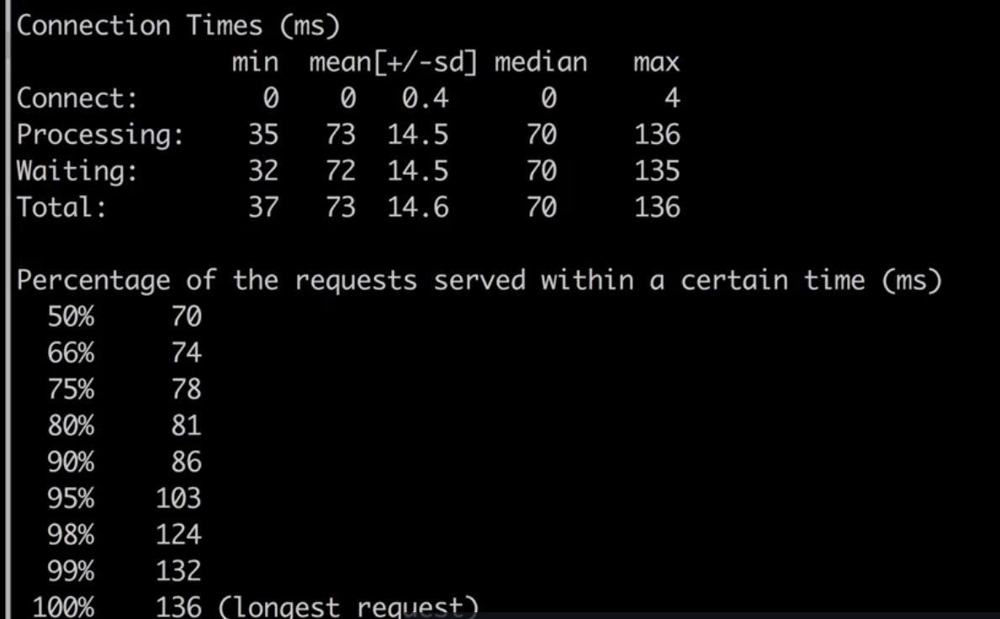

# NodeJS Advance 2주차 스터디 

> 부산에서 매주 진행되는 `NodeJS Advance 스터디`입니다.
>
> 더 많은 스터디는 [네이버 카페](https://cafe.naver.com/busandev)에서 확인 부탁드립니다.
>
> 스터디 내용은 [Udemy 강좌](https://www.udemy.com/advanced-node-for-developers)를 같이 보고 정리를 한 글입니다.

1주차 스터디 내용

- [NodeJS 내부 구조 정리 #1](http://javaexpert.tistory.com/1000)
- [NodeJS 내부 구조 정리 #2](http://javaexpert.tistory.com/1001)

이번 스터디에서는 노드의 성능향상에 대해서 공부하도록 한다. 

- `Cluster` 모드를 사용
- `Worker Threads`를 사용

우선 테스트를 위해 `express` 를 사용해보자. 

```javascript
const express = require('express');
const app = express();

app.get('/', (req, res) => {
    res.send('Hi there');
});

app.listen(3000);
```

위와 같이 구성될 경우 일반적이라고 볼수 있는데 이건 그림으로 표현하자면



## 의도적 딜레이

만약 요청을 5초정도로 하는 경우 동시에 실행시 어떻게 되는지 체크 해보자. 

```javascript
const express = require('express');
const app = express();

function doWork(duration) {
    const start = Date.now();
    while(Date.now() - start < duration) {

    }
}

app.get('/', (req, res) => {
    doWork(5000);
    res.send('Hi there');
});

app.listen(3000);
```

하나만 실행했을 경우 5초가 걸릴것이다. 

만약 2개를 동시에 실행시 처음 5초가 끝나고 두번째가 실행된다. 

- 2번째를 동시 실행시 8.57초가 걸리는 걸 볼수 있다.



이를 해결하기 위해 `Cluster` 라는 방법을 사용할 수 있다. 



## Cluster 동작원리

- 처음 `index.js` 를 호출시 `cluster manager`를 통해서 `cluster.fork()` 를 실행
- 그 후 다시 `index.js` 로 가서 `worker instance`를 실행한다. 



소스로 구현해보자. 

- `cluster.fork()`를 통해서 다시 `index.js` 를 실행해서 프로세스를 새로 만든다. 

```javascript
const cluster = require('cluster');

if(cluster.isMaster) {
    cluster.fork();
} else {
    const express = require('express');
    const app = express();

    function doWork(duration) {
        const start = Date.now();
        while(Date.now() - start < duration) {

        }
    }

    app.get('/', (req, res) => {
        doWork(5000);
        res.send('Hi there');
    });

    app.listen(3000);

}
```

## 다중 클러스터

만약 Cluster 를 여러개 설정시 어떻게 될까?

```
cluster.fork();
cluster.fork();
cluster.fork();
```

테스트시 다른 탭에 있는 2개의 쓰레드가 빨리 도는 걸 확인할수 있다는데...잘 안된다...;;

## AB 테스트

맥이나 리눅스에서 AB 테스팅할 수 있는 방법이 있다고 한다. 

> 50번의 요청을 동시에 50번을 날리도록 실행

```
ab -c 50 -n 50 localhost:3000/fast
```



## 문제점

클러스터를 실행하더라도 한정된 자원이 있기 때문에 점점 가성비가 떨어진다고 한다. 


이번 시간에는 클러스트 개념과 기본 사용법에 대해서 살펴보았다. 

참석해주셔서 감사합니다. 

