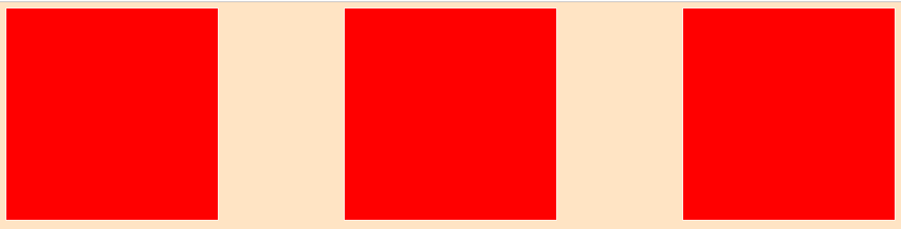
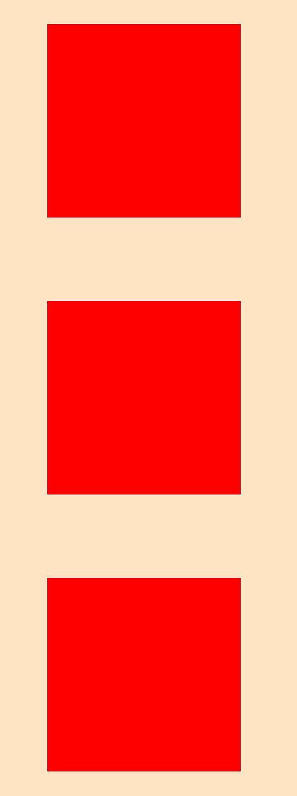
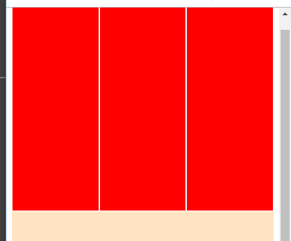
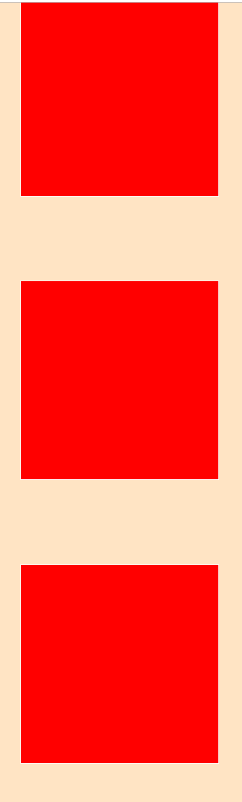
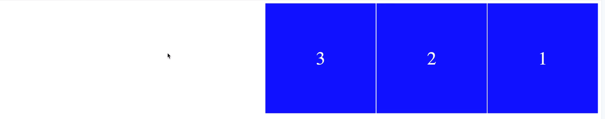
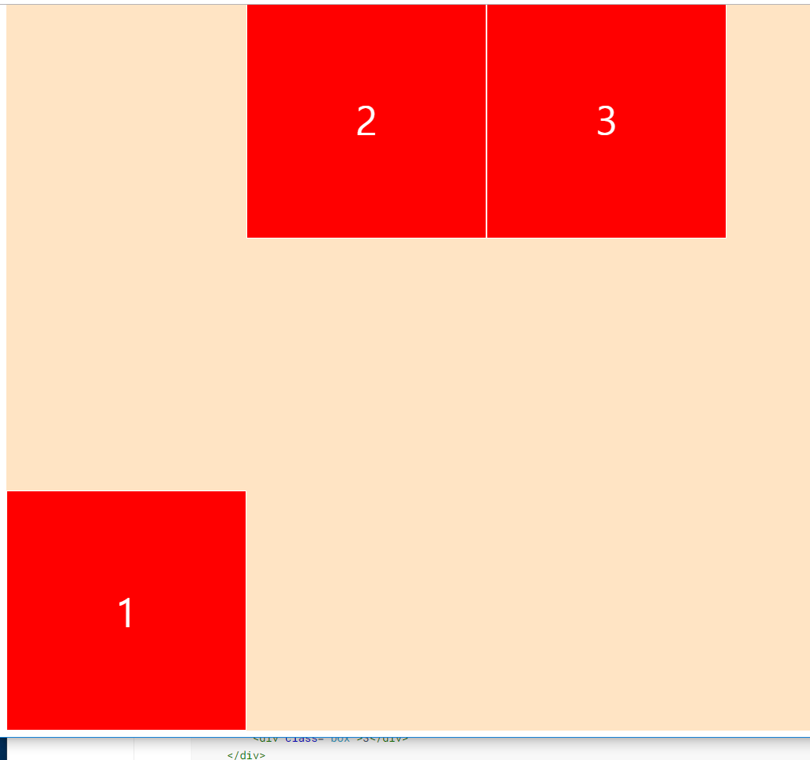

# HTML + CSS 스터디 1주차 스터디 정리내용

> 부산에서 매주 진행되는 CSS 초중급 스터디입니다. 

목차

- `Flex`
  - `Flex Basic`
  - `Main Axis and Cross Axis`
  - `Flex Wrap and Direction`
    - `wrap`
    - `flex-direction`
  - `Align self`

## Flex

### Flex Basic

컨테이너들을 가로 또는 세로로 정렬을 쉽게 도와준다. . 

- `display`
- `justify-content`

```html
<!DOCTYPE html>
<html lang="en">
<head>
    <meta charset="UTF-8">
    <meta name="viewport" content="width=device-width, initial-scale=1.0">
    <meta http-equiv="X-UA-Compatible" content="ie=edge">
    <title>Document</title>
    <style>
        body{
            display: flex;
            justify-content: space-between;
        }
        .box {
           width: 300px;
           height: 300px;
           background-color: red; 
           border: 1px solid white;
        }
    </style>
</head>
<body>    
    <div class="box"></div>
    <div class="box"></div>
    <div class="box"></div>
</body>
</html>
```



### Main Axis and Cross Axis

> `Main Axis` 는 `justify-content`, `Cross Axis` 는 `align-items`

`Flex` 에서는 기본 `flex-direction` 이 `row` (가로) 로 되어 있다.

-  `Flex-direaction` 가 row 일 경우

- `justify-content` 는 가로축
- `align-items`는 세로축

```html
<!DOCTYPE html>
<html lang="en">
<head>
    <meta charset="UTF-8">
    <meta name="viewport" content="width=device-width, initial-scale=1.0">
    <meta http-equiv="X-UA-Compatible" content="ie=edge">
    <title>Document</title>
    <style>
        .father{
            display: flex;
            flex-direction: column; /* or row */
            justify-content: space-around;
            align-items: center;
            height: 100vh;
        }
        .box {
           width: 300px;
           height: 300px;
           background-color: red; 
           border: 1px solid white;
        }
    </style>
</head>
<body>    
    <div class="father">
        <div class="box"></div>
        <div class="box"></div>
        <div class="box"></div>
    </div>
</body>
</html>
```




### Flex Wrap And Direction

#### wrap

화면이 축소될 경우 레이아웃이 커지면서 차지하게 된다. 즉 늘어나게 되는 것이다. 



이걸 방지 하기 위해서 `wrap` 속성을 추가할 수 있다. 

기본 옵션은 `nowrap`이다. 

`wrap` 적용시 나오는 화면은 아래와 같다. 




#### flex-direction

> flex-direction을 row-reverse 로 주는 경우 반대 방향으로 바꿀 수 있다. 
>
> 그럴 경우 justify-content 도 영향을 주니 참고하자. 

```html
<!DOCTYPE html>
<html lang="en">
<head>
    <meta charset="UTF-8">
    <meta name="viewport" content="width=device-width, initial-scale=1.0">
    <meta http-equiv="X-UA-Compatible" content="ie=edge">
    <title>Document</title>
    <style>
        .father{
            display: flex;           
            flex-wrap: wrap; 
            justify-content: flex-start;            
            height: 100vh;
            background-color: bisque;
            flex-direction: row-reverse
        }
        .box {
           width: 300px;
           height: 300px;
           background-color: red; 
           border: 1px solid white;
           color:white;
           font-size: 50px;
           display: flex;
           justify-content: center;
           align-items: center;
        }
    </style>
</head>
<body>    
    <div class="father">
        <div class="box">1</div>
        <div class="box">2</div>
        <div class="box">3</div>
    </div>
</body>
</html>
```




### Align self

> `chidren` 에게 따로 이동을 줄 수 있는 방법 중 하나. 

```html
<!DOCTYPE html>
<html lang="en">
<head>
    <meta charset="UTF-8">
    <meta name="viewport" content="width=device-width, initial-scale=1.0">
    <meta http-equiv="X-UA-Compatible" content="ie=edge">
    <title>Document</title>
    <style>
        .father{
            display: flex;           
            flex-wrap: wrap; 
            justify-content: flex-start;            
            height: 100vh;
            background-color: bisque;            
        }
        .box {
           width: 300px;
           height: 300px;
           background-color: red; 
           border: 1px solid white;
           color:white;
           font-size: 50px;
           display: flex;
           justify-content: center;
           align-items: center;
        }

        .box:first-child {
            align-self: flex-end;
        }
    </style>
</head>
<body>    
    <div class="father">
        <div class="box">1</div>
        <div class="box">2</div>
        <div class="box">3</div>
    </div>
</body>
</html>
```



