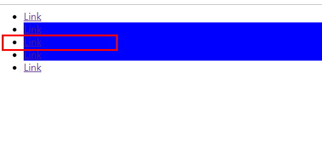
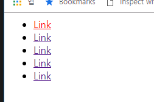
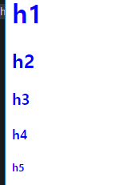
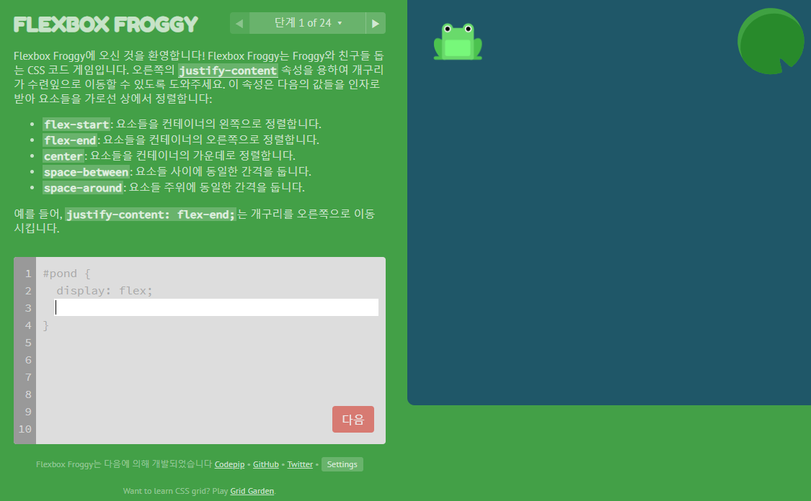
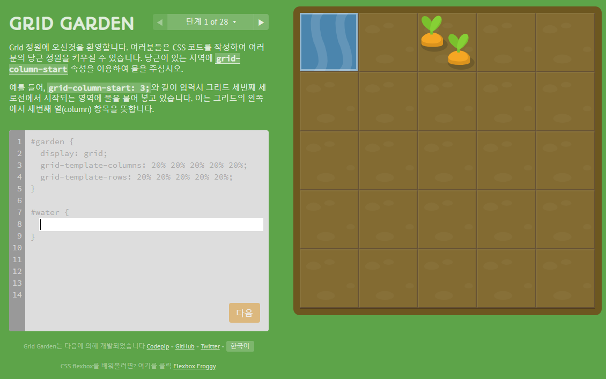

# PostCSS 공부 ( 부산 스터디 2주차 ) 정리

> 부산에서 매주 진행되는 CSS 초중급 스터디입니다.
>
> 더 많은 스터디는 [네이버 카페](https://cafe.naver.com/busandev)에서 확인 부탁드립니다. 
>
> 이 내용은 [니콜라스님의 CSS 마스터 클래스](https://academy.nomadcoders.co/)를 공부하고 정리한 글입니다. 
>
> [Github 소스링크](https://github.com/nomadcoders/css-masterclass)

저번 시간에는 CSS Next 에 대해서 정리를 했었다. 

- 1주차 정리 바로가기 
  - [Flex](http://javaexpert.tistory.com/991)
  - [CSS Next](http://javaexpert.tistory.com/993)

이번 스터디는 PostCSS 에 대해서 공부 하도록 한다. 

공부할 내용은 아래와 같다. 

- `Parcel`
- `PostCSS & Parcel`
- `pseudo class`
- `Css Variables`
- `@custom media and media query ranges`
- `color-mod, gray(), System-ui`
- `Nesting Rules`
- 기타 추천 사이트들

## Parcel

코드를 압축,변환등을 해주는 툴이다. `CSS` 를 컴파일해서 어디든 사용할 수 있는 `CSS`로 바꿀수 있다. 

> 공식 홈페이지는 https://parceljs.org/ 이다. 

우선 디펜시즈를 설치를 하자. 노드를 사용할 예정이다. 

```
npm install -g parcel-bundler
```

그럼 `index.html` 을 컴파일해서 변경시 

```
parcel index.html
```

```css
body {
    background-color: blue;
}
```

> package.json

```json
{
  "name": "web_css",
  "version": "1.0.0",
  "description": "",
  "main": "index.js",
  "scripts": {
    "start": "parcel index.html"
  },
  "author": "",
  "license": "ISC"
}
```

```
npm run start
```

```
$ npm run start

> web_css@1.0.0 start G:\workspace_study\web_css
> parcel index.html

Server running at http://localhost:1234
√  Built in 2.73s.
```

서버가 실행되는 걸 볼 수 있다. 

그럼 이걸 이용해서 최신 CSS를 어떻게 사용할 수 있는지 살펴보도록 하자. 

## PostCSS & PostCSS Preset Env

PostCSS 는 플러그인으로 좀 더 편하게 CSS 개발을 할 수 있도록 도와주는 역할을 한다. 

자바스크립트로 말하면 타입스크립트 같은 ...

자세한 설명은 링크를 참고하도록 하자. 

- [PostCSS 소개](https://medium.com/@FourwingsY/postcss-%EC%86%8C%EA%B0%9C-727310aa6505)

플러그인으로 할수 있는게 상당히 다양하다고 한다. 

우리가 이용할건 `PostCSS preset env` 를 이용할 것이다. 

특이한 점은 stage 0~3 까지 나뉘어져 있으며 단계별로 사용할 수 있는 게 다르다. 

> https://preset-env.cssdb.org/
>
> https://preset-env.cssdb.org/features#all-property

```
npm install postcss-preset-env
```

> `package.json`

```
  "postcss": {
    "plugins":{
      "postcss-preset-env": {
        "stage":0
      }
    }
  }
```

> `style.css`

```css
@custom-media --viewport-medium (width <= 50rem);
@custom-selector :--heading h1, h2, h3, h4, h5, h6;

:root {
  --fontSize: 1rem;
  --mainColor: #12345678;
  --secondaryColor: lab(32.5 38.5 -47.6 / 90%);
}

html {
  overflow: hidden auto;
}

@media (--viewport-medium) {
  body {
    color: var(--mainColor);
    font-family: system-ui;
    font-size: var(--fontSize);
    line-height: calc(var(--fontSize) * 1.5);
    overflow-wrap: break-word;
    padding-inline: calc(var(--fontSize) / 2 + 1px);
  }
}

:--heading {
  margin-block: 0;
}

.hero:matches(main, .main) {
  background-image: image-set("img/background.jpg" 1x, "img/background-2x.jpg" 2x);
}

a {
  color: rgb(0 0 100% / 90%);

  &:hover {
    color: rebeccapurple;
  }
}
```

실행시 보기 편한 CSS로 컴파일 되서 나오는 걸 볼수 있다. 

```css
:root {
  --fontSize: 1rem;
  --mainColor: rgba(18,52,86,0.47059);
  --secondaryColor: rgba(102, 51, 153, 0.9);
}

html {
  overflow-x: hidden;
  overflow-y: auto;
  overflow: hidden auto;
}

@media (max-width: 50rem) {
  body {
    color: rgba(18,52,86,0.47059);
    color: var(--mainColor);
    font-family: system-ui, -apple-system, Segoe UI, Roboto, Ubuntu, Cantarell, Noto Sans, sans-serif;
    font-size: 1rem;
    font-size: var(--fontSize);
    line-height: calc(1rem * 1.5);
    line-height: calc(var(--fontSize) * 1.5);
    word-wrap: break-word;
    padding-left: calc(1rem / 2 + 1px);
    padding-right: calc(1rem / 2 + 1px);
    padding-left: calc(var(--fontSize) / 2 + 1px);
    padding-right: calc(var(--fontSize) / 2 + 1px);
  }
}

h1,h2,h3,h4,h5,h6 {
  margin-top: 0;
  margin-bottom: 0;
}

main.hero, .hero.main {
  background-image: img/background.jpg;
}

@media (-webkit-min-device-pixel-ratio: 2), (min-resolution: 192dpi) {

main.hero, .hero.main {
  background-image: img/background-2x.jpg;
}
}

main.hero, .hero.main {
  background-image: -webkit-image-set(url("img/background.jpg") 1x, url("img/background-2x.jpg") 2x);
  background-image: image-set("img/background.jpg" 1x, "img/background-2x.jpg" 2x);
}

a {
  color: rgba(0, 0, 255, 0.9)
}

a:hover {
    color: #639;
  }
```

## Pseudo-classes

```html
    <nav>
        <ul>
            <li><a href="">Link</a></li>
            <li><a href="">Link</a></li>
            <li class="target"><a href="">Link</a></li>
            <li><a href="">Link</a></li>
            <li><a href="">Link</a></li>
        </ul>
    </nav>
```

```css
li:matches(:nth-child(even), .target) {
    background-color: blue;
}
```

- li태그에 대해서 짝수번째만 선택 하고 , target 클래스가 있는걸 동시에 배경을 변경하도록 한다. 



빨간 박스는 `target` 이어서 선택이 된것을 볼 수 있다. 

> `not` 태그

exclude 한 태그들을 선택가능하다. 

```css
li:not(.target) {
    background-color: blue;
}
```

## CSS Variables

css에 변수를 지정해서 할당하는 것도 가능하다. 

- 여러번 반복되는 복사, 붙여넣기할때 유용하다. 

```css
:root {
    --awesomeColor:red;
}

li:first-child a{
    color:var(--awesomeColor);
}
```



## Custom Selector

```css
@custom-selector :--headers h1,h2,h3,h4,h5;

:--headers {
    color: blue;
}
```



## Custom media & range

> `850px width` 밑으로는 배경색을 `red` 로 지정
```css
@custom-media --ipad-size (max-width: 850px);

@media(--ipad-size) {
    body {
        background-color: red;
    }
}
```

### range

```css
@custom-media --ipad-size (450px < width <= 850px);

@media(--ipad-size) {
    body {
        background-color: red;
    }
}
```

컴파일 되서 나오는 결과는 아래와 같이 나온다.

```css
@media(min-width: 451px) and (max-width: 850px) {
    body {
        background-color: red;
    }
}
```

## color mod

```css
h1 {
    color: color-mod(#8e44ad, alpha(50%))
    color: color-mod(#8e44ad, lightness(50%))
}
```

> https://www.w3.org/TR/css-color-4/#modifying-colors

## Grey

```css
h1 {
    color: grey(90);
}
```

## System-ui

```css
h1 {
    font-family: system-ui;
}
```


## Nesting Rules

내부적으로 `this` 개념을 `&` 을 통해 넣을 수 있다.

> `index.html`

```
    <main>
        <section>
            <li><a href="#">Hello!</a></li>
        </section>
    </main>
```

>  ` style.css`

```css
main {
    background-color: blue;
    & section {
      background-color: red;
      width: 500px;
      & li {
        background-color: yellow;
        width: 400px;
        & a {
          color: black;
          &:hover {
            font-size: 30px;
          }
        }
      }
    }
  }

 a {
    color: red;
  }
```


## 기타

- [postcss-grid-kiss](https://github.com/sylvainpolletvillard/postcss-grid-kiss)


- [flexbox froggy ( flex 게임형태의 연습형)](https://flexboxfroggy.com/#ko)

  

- [css grid (Grid 게임형태의 연습 사이트)](https://cssgridgarden.com/#ko)

  


여기까지 이론 수업이고 다음에는 실전으로 넘어가서 `15개의 사이트`를 클론하도록 한다. 

이상으로 `2주차 스터디 내용`을 정리하였다. 

참석해주셔서 감사합니다. 