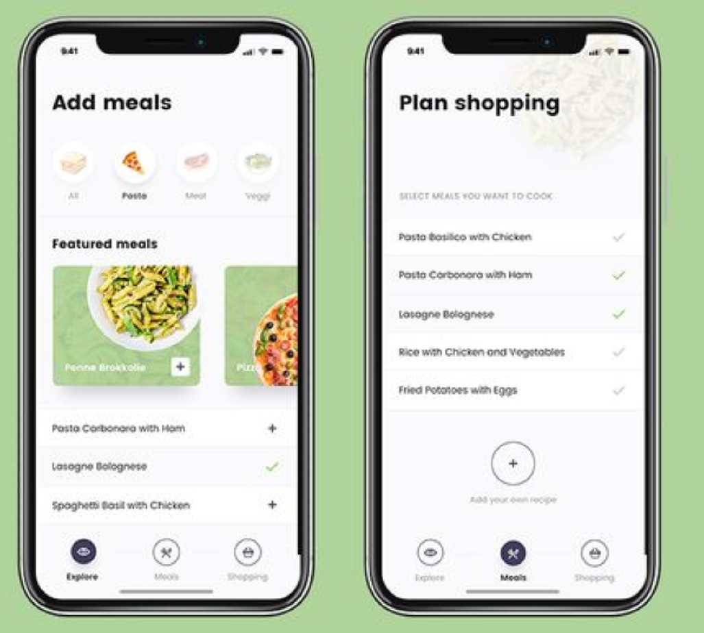
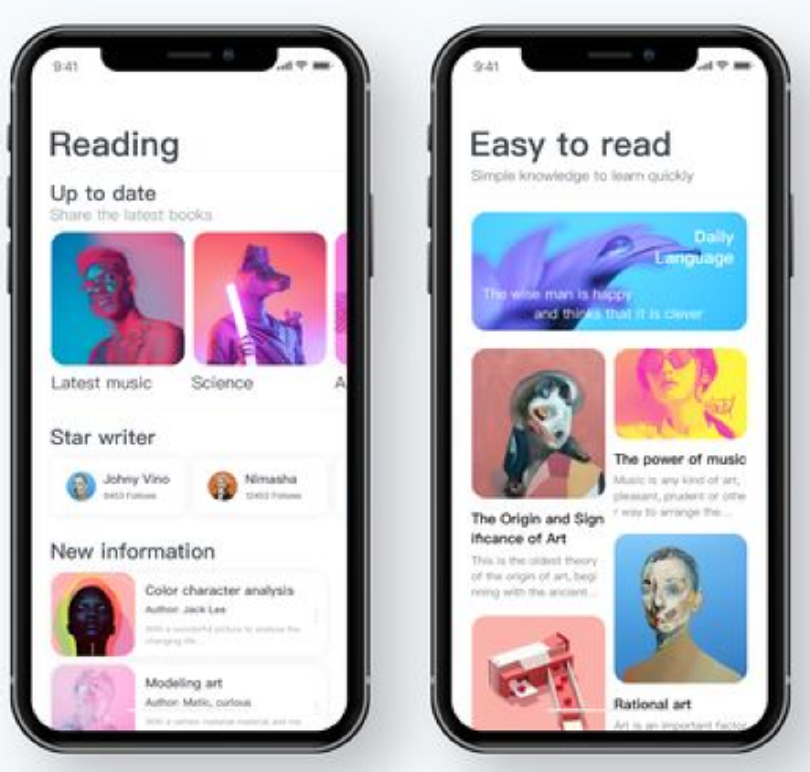
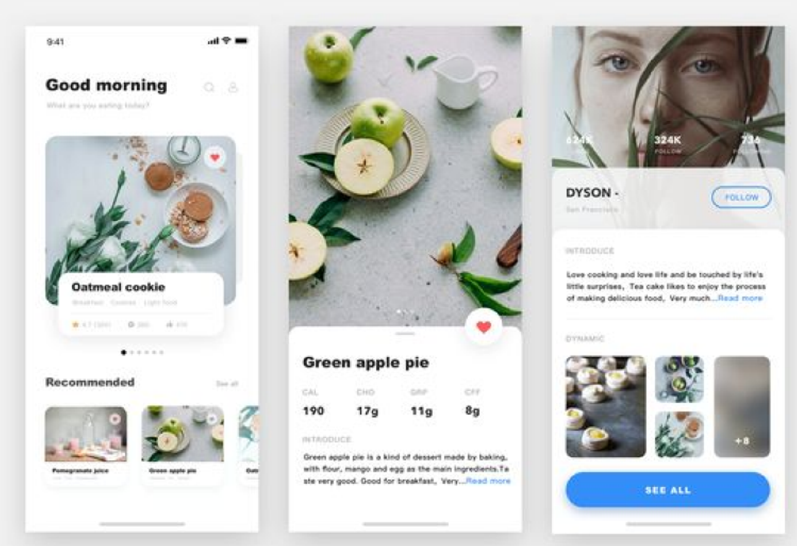

# Web Grid 클론 프로젝트 #1

>부산에서 매주 진행되는 `CSS 초중급 스터디`입니다.
>
>더 많은 스터디는 [네이버 카페](https://cafe.naver.com/busandev)에서 확인 부탁드립니다. 
>
>이 내용은 [니콜라스님의 CSS 마스터 클래스](https://academy.nomadcoders.co/)를 공부하고 정리한 글입니다. 

이번주는 `1 ~ 5번` 페이지까지 공부했습니다.  [Github 소스](https://github.com/bear2u/css-masterclass)

## 1

## 2

## 3

## 4

## 5
